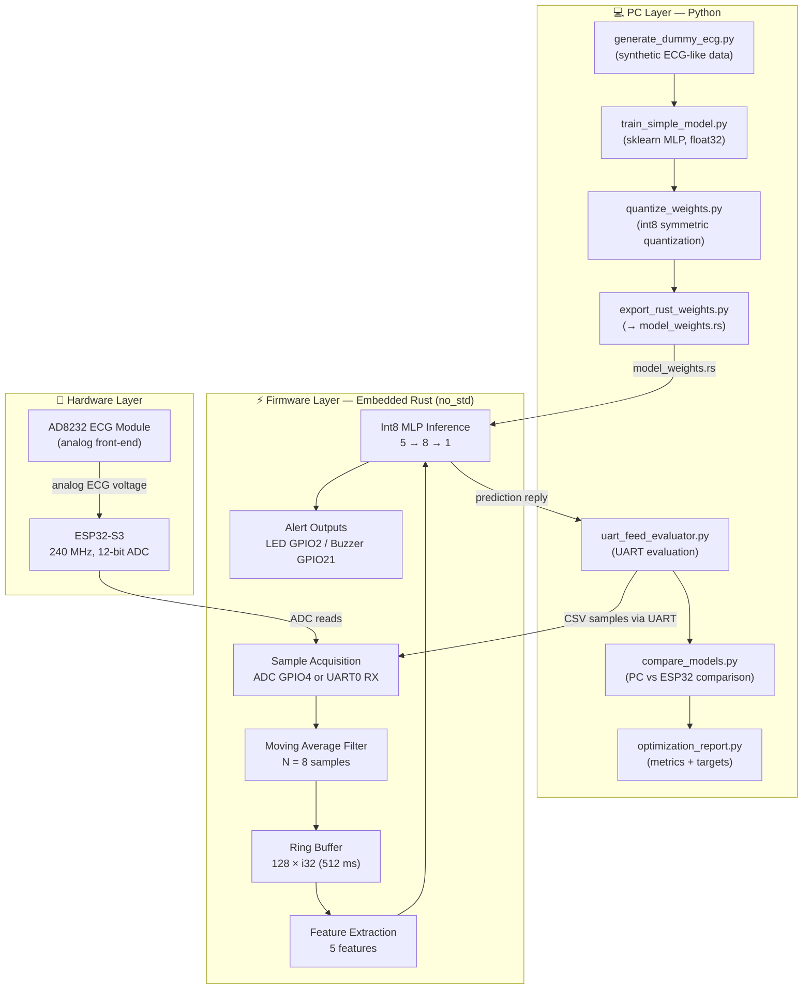
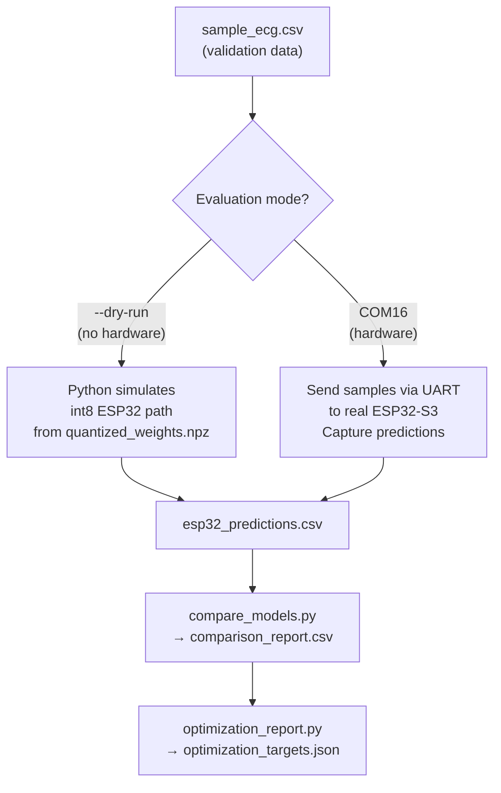

# RT-QTinyECG-ESP32-Rust — Documentation Index

> [!IMPORTANT]
> **This project is not a medical device.** All ECG-like data is synthetic and for educational/research purposes only. Do not use this system for clinical diagnosis or patient monitoring.

RT-QTinyECG-ESP32-Rust is an educational **TinyML** prototype that classifies ECG-like signals in real time on an ESP32-S3 microcontroller. A quantized int8 multilayer perceptron (MLP) is trained on a PC, exported as Rust source code, and executed entirely in embedded firmware with no heap allocation and no external ML runtime.

---

## Table of Contents

1. [Project Architecture](#1-project-architecture)
2. [Recommended Reading Order](#2-recommended-reading-order)
3. [Complete Pipeline Diagram](#3-complete-pipeline-diagram)
4. [Key Commands](#4-key-commands)
5. [Current Performance Metrics](#5-current-performance-metrics)
6. [Important Design Notes](#6-important-design-notes)
7. [File and Directory Map](#7-file-and-directory-map)

---

## 1. Project Architecture

The system is divided into three layers that work together:



---

## 2. Recommended Reading Order

| # | Document | Purpose | Key Topics |
|:---:|---|---|---|
| 1 | `../README.md` | Start here: project overview and setup | Installation, first run, quick commands |
| 2 | [`algorithm.md`](algorithm.md) | Core signal processing and ML algorithm | Filter, features, MLP, quantization |
| 3 | [`block_diagram.md`](block_diagram.md) | End-to-end architecture diagrams | System/firmware/training data paths |
| 4 | [`flowchart.md`](flowchart.md) | Firmware and evaluation control flow | Main loop, MLP flow, retraining loop |
| 5 | [`uart_feed_evaluation.md`](uart_feed_evaluation.md) | Hardware and dry-run validation workflow | UART protocol, dry-run vs hardware |
| 6 | [`evaluation_metrics.md`](evaluation_metrics.md) | Metric definitions and performance targets | Accuracy, F1, latency, model size |
| 7 | [`optimization_guide.md`](optimization_guide.md) | Retraining, fine-tuning, and optimization | Decision tree, architecture experiments |
| 8 | [`real_time_design.md`](real_time_design.md) | Timing, memory, and real-time rationale | Sampling, ring buffer, inference cost |
| 9 | [`wiring_esp32_ad8232.md`](wiring_esp32_ad8232.md) | AD8232 wiring for ADC mode | Pin map, circuits, troubleshooting |
| ★ | [`diagrams_master.md`](diagrams_master.md) | **All 32 Mermaid diagrams in one file** | Quick visual reference for the entire project |

---

## 3. Complete Pipeline Diagram

### Training → Deployment Pipeline

```mermaid
flowchart LR
    subgraph Data["📊 Data Generation"]
        CSV["sample_ecg.csv\n(synthetic ECG-like\nwaveforms + labels)"]
    end

    subgraph Training["🏋️ Training (Python / sklearn)"]
        T1["Feature extraction\n(firmware-compatible)"]
        T2["MLP training\n5→8→1, float32"]
        T3["model.pkl"]
    end

    subgraph Quantization["🔢 Quantization"]
        Q1["quantize_weights.py"]
        Q2["quantized_weights.npz\n(int8 W, i32 B, scale)"]
    end

    subgraph Export["📤 Rust Export"]
        E1["export_rust_weights.py\n(transposes W1)"]
        E2["model_weights.rs\n(const arrays)"]
    end

    subgraph Firmware["⚡ ESP32-S3 Firmware"]
        F1["cargo build --release"]
        F2["ECG firmware binary\n+ embedded weights"]
    end

    subgraph Evaluation["📈 Evaluation"]
        EV1["uart_feed_evaluator.py"]
        EV2["compare_models.py"]
        EV3["optimization_report.py"]
        EV4["esp32_predictions.csv\ncomparison_report.csv\noptimization_targets.json"]
    end

    CSV --> T1 --> T2 --> T3
    T3 --> Q1 --> Q2
    Q2 --> E1 --> E2
    E2 --> F1 --> F2
    CSV -->|"validation samples"| EV1
    F2 -->|"UART predictions"| EV1
    Q2 -->|"dry-run simulation"| EV1
    EV1 --> EV2 --> EV3 --> EV4
```



### Two Evaluation Paths



---

## 4. Key Commands

### Complete PC-Only Simulation

```bat
cd /d D:\PropertiesProject-D\Kuliah\Pemkon\Product
run_simulation.bat
```

### Retrain and Export New Firmware Weights

```bat
py python\generate_dummy_ecg.py
py python\train_simple_model.py
py python\quantize_weights.py
py python\export_rust_weights.py
```

### Evaluate Without Hardware (Dry-Run)

```bat
run_uart_eval.bat --dry-run
```

### Evaluate With ESP32-S3 Hardware

```bat
run_uart_eval.bat COM16
```

### Regenerate Comparison Charts

```bat
run_all_plots.bat
```

### Build and Flash Firmware Manually

```powershell
cd firmware\esp32-rust
. $HOME\export-esp.ps1
cargo build --release --target xtensa-esp32s3-none-elf --features uart-feed
espflash flash target\xtensa-esp32s3-none-elf\release\ecg-esp32 --port COM16
```

---

## 5. Current Performance Metrics

### Classification Performance

| Metric | PC float32 | ESP32 / int8 dry-run | Target (Good) |
|---|:---:|:---:|:---:|
| Accuracy | **96.5%** | **95.4%** | > 90% |
| Precision | 1.000 | 1.000 | > 0.90 |
| Recall | 0.917 | 0.892 | > 0.85 |
| F1-score | 0.957 | 0.943 | > 0.90 |
| Quantization delta | — | **1.05%** | < 3% |
| PC / int8 agreement | — | **98.9%** | > 95% |

> [!NOTE]
> These metrics are computed on synthetic ECG-like data. They do not constitute clinical validation.

### Metric Comparison (visual)

```mermaid
xychart-beta
    title "PC float32 vs ESP32 int8 — Key Metrics"
    x-axis ["Accuracy", "Precision", "Recall", "F1-score"]
    y-axis "Score" 0.8 --> 1.05
    bar [0.965, 1.000, 0.917, 0.957]
    bar [0.954, 1.000, 0.892, 0.943]
```



### Latency Budget

| Stage | Approximate Time |
|---|---:|
| Initial window fill (128 samples @ 250 Hz) | **512 ms** |
| Feature extraction | ~10 µs |
| Int8 MLP inference | ~20–60 µs |
| GPIO toggle (LED/Buzzer) | < 1 µs |
| UART TX (one line @ 115200) | ~1–3 ms |

### Model Size

| Component | Size |
|---|---:|
| W1 int8 `[8 × 5]` | 40 bytes |
| B1 int32 `[8]` | 32 bytes |
| W2 int8 `[1 × 8]` | 8 bytes |
| B2 int32 `[1]` | 4 bytes |
| Scale metadata | 16 bytes |
| **Total** | **~100 bytes** |

---

## 6. Important Design Notes

> [!IMPORTANT]
> Read these before modifying the pipeline.

1. **Firmware-compatible features**: The model is trained on features computed with the exact same algorithm as `inference.rs`. Do not use sklearn's `StandardScaler` for embedded deployment — the current path stores `None` in `scaler.pkl`.

2. **W1 transposition**: sklearn stores the first-layer weight matrix as `[features, hidden]` = `[5, 8]`. `export_rust_weights.py` transposes it to `[hidden, features]` = `[8, 5]` before writing `model_weights.rs`. Breaking this transposition causes silent misclassification.

3. **`uart_feed_evaluator.py --dry-run`**: Simulates the quantized int8 model entirely in Python using `quantized_weights.npz`. This is the fastest correctness check without flashing hardware.

4. **No heap allocation in firmware**: The firmware uses only static arrays. `no_std` Rust with `const` generics ensures the ring buffer and filter state are stack/BSS allocated.

5. **GPIO44 = UART0 RX, GPIO43 = UART0 TX**: These are the UART-feed mode pins on ESP32-S3. Classic ESP32 examples using GPIO34/GPIO25 do not apply.

---

## 7. File and Directory Map

```text
Product/
├── docs/                        ← You are here
│   ├── INDEX.md                 ← This file
│   ├── algorithm.md             ← Signal processing & ML details
│   ├── block_diagram.md         ← Architecture diagrams
│   ├── flowchart.md             ← Control flow diagrams
│   ├── uart_feed_evaluation.md  ← Evaluation workflow
│   ├── evaluation_metrics.md    ← Metric definitions & targets
│   ├── optimization_guide.md    ← Retraining & fine-tuning
│   ├── real_time_design.md      ← Timing & memory design
│   └── wiring_esp32_ad8232.md   ← Hardware wiring guide
│
├── python/                      ← PC-side scripts
│   ├── generate_dummy_ecg.py
│   ├── train_simple_model.py
│   ├── quantize_weights.py
│   ├── export_rust_weights.py
│   ├── uart_feed_evaluator.py
│   ├── compare_models.py
│   ├── optimization_report.py
│   └── preprocessing.py
│
├── firmware/esp32-rust/         ← Embedded Rust firmware
│   └── src/
│       ├── main.rs              ← Main loop, ADC/UART modes
│       ├── inference.rs         ← Threshold + int8 MLP classifier
│       └── model_weights.rs     ← Auto-generated quantized weights
│
├── data/                        ← Generated data files
│   ├── sample_ecg.csv
│   ├── model.pkl
│   ├── quantized_weights.npz
│   ├── esp32_predictions.csv
│   ├── comparison_report.csv
│   └── optimization_targets.json
│
└── images/                      ← Generated charts
    ├── evaluation/
    └── model_esp32/
```

---

*Document version: 2026-06-17 | Project: RT-QTinyECG-ESP32-Rust*
