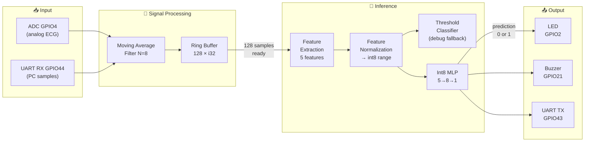
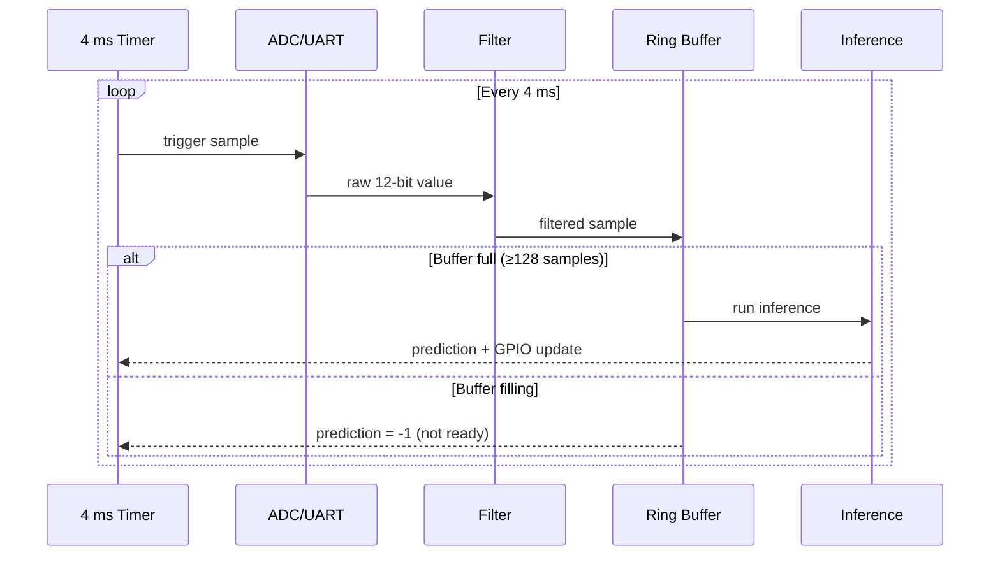
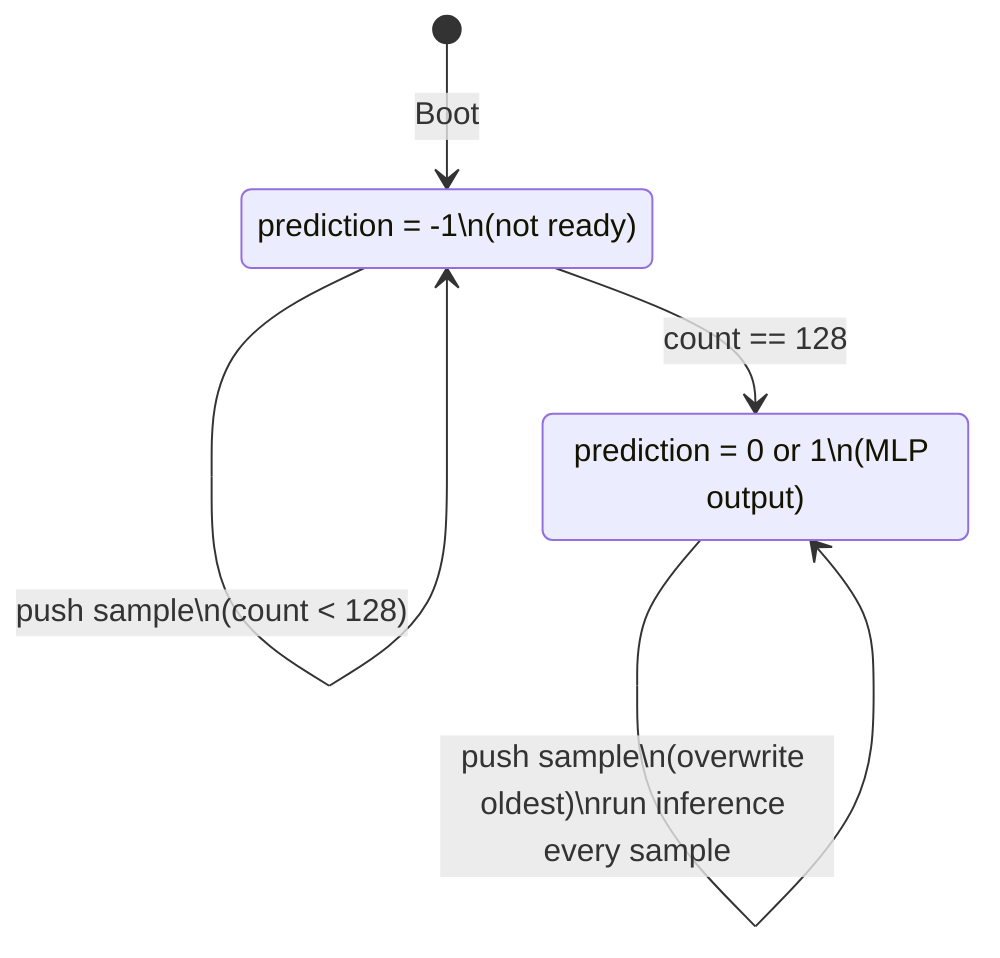
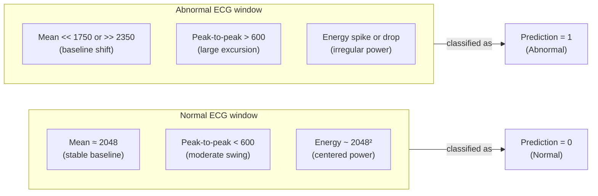
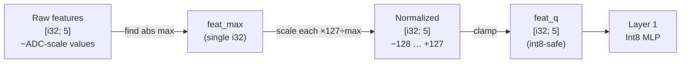
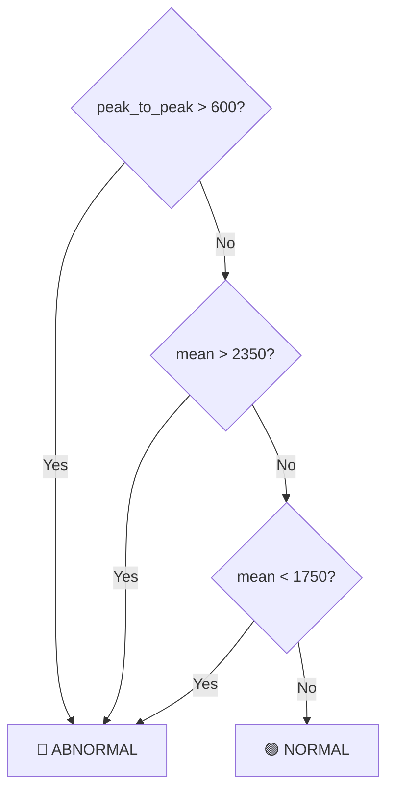
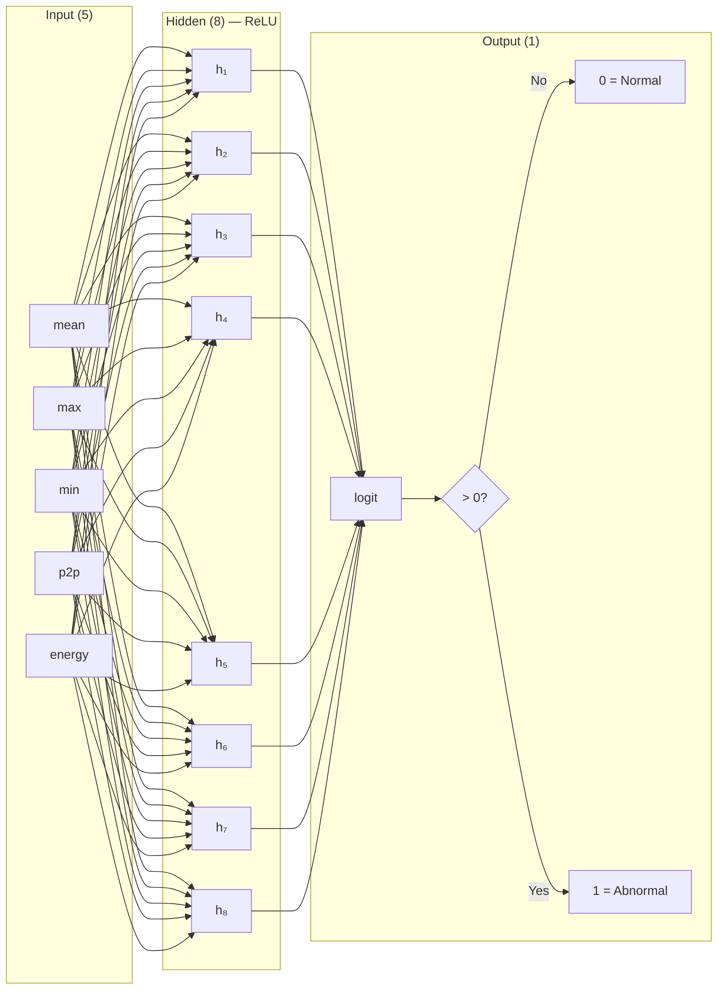

# Algorithm Description

This document describes the complete signal-processing and classification algorithm used by RT-QTinyECG-ESP32-Rust. The same algorithm runs identically in the embedded Rust firmware and in the Python dry-run simulation — any divergence between them is a bug.

> [!NOTE]
> All values in this document use **12-bit ADC integers (0–4095)** as the native unit. There is no floating-point conversion in the firmware.

---

## Table of Contents

1. [Processing Pipeline Overview](#1-processing-pipeline-overview)
2. [Sampling](#2-sampling)
3. [Moving Average Filter](#3-moving-average-filter)
4. [Ring Buffer](#4-ring-buffer)
5. [Feature Extraction](#5-feature-extraction)
6. [Feature Normalization](#6-feature-normalization)
7. [Threshold Classifier](#7-threshold-classifier)
8. [Quantized MLP Classifier](#8-quantized-mlp-classifier)
9. [Alert Logic](#9-alert-logic)
10. [Training and Export](#10-training-and-export)
11. [Current Performance](#11-current-performance)

---

## 1. Processing Pipeline Overview



The production default uses the **quantized MLP**. The threshold classifier is retained in `inference.rs` as a transparent, interpretable fallback for debugging.

---

## 2. Sampling

### Target Rate

```text
250 Hz  →  4 ms per sample
```

A uniform sample rate is required because the windowed features assume fixed time spacing. Irregular sampling changes the physical meaning of energy and amplitude statistics.

### Input Sources

| Mode | Source | GPIO | Description |
|---|---|:---:|---|
| **ADC mode** | AD8232 analog output | GPIO4 | Live ECG capture via ADC1 |
| **UART-feed mode** | PC `sample_ecg.csv` | GPIO44 (RX) | Controlled evaluation |
| **Dry-run mode** | Python simulation | — | No hardware; uses `quantized_weights.npz` |

### ADC Value Range

```text
0  ·····················  2048 (≈1.65 V midpoint)  ·····················  4095
└── rail (0 V)                                                    rail (3.3 V) ──┘
```

The synthetic dataset is centered near **2048**, representing the ½-VCC mid-rail of the AD8232 output.

### Timing Diagram



---

## 3. Moving Average Filter

The firmware applies a **causal moving average** with an 8-sample window immediately after each sample is read:

```text
filtered[n] = ( x[n] + x[n-1] + x[n-2] + ... + x[n-7] ) / 8
```

### Efficient Running-Sum Implementation (Rust)

Instead of summing 8 values per sample, the firmware keeps a running sum and subtracts the outgoing oldest value:

```rust
running_sum = running_sum + new_sample - oldest_sample;
average = running_sum / count;    // O(1) per sample
```

### Effect on Signal

| Property | Value |
|---|---|
| Window length | 8 samples |
| Group delay | 3.5 samples = **~14 ms** |
| Low-pass effect | Attenuates high-frequency noise, 50/60 Hz powerline |
| Memory cost | `[i32; 8]` = **32 bytes** |

```text
Raw signal:    ▁▂▅▇▆▄▂▁▂▄▆▇▅▃▁ ← high-frequency noise visible
Filtered:      ▁▂▃▄▄▄▃▂▂▃▄▅▅▄▃ ← smoothed waveform
                              ↑ 14 ms lag (acceptable for 512 ms window)
```

---

## 4. Ring Buffer

The latest **128 filtered samples** are stored in a fixed-size ring buffer.

### Buffer Parameters

```text
128 samples × 4 ms/sample = 512 ms of ECG context
```

| Property | Value |
|---|---|
| Capacity | 128 × i32 |
| Memory | **512 bytes** |
| Allocation | Static (BSS), no heap |
| Insertion | O(1) with head-pointer wrap |
| Access pattern | Oldest → newest, contiguous via modular index |

### Buffer State Machine



### Visual Layout

```text
Index:  [0]  [1]  [2]  ... [63]  ... [127]
         ↑                              ↑
      oldest                         newest (head)

After next sample: oldest wraps → [1] becomes oldest, [0] receives new value
```

---

## 5. Feature Extraction

For each complete 128-sample window, firmware computes **5 scalar features**:

| # | Feature | Formula | Physical meaning |
|:---:|---|---|---|
| 1 | Mean | `Σx / N` | DC baseline level |
| 2 | Maximum | `max(x)` | Peak amplitude |
| 3 | Minimum | `min(x)` | Trough amplitude |
| 4 | Peak-to-peak | `max − min` | Total swing; key arrhythmia indicator |
| 5 | Energy (scaled) | `Σ(x²) / N / 4096` | Signal power; normalization avoids int64 overflow |

### Why These 5 Features?



The MLP input vector fed to Layer 1:

```text
input = [mean, maximum, minimum, peak_to_peak, energy_scaled]
```

---

## 6. Feature Normalization

Before inference, features are normalized to an int8-like range per window. This is the key step that aligns Python training with Rust firmware inference.

### Algorithm

```text
1. feat_max = max( abs(feature[0]), abs(feature[1]), ..., abs(feature[4]), 1 )
   (floor at 1 to avoid division by zero)

2. feat_q[i] = clamp( feature[i] × 127 / feat_max, −128, 127 )
```

### Why Per-Window Normalization?

Standard sklearn `StandardScaler` uses fixed global mean/std computed over the training set. On a microcontroller this requires storing the scaler parameters in flash and doing floating-point arithmetic — expensive and fragile.

Per-window normalization:
- Requires **no stored parameters** (computed fresh each inference)
- Is **scale-invariant**: works regardless of absolute ADC level
- Is **identical in Python and Rust**: no float/int mismatch
- Costs only ~10 integer operations



---

## 7. Threshold Classifier

The threshold classifier is a simple, transparent rule-based classifier used as a **debug fallback**. It does not require trained weights.

### Rules

```text
if  peak_to_peak  > 600   →  ABNORMAL
if  mean          > 2350  →  ABNORMAL
if  mean          < 1750  →  ABNORMAL
else                      →  NORMAL
```

### Rust Constants (`inference.rs`)

```rust
const THRESH_P2P:       i32 = 600;
const THRESH_MEAN_HIGH: i32 = 2350;
const THRESH_MEAN_LOW:  i32 = 1750;
```

### Decision Diagram



> [!NOTE]
> The production firmware default is the **quantized MLP**, not the threshold classifier. The threshold classifier is kept for interpretable debugging when the MLP output is suspicious.

---

## 8. Quantized MLP Classifier

### Architecture

```text
Input layer:   5 neurons  (normalized features)
Hidden layer:  8 neurons  (ReLU activation)
Output layer:  1 neuron   (logit → threshold at 0)
```



### Weight Layout (Rust)

| Array | Shape | Type | Size |
|---|---|---|---:|
| `W1` | `[8 × 5]` row-major | `i8` | 40 bytes |
| `B1` | `[8]` | `i32` | 32 bytes |
| `W2` | `[8]` (1 output) | `i8` | 8 bytes |
| `B2` | `[1]` | `i32` | 4 bytes |
| Scale metadata | — | `f32 × 4` | 16 bytes |
| **Total** | | | **~100 bytes** |

> [!WARNING]
> `W1` is stored **transposed** relative to sklearn's internal layout. sklearn stores `W1` as `[features=5, hidden=8]`. The firmware expects `[hidden=8, features=5]`. `export_rust_weights.py` performs this transposition. If you bypass the export script, apply `.T` manually.

### Quantization Scheme

```text
scale = max( abs(W) ) / 127          ← per-layer symmetric
W_q[i] = round( W[i] / scale )       ← clamp to [-128, 127]
B_q[i] = round( B[i] / scale )       ← stored as i32
```

### Firmware Inference (integer arithmetic only)

```text
Layer 1:
  accum[j] = Σᵢ( W1[j×5 + i] × feat_q[i] )  +  B1[j]    for j = 0..7
  hidden[j] = relu(accum[j])                               (zero negative)

Re-quantize hidden:
  h_max = max( abs(hidden[j]) )
  hidden_q[j] = clamp( hidden[j] × 127 / h_max, -128, 127 )

Layer 2:
  output = Σⱼ( W2[j] × hidden_q[j] )  +  B2[0]

Decision:
  prediction = 1 if output > 0 else 0
```

### Operation Count

| Step | Operations |
|---|---:|
| Layer 1 MACs | 40 multiply-accumulates |
| ReLU | 8 comparisons |
| Re-quantization | 9 operations |
| Layer 2 MACs | 8 multiply-accumulates |
| **Total** | **~65 operations** |

Comfortably fits within the 4 ms sampling budget on a 240 MHz ESP32-S3.

---

## 9. Alert Logic

Firmware maps the binary prediction to GPIO outputs immediately after inference:

| Prediction | Meaning | LED (GPIO2) | Buzzer (GPIO21) |
|:---:|---|:---:|:---:|
| `0` | Normal ECG | LOW (off) | LOW (off) |
| `1` | Abnormal ECG | HIGH (on) | HIGH (on) |

UART output in UART-feed mode:

| Value | Meaning |
|:---:|---|
| `-1` | Ring buffer not yet full (startup) |
| `0` | Normal prediction |
| `1` | Abnormal prediction |

---

## 10. Training and Export

### Commands

```bat
py python\generate_dummy_ecg.py
py python\train_simple_model.py
py python\quantize_weights.py
py python\export_rust_weights.py
```

### Training Pipeline Detail

```mermaid
flowchart LR
    CSV["sample_ecg.csv"] -->|"sliding window\n128 samples\n+8 MA filter"| FEAT["Firmware-compatible\nfeature vectors\n[N × 5]"]
    FEAT -->|"per-window\nnormalization"| NORM["Normalized\nfeature matrix"]
    NORM --> TRAIN["sklearn MLPClassifier\nhidden=(8,)\nmax_iter=1000"]
    TRAIN --> PKL["model.pkl\n(float32 weights)"]
    PKL --> QUANT["quantize_weights.py\nsymmetric int8"]
    QUANT --> NPZ["quantized_weights.npz\n(W_q, B_q, scale)"]
    NPZ -->|"transpose W1"| RUST["model_weights.rs\n(const arrays)"]
```



### Key Training Rules

1. **Feature extraction must match firmware exactly** — use `extract_firmware_mlp_input_array()` from `preprocessing.py`.
2. **Do not use `scaler.pkl`** for embedded inference — `scaler.pkl` stores `None` intentionally. Per-window normalization is built into the feature function.
3. **W1 transposition** — always applied by `export_rust_weights.py`. Never skip this step.

---

## 11. Current Performance

| Metric | PC float32 | ESP32 / int8 dry-run |
|---|:---:|:---:|
| Accuracy | **96.5%** | **95.4%** |
| Precision | 1.000 | 1.000 |
| Recall | 0.917 | 0.892 |
| F1-score | 0.957 | 0.943 |
| Quantization delta | — | 1.05% |
| Agreement | — | 98.9% |
| Disagreements | — | 25 / 2373 valid samples |

> [!CAUTION]
> These metrics are computed on **synthetic ECG-like data** generated by `generate_dummy_ecg.py`. They are useful for verifying pipeline correctness but are **not clinical validation** results.

---

*Document version: 2026-06-17 | Firmware target: ESP32-S3 Embedded Rust (no_std)*
