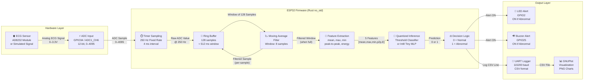
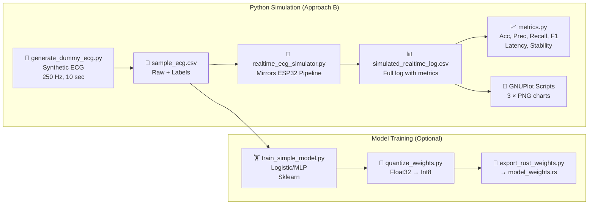
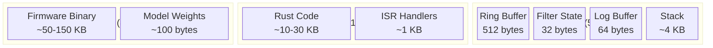

# System Block Diagram

This document describes the signal flow architecture of the RT-QTinyECG-ESP32-Rust system.

---

## Full System Block Diagram

---

## PC Simulation Block Diagram

---

## Memory Architecture (ESP32)

---

## Signal Processing Pipeline Detail

| Stage | Input | Output | Latency |
|---|---|---|---|
| ADC Read | Analog voltage | 12-bit integer | ~20–100 µs |
| Moving Avg | New sample | Filtered sample | ~1 µs |
| Ring Buffer | Filtered sample | Window of 128 | O(1), ~0.1 µs |
| Feature Extract | 128-sample window | 5 features | ~5 µs |
| Threshold Classify | 5 features | 0 or 1 | ~1 µs |
| MLP Classify | 5 features | 0 or 1 | ~10–50 µs |
| GPIO Alert | Prediction | LED/Buzzer ON | ~2 µs |
| UART Log | CSV line | Serial TX | ~5 ms @ 115200 |

**Total computational latency (excl. UART): ~30–160 µs**
**Sampling interval: 4000 µs** → large safety margin.
