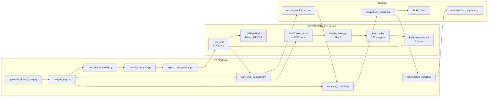
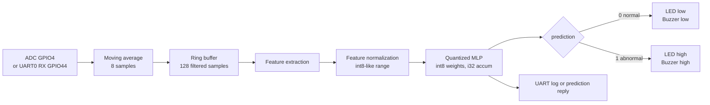
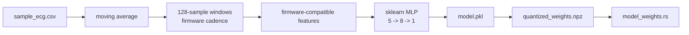

# System Block Diagram

This document describes the current system architecture.

## Full System

## Firmware Data Path

## Training and Export Path

## File Outputs

| Output | Source |
|---|---|
| `data/model.pkl` | `train_simple_model.py` |
| `data/quantized_weights.npz` | `quantize_weights.py` |
| `firmware/esp32-rust/src/model_weights.rs` | `export_rust_weights.py` |
| `data/esp32_predictions.csv` | `uart_feed_evaluator.py` |
| `data/comparison_report.csv` | `compare_models.py` |
| `data/optimization_targets.json` | `optimization_report.py` |
| `images/evaluation/*.png` | GNUPlot scripts |

## Memory View

