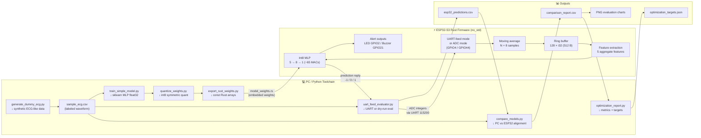
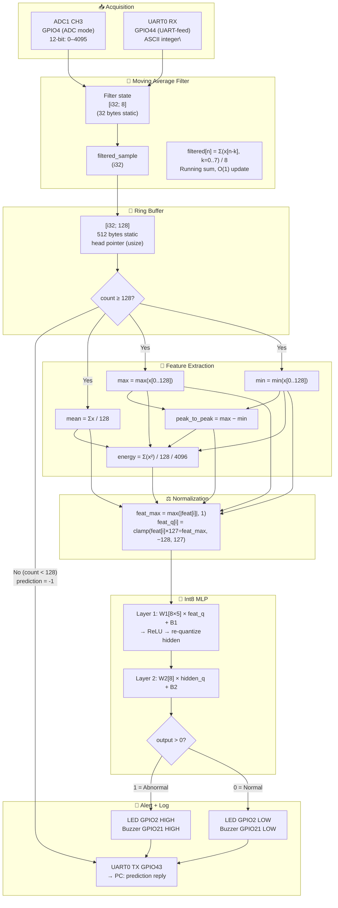
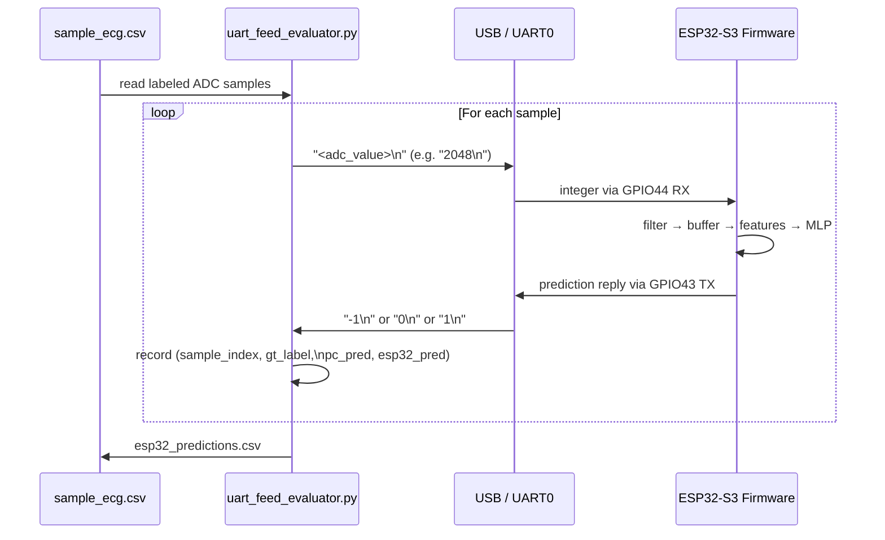
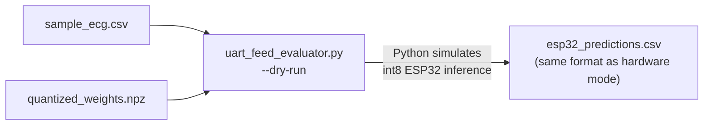
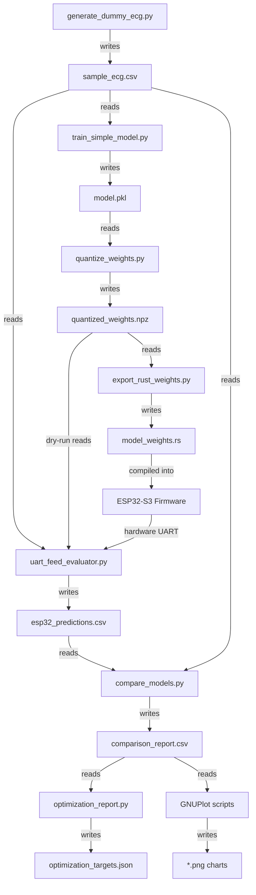

# System Block Diagram

This document provides comprehensive architecture diagrams for the RT-QTinyECG-ESP32-Rust system, covering the full end-to-end data flow, firmware internals, training pipeline, and memory layout.

---

## Table of Contents

1. [Full System Overview](#1-full-system-overview)
2. [Firmware Data Path](#2-firmware-data-path)
3. [Training and Export Path](#3-training-and-export-path)
4. [PC ↔ ESP32-S3 Interaction Model](#4-pc--esp32-s3-interaction-model)
5. [Memory Layout](#5-memory-layout)
6. [File Output Map](#6-file-output-map)
7. [Component Dependency Graph](#7-component-dependency-graph)

---

## 1. Full System Overview

The system spans three physical layers: the PC (Python toolchain), the ESP32-S3 embedded firmware, and optional hardware peripherals (AD8232 + alerts).

```mermaid
flowchart LR
    subgraph PC["💻 PC / Python Toolchain"]
        A["generate_dummy_ecg.py\n↓ synthetic ECG-like data"]
        B["sample_ecg.csv\n(labeled waveform)"]
        C["train_simple_model.py\n↓ sklearn MLP float32"]
        D["quantize_weights.py\n↓ int8 symmetric quant"]
        E["export_rust_weights.py\n↓ const Rust arrays"]
        F["uart_feed_evaluator.py\n↓ UART or dry-run eval"]
        G["compare_models.py\n↓ PC vs ESP32 alignment"]
        H["optimization_report.py\n↓ metrics + targets"]
    end

    subgraph FW["⚡ ESP32-S3 Rust Firmware (no_std)"]
        I["UART-feed mode\nor ADC mode\n(GPIO4 / GPIO44)"]
        J["Moving average\nN = 8 samples"]
        K["Ring buffer\n128 × i32 (512 B)"]
        L["Feature extraction\n5 aggregate features"]
        M["Int8 MLP\n5 → 8 → 1  (~65 MACs)"]
        N["Alert outputs\nLED GPIO2 / Buzzer GPIO21"]
    end

    subgraph OUT["📊 Outputs"]
        O["esp32_predictions.csv"]
        P["comparison_report.csv"]
        Q["optimization_targets.json"]
        R["PNG evaluation charts"]
    end

    A --> B --> C --> D --> E
    E -->|"model_weights.rs\n(embedded weights)"| M
    B --> F
    F -->|"ADC integers\nvia UART 115200"| I
    I --> J --> K --> L --> M --> N
    M -->|"prediction reply\n-1 / 0 / 1"| F
    F --> O --> G
    B --> G --> P --> H --> Q
    P --> R
```

---

## 2. Firmware Data Path

This diagram traces a single sample from acquisition through inference to output.

```mermaid
flowchart TD
    subgraph ACQ["📥 Acquisition"]
        ADC["ADC1 CH3\nGPIO4 (ADC mode)\n12-bit: 0–4095"]
        UART_IN["UART0 RX\nGPIO44 (UART-feed)\nASCII integer\\n"]
    end

    subgraph FILTER["🔧 Moving Average Filter"]
        MA_BUF["Filter state\n[i32; 8]\n(32 bytes static)"]
        MA_OUT["filtered_sample\n(i32)"]
        MA_DESC["filtered[n] = Σ(x[n-k], k=0..7) / 8\nRunning sum, O(1) update"]
    end

    subgraph BUFFER["💾 Ring Buffer"]
        RB["[i32; 128]\n512 bytes static\nhead pointer (usize)"]
        CHECK{"count ≥ 128?"}
    end

    subgraph FEATURES["📐 Feature Extraction"]
        F_MEAN["mean = Σx / 128"]
        F_MAX["max = max(x[0..128])"]
        F_MIN["min = min(x[0..128])"]
        F_P2P["peak_to_peak = max − min"]
        F_ENERGY["energy = Σ(x²) / 128 / 4096"]
    end

    subgraph NORM["⚖️ Normalization"]
        NORM_STEP["feat_max = max(|feat[i]|, 1)\nfeat_q[i] = clamp(feat[i]×127÷feat_max, −128, 127)"]
    end

    subgraph INFER["🧠 Int8 MLP"]
        L1["Layer 1: W1[8×5] × feat_q + B1\n→ ReLU → re-quantize hidden"]
        L2["Layer 2: W2[8] × hidden_q + B2"]
        DEC{"output > 0?"}
    end

    subgraph ALERT["🔔 Alert + Log"]
        GPIO_ON["LED GPIO2 HIGH\nBuzzer GPIO21 HIGH"]
        GPIO_OFF["LED GPIO2 LOW\nBuzzer GPIO21 LOW"]
        UART_OUT["UART0 TX GPIO43\n→ PC: prediction reply"]
    end

    ADC --> MA_BUF
    UART_IN --> MA_BUF
    MA_BUF --> MA_OUT
    MA_OUT --> RB
    RB --> CHECK
    CHECK -->|"No (count < 128)\nprediction = -1"| UART_OUT
    CHECK -->|"Yes"| F_MEAN & F_MAX & F_MIN
    F_MAX & F_MIN --> F_P2P
    F_MEAN & F_MAX & F_MIN & F_P2P --> F_ENERGY
    F_MEAN & F_MAX & F_MIN & F_P2P & F_ENERGY --> NORM_STEP
    NORM_STEP --> L1 --> L2 --> DEC
    DEC -->|"1 = Abnormal"| GPIO_ON
    DEC -->|"0 = Normal"| GPIO_OFF
    GPIO_ON & GPIO_OFF --> UART_OUT
```

---

## 3. Training and Export Path

This diagram shows how a Python model becomes embedded Rust const arrays.

```mermaid
flowchart LR
    subgraph GEN["Data Generation"]
        G1["generate_dummy_ecg.py"]
        G2["Synthetic normal\nECG-like waveforms\n(2048 baseline, low P2P)"]
        G3["Synthetic abnormal\nECG-like waveforms\n(high P2P or shifted mean)"]
        G4["sample_ecg.csv\n(ADC integers + labels)"]
    end

    subgraph FEAT["Feature Engineering"]
        F1["Sliding window\n128 samples + 8-MA filter"]
        F2["extract_firmware_mlp_input_array()\npreprocessing.py"]
        F3["Per-window normalization\n(firmware-identical)"]
        F4["Feature matrix X\n[N × 5], label vector y"]
    end

    subgraph TRAIN["Model Training"]
        T1["sklearn MLPClassifier\nhidden_layer_sizes=(8,)\nmax_iter=1000\nrelu activation"]
        T2["model.pkl\n(float32 weights W1, B1, W2, B2)"]
    end

    subgraph QUANT["Quantization"]
        Q1["quantize_weights.py"]
        Q2["scale = max(|W|) / 127"]
        Q3["W_q = round(W/scale)  [i8]\nB_q = round(B/scale)  [i32]"]
        Q4["quantized_weights.npz"]
    end

    subgraph EXPORT["Rust Export"]
        E1["export_rust_weights.py"]
        E2["Transpose W1:\nsklearn [5,8] → Rust [8,5]"]
        E3["model_weights.rs\n(const arrays, no runtime deps)"]
    end

    G1 --> G2 & G3 --> G4
    G4 --> F1 --> F2 --> F3 --> F4
    F4 --> T1 --> T2
    T2 --> Q1 --> Q2 --> Q3 --> Q4
    Q4 --> E1 --> E2 --> E3
```

---

## 4. PC ↔ ESP32-S3 Interaction Model

### UART-Feed Evaluation Mode

```mermaid
sequenceDiagram
    participant CSV as sample_ecg.csv
    participant PY as uart_feed_evaluator.py
    participant UART as USB / UART0
    participant FW as ESP32-S3 Firmware

    CSV->>PY: read labeled ADC samples
    loop For each sample
        PY->>UART: "<adc_value>\n"  (e.g. "2048\n")
        UART->>FW: integer via GPIO44 RX
        FW->>FW: filter → buffer → features → MLP
        FW->>UART: prediction reply via GPIO43 TX
        UART->>PY: "-1\n" or "0\n" or "1\n"
        PY->>PY: record (sample_index, gt_label,\npc_pred, esp32_pred)
    end
    PY->>CSV: esp32_predictions.csv
```

### Dry-Run Mode (No Hardware)

```mermaid
flowchart LR
    CSV["sample_ecg.csv"] --> PY["uart_feed_evaluator.py\n--dry-run"]
    NPZ["quantized_weights.npz"] --> PY
    PY -->|"Python simulates\nint8 ESP32 inference"| OUT["esp32_predictions.csv\n(same format as hardware mode)"]
```

---

## 5. Memory Layout

### Static Memory Map (Firmware at Runtime)

```mermaid
block-beta
    columns 3

    block:FLASH["🗃️ Flash (SPI)"]:1
        fw["Firmware binary\n(Rust text + rodata)"]
        weights["model_weights.rs\nconst arrays\n~100 bytes"]
        boot["Bootloader +\npartition table"]
    end

    block:RAM["🧠 SRAM (Static)"]:1
        ring["Ring buffer\n[i32; 128]\n512 bytes"]
        filt["MA filter state\n[i32; 8]\n32 bytes"]
        stack["Stack frames\n+ locals\n(a few KB)"]
        bss["BSS / zeroed\nglobals"]
    end

    block:PC["💻 PC Artifacts"]:1
        model["model.pkl\n(float32 sklearn)"]
        npz["quantized_weights.npz\n(int8 arrays)"]
        reports["CSV / JSON\nreports"]
        images["PNG charts"]
    end
```

### Memory Size Summary

| Region | Item | Size |
|---|---|---:|
| Flash | Firmware binary (Rust) | ~200–400 KB |
| Flash | Int8 model weights | ~100 bytes |
| SRAM | Ring buffer `[i32; 128]` | 512 bytes |
| SRAM | MA filter state `[i32; 8]` | 32 bytes |
| SRAM | Stack + locals | ~2–4 KB |
| **SRAM total (approx)** | | **~3–5 KB** |

> [!TIP]
> The ESP32-S3 has 512 KB of SRAM. The firmware uses less than 1% of available RAM — there is plenty of headroom for future feature expansion.

---

## 6. File Output Map

| Output File | Produced By | Contents |
|---|---|---|
| `data/sample_ecg.csv` | `generate_dummy_ecg.py` | Synthetic ADC waveform + labels |
| `data/model.pkl` | `train_simple_model.py` | sklearn float32 MLP |
| `data/quantized_weights.npz` | `quantize_weights.py` | int8 weights, i32 biases, scale |
| `firmware/.../model_weights.rs` | `export_rust_weights.py` | Rust const arrays (auto-generated) |
| `data/esp32_predictions.csv` | `uart_feed_evaluator.py` | Per-sample predictions + ground truth |
| `data/comparison_report.csv` | `compare_models.py` | PC vs ESP32 per-sample comparison |
| `data/optimization_targets.json` | `optimization_report.py` | Summary metrics + tuning suggestions |
| `images/evaluation/*.png` | GNUPlot scripts | Comparison charts |
| `images/model_esp32/*.png` | GNUPlot scripts | ESP32/int8 model charts |

---

## 7. Component Dependency Graph

Shows which scripts depend on which files, in the order they must be run:

```mermaid
graph TD
    GEN["generate_dummy_ecg.py"] -->|writes| CSV["sample_ecg.csv"]
    CSV -->|reads| TRAIN["train_simple_model.py"]
    TRAIN -->|writes| PKL["model.pkl"]
    PKL -->|reads| QUANT["quantize_weights.py"]
    QUANT -->|writes| NPZ["quantized_weights.npz"]
    NPZ -->|reads| EXPORT["export_rust_weights.py"]
    EXPORT -->|writes| RS["model_weights.rs"]
    RS -->|compiled into| FW["ESP32-S3 Firmware"]

    CSV -->|reads| EVAL["uart_feed_evaluator.py"]
    NPZ -->|dry-run reads| EVAL
    FW -->|hardware UART| EVAL
    EVAL -->|writes| PRED["esp32_predictions.csv"]

    PRED -->|reads| COMP["compare_models.py"]
    CSV -->|reads| COMP
    COMP -->|writes| REPORT["comparison_report.csv"]
    REPORT -->|reads| OPT["optimization_report.py"]
    OPT -->|writes| JSON["optimization_targets.json"]
    REPORT -->|reads| PLOT["GNUPlot scripts"]
    PLOT -->|writes| PNG["*.png charts"]
```

---

*Document version: 2026-06-17 | Firmware target: ESP32-S3 Embedded Rust (no_std)*
