# RT-QTinyECG-ESP32-Rust — Master Diagram Reference

> All diagrams in one place. Every diagram here is the canonical source of truth; individual doc files contain the same diagrams with surrounding prose. Navigate by section or jump directly to any diagram via the TOC.

---

## Table of Contents

| # | Section | Diagram type |
|:---:|---|---|
| 1 | [Full System Architecture](#1-full-system-architecture) | `flowchart LR` |
| 2 | [Three-Layer System Overview](#2-three-layer-system-overview) | `graph TD` |
| 3 | [Firmware Data Path (sample → alert)](#3-firmware-data-path) | `flowchart TD` |
| 4 | [Training → Deployment Pipeline](#4-training--deployment-pipeline) | `flowchart LR` |
| 5 | [Two Evaluation Paths](#5-two-evaluation-paths) | `flowchart TD` |
| 6 | [Firmware Boot Sequence](#6-firmware-boot-sequence) | `flowchart TD` |
| 7 | [ADC Mode Main Loop](#7-adc-mode-main-loop) | `flowchart TD` |
| 8 | [UART-Feed Mode Main Loop](#8-uart-feed-mode-main-loop) | `flowchart TD` |
| 9 | [Quantized MLP Inference Pipeline](#9-quantized-mlp-inference-pipeline) | `flowchart LR` |
| 10 | [MLP Neural Network Architecture](#10-mlp-neural-network-architecture) | `graph LR` |
| 11 | [Threshold Classifier Decision Tree](#11-threshold-classifier-decision-tree) | `flowchart TD` |
| 12 | [Signal Processing Chain (DSP)](#12-signal-processing-chain) | `flowchart LR` |
| 13 | [Ring Buffer State Machine](#13-ring-buffer-state-machine) | `stateDiagram-v2` |
| 14 | [Alert Output State Machine](#14-alert-output-state-machine) | `stateDiagram-v2` |
| 15 | [UART-Feed Evaluation Workflow](#15-uart-feed-evaluation-workflow) | `flowchart TD` |
| 16 | [UART Communication Sequence](#16-uart-communication-sequence) | `sequenceDiagram` |
| 17 | [Sampling Timing Diagram](#17-sampling-timing-diagram) | `sequenceDiagram` |
| 18 | [Per-Sample Timing Budget (Gantt)](#18-per-sample-timing-budget) | `gantt` |
| 19 | [Alert Latency Timeline](#19-alert-latency-timeline) | `timeline` |
| 20 | [Optimization Improvement History](#20-optimization-improvement-history) | `timeline` |
| 21 | [Optimization Decision Tree](#21-optimization-decision-tree) | `flowchart TD` |
| 22 | [Full Retraining Loop](#22-full-retraining-loop) | `flowchart TD` |
| 23 | [Fine-Tuning Safety Flow](#23-fine-tuning-safety-flow) | `flowchart TD` |
| 24 | [Architecture Change Checklist](#24-architecture-change-checklist) | `flowchart LR` |
| 25 | [Component Dependency Graph](#25-component-dependency-graph) | `graph TD` |
| 26 | [Memory Layout](#26-memory-layout) | `block-beta` |
| 27 | [ECG Signal Flow (Electrodes → Alert)](#27-ecg-signal-flow-electrodes--alert) | `flowchart TD` |
| 28 | [AD8232 Wiring Diagram](#28-ad8232-wiring-diagram) | `graph LR` |
| 29 | [Buzzer Driver Circuit](#29-buzzer-driver-circuit) | `graph TD` |
| 30 | [Power Supply Chain](#30-power-supply-chain) | `flowchart LR` |
| 31 | [UART Edge Case Handling](#31-uart-edge-case-handling) | `flowchart TD` |
| 32 | [Failure Diagnosis Flowchart](#32-failure-diagnosis-flowchart) | `flowchart TD` |

---

## 1. Full System Architecture

End-to-end view: PC toolchain → firmware → outputs.

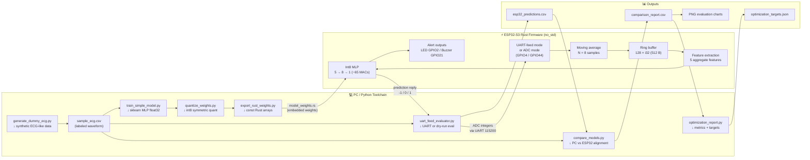

---

## 2. Three-Layer System Overview

PC Layer / Firmware Layer / Hardware Layer.

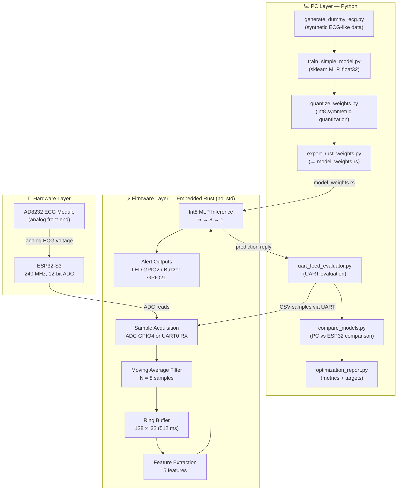

---

## 3. Firmware Data Path

Traces one sample from ADC/UART acquisition to GPIO alert output.

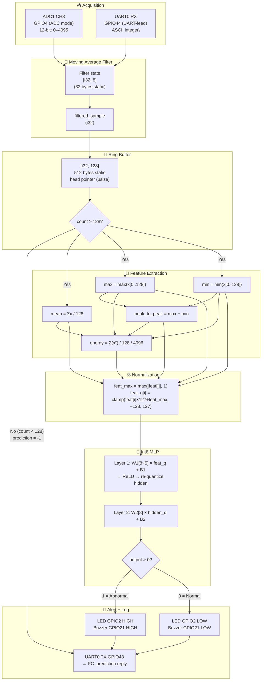

---

## 4. Training → Deployment Pipeline

How a Python model becomes embedded Rust const arrays.

```mermaid
flowchart LR
    subgraph Data["📊 Data Generation"]
        CSV["sample_ecg.csv\n(synthetic ECG-like\nwaveforms + labels)"]
    end

    subgraph Training["🏋️ Training"]
        T1["Feature extraction\n(firmware-compatible)"]
        T2["MLP training\n5→8→1, float32"]
        T3["model.pkl"]
    end

    subgraph Quantization["🔢 Quantization"]
        Q1["quantize_weights.py"]
        Q2["quantized_weights.npz\n(int8 W, i32 B, scale)"]
    end

    subgraph Export["📤 Rust Export"]
        E1["export_rust_weights.py\n(transposes W1)"]
        E2["model_weights.rs\n(const arrays)"]
    end

    subgraph Firmware["⚡ ESP32-S3"]
        F1["cargo build --release"]
        F2["ECG firmware binary\n+ embedded weights"]
    end

    subgraph Evaluation["📈 Evaluation"]
        EV1["uart_feed_evaluator.py"]
        EV2["compare_models.py"]
        EV3["optimization_report.py"]
    end

    CSV --> T1 --> T2 --> T3
    T3 --> Q1 --> Q2
    Q2 --> E1 --> E2
    E2 --> F1 --> F2
    CSV -->|"validation samples"| EV1
    F2 -->|"UART predictions"| EV1
    Q2 -->|"dry-run simulation"| EV1
    EV1 --> EV2 --> EV3
```

---

## 5. Two Evaluation Paths

Dry-run (no hardware) vs hardware UART evaluation.

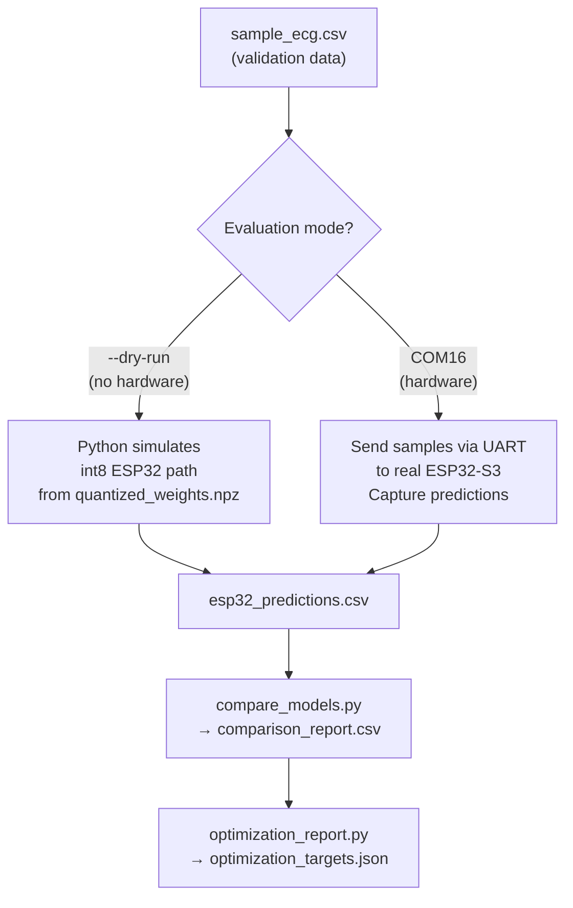

---

## 6. Firmware Boot Sequence

Startup initialization before entering the main sample loop.

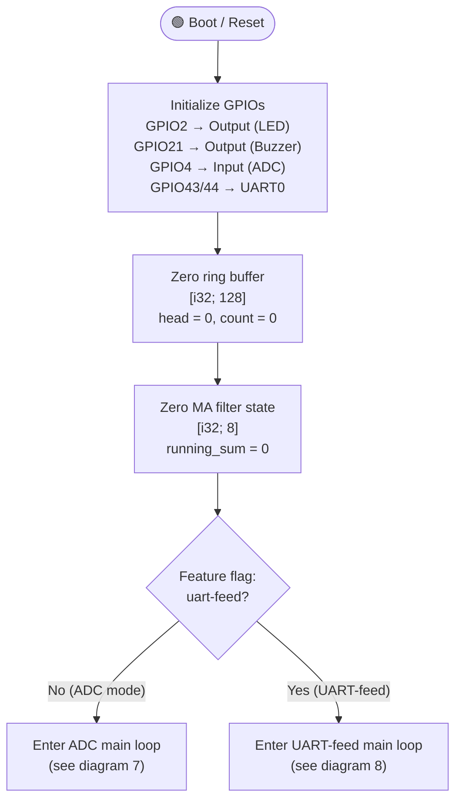

---

## 7. ADC Mode Main Loop

Real-time ECG capture loop at 250 Hz from GPIO4.

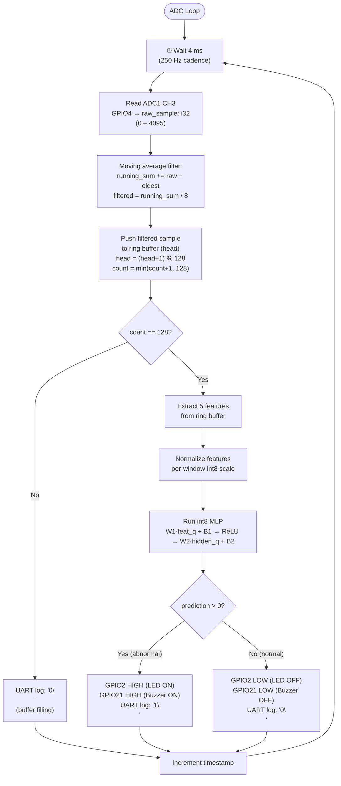

---

## 8. UART-Feed Mode Main Loop

Controlled evaluation loop: receives sample integers from PC via UART.

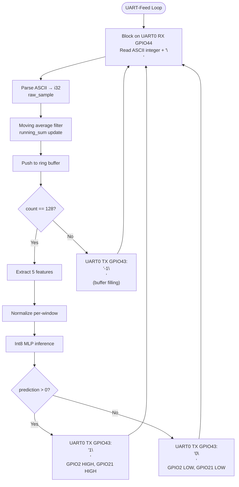

---

## 9. Quantized MLP Inference Pipeline

Complete step-by-step inference from window to prediction.

```mermaid
flowchart LR
    subgraph INPUT["📥 Input"]
        WIN["Ring buffer window\n128 × i32 samples"]
    end

    subgraph FEAT["📐 Feature Extraction"]
        F1["mean = Σx/128"]
        F2["max = max(x)"]
        F3["min = min(x)"]
        F4["p2p = max − min"]
        F5["energy = Σ(x²)/128/4096"]
    end

    subgraph NORM["⚖️ Normalization"]
        N1["feat_max = max(|feat[i]|, 1)"]
        N2["feat_q[i] = clamp(feat[i]×127÷feat_max, −128, 127)"]
    end

    subgraph L1["🧠 Layer 1  W1[8×5] + B1[8]"]
        L1_MAC["accum[j] = Σᵢ(W1[j×5+i] × feat_q[i]) + B1[j]"]
        L1_RELU["hidden[j] = max(accum[j], 0)  ← ReLU"]
        L1_REQT["h_max = max(|hidden[j]|, 1)\nhidden_q[j] = clamp(hidden[j]×127÷h_max, −128, 127)"]
    end

    subgraph L2["🧠 Layer 2  W2[8] + B2[1]"]
        L2_MAC["output = Σⱼ(W2[j] × hidden_q[j]) + B2[0]"]
    end

    subgraph DEC["⚡ Decision"]
        THRESH{"output > 0?"}
        ABN["Prediction = 1\n🔴 Abnormal"]
        NRM["Prediction = 0\n🟢 Normal"]
    end

    WIN --> F1 & F2 & F3
    F2 & F3 --> F4
    F1 & F2 & F3 & F4 --> F5
    F1 & F2 & F3 & F4 & F5 --> N1 --> N2
    N2 --> L1_MAC --> L1_RELU --> L1_REQT
    L1_REQT --> L2_MAC --> THRESH
    THRESH -->|"Yes"| ABN
    THRESH -->|"No"| NRM
```

---

## 10. MLP Neural Network Architecture

5 inputs → 8 hidden ReLU neurons → 1 output logit.

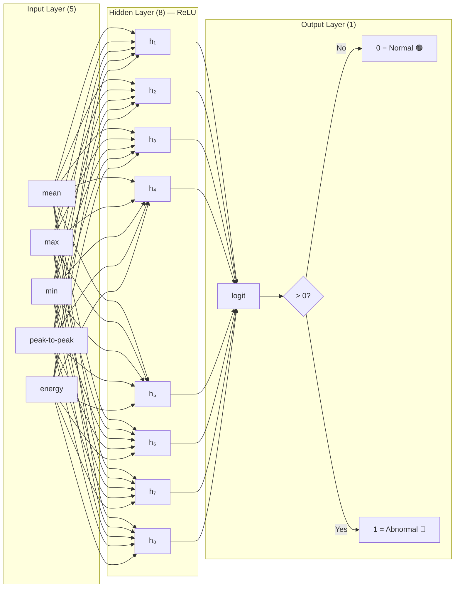

---

## 11. Threshold Classifier Decision Tree

Simple rule-based fallback classifier in `inference.rs`.

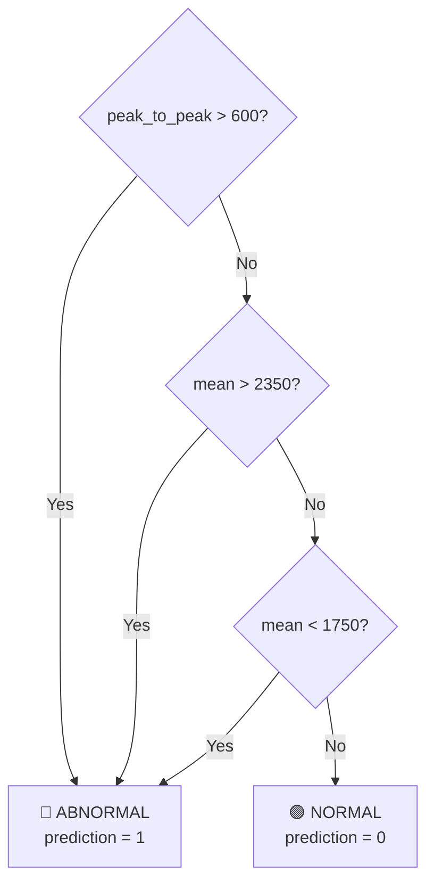

---

## 12. Signal Processing Chain

Raw ADC integer → smoothed → buffered → features → normalized → MLP.

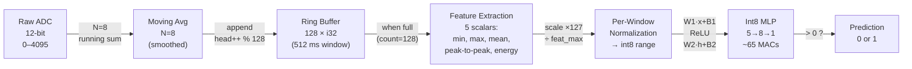

---

## 13. Ring Buffer State Machine

Fill → Ready transitions; sliding window in steady state.

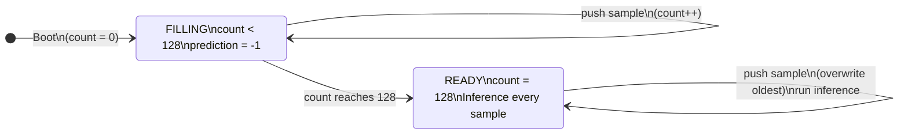

---

## 14. Alert Output State Machine

LED + Buzzer state changes driven by MLP prediction every 4 ms.

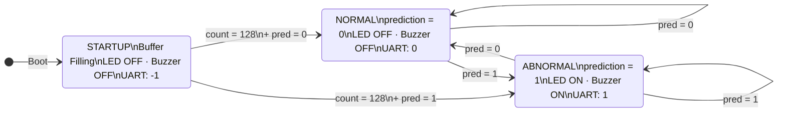

---

## 15. UART-Feed Evaluation Workflow

What `run_uart_eval.bat` does end-to-end.

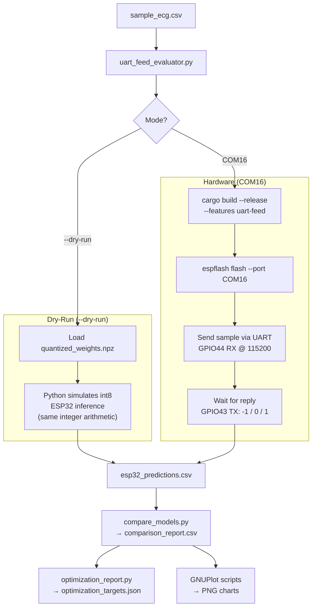

---

## 16. UART Communication Sequence

Full sample → prediction round-trip between PC and ESP32-S3.

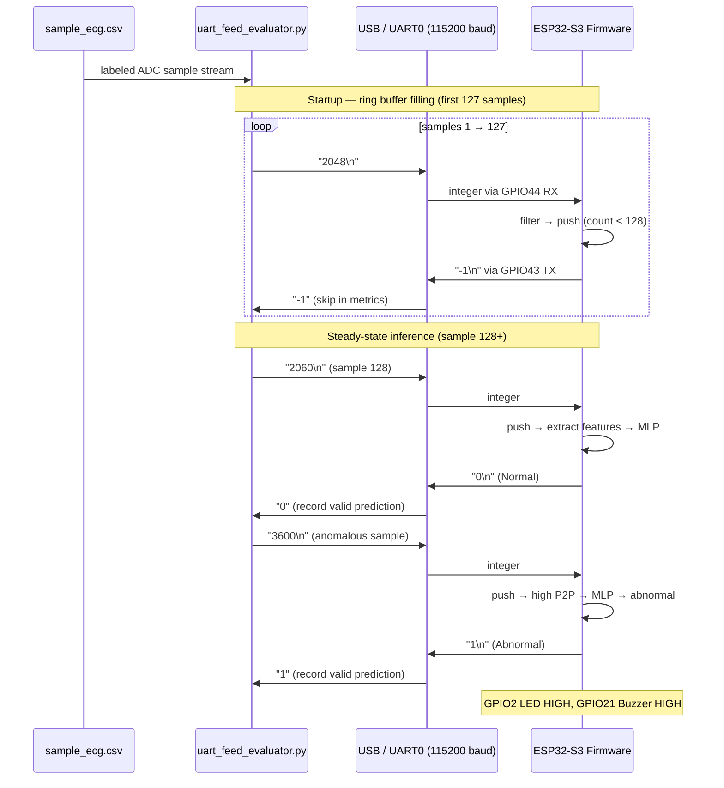

---

## 17. Sampling Timing Diagram

250 Hz sample cadence showing the per-sample work cycle.

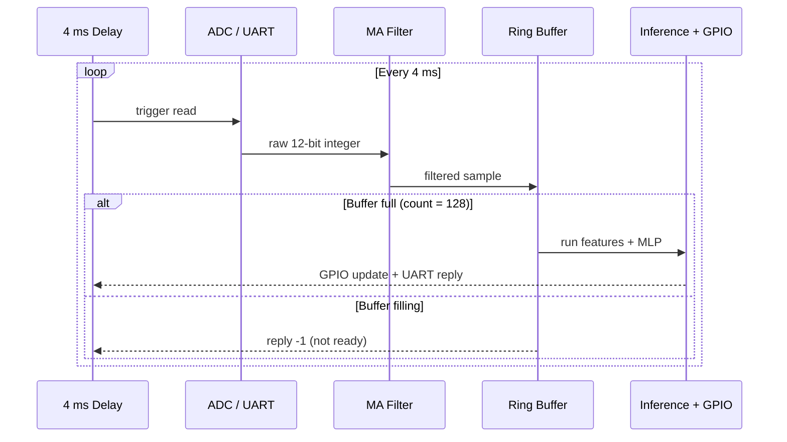

---

## 18. Per-Sample Timing Budget

4 ms = 4000 µs budget per sample. Gantt shows time allocation.

```mermaid
gantt
    title Firmware Timing Budget per 4 ms Sample Period
    dateFormat X
    axisFormat %L µs

    section Always
    ADC read GPIO4           :  0,   50
    Moving average update    :  50,  10

    section After buffer full
    Ring buffer insert       :  60,   5
    Feature extraction (128) :  65,  15
    Feature normalization    :  80,   5
    MLP Layer 1 (40 MACs)   :  85,  30
    MLP Layer 2 (8 MACs)    :  115, 10
    GPIO alert toggle        :  125,  1

    section Optional logging
    UART TX one line         :  126, 1000
```

---

## 19. Alert Latency Timeline

Time from first sample to first valid alert output.

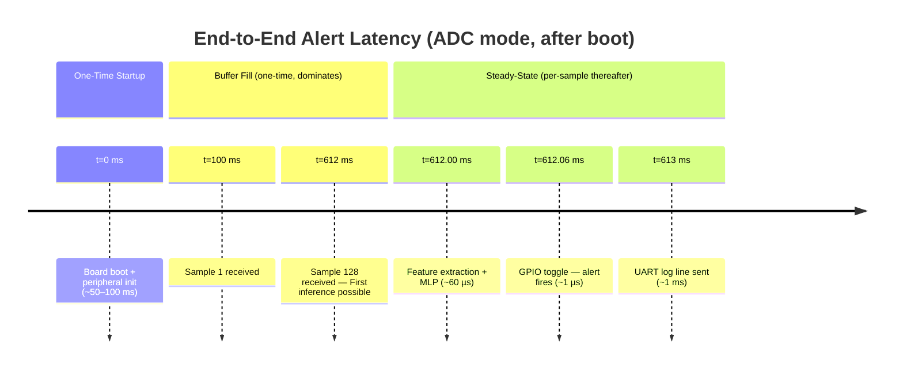

---

## 20. Optimization Improvement History

Representative timeline of model improvement during development.

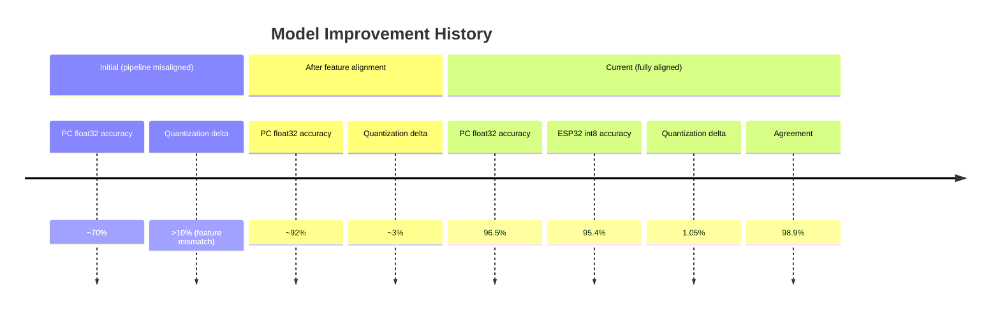

---

## 21. Optimization Decision Tree

What to do based on `compare_models.py` output.

```mermaid
flowchart TD
    START(["Run compare_models.py\n+ optimization_report.py"])

    START --> DELTA{"Quantization\ndelta > 5%?"}
    DELTA -->|"Yes"| FIX_DELTA["Check in order:\n1. extract_firmware_mlp_input_array() matches inference.rs\n2. W1 transposed in export_rust_weights.py?\n3. Dry-run integer math matches Rust?\n4. No scaler in embedded path?"]

    DELTA -->|"No"| ACC{"ESP32 accuracy\n< 85%?"}
    ACC -->|"Yes"| FIX_ACC["Inspect comparison_report.csv\nRetrain with more data\nIncrease max_iter"]

    ACC -->|"No"| AGREE{"Agreement\n< 95%?"}
    AGREE -->|"Yes"| FIX_AGREE["Reflash firmware\nConfirm NPZ matches RS\nCheck baud rate 115200"]

    AGREE -->|"No"| RECALL{"Recall < 0.85?"}
    RECALL -->|"Yes"| FIX_RECALL["Add abnormal patterns\nAugment dataset\nFine-tune with disagreements"]

    RECALL -->|"No"| PREC{"Precision < 0.85?"}
    PREC -->|"Yes"| FIX_PREC["Add noise/normal examples\nFine-tune with disagreements"]

    PREC -->|"No"| OK["✅ All metrics within targets\nNo optimization needed"]

    FIX_DELTA & FIX_ACC & FIX_AGREE & FIX_RECALL & FIX_PREC --> ACTION["Retrain or fine-tune\nthen re-evaluate"]
    ACTION --> START
```

---

## 22. Full Retraining Loop

Complete retrain → quantize → export → eval → hardware cycle.

```mermaid
flowchart TD
    TRIGGER(["Trigger: data / firmware / features changed"])
    GEN["py generate_dummy_ecg.py"]
    TRAIN["py train_simple_model.py\n→ model.pkl"]
    QUANT["py quantize_weights.py\n→ quantized_weights.npz"]
    EXPORT["py export_rust_weights.py\n→ model_weights.rs"]
    DRYRUN["run_uart_eval.bat --dry-run\n→ comparison_report.csv"]
    CHECK{"Metrics within\ntargets?\nacc > 90%, delta < 3%"}
    KEEP["✅ Keep model\nCommit model_weights.rs"]
    FLASH["Flash to hardware\nrun_uart_eval.bat COM16"]
    HW_CHECK{"Hardware metrics\nmatch dry-run?"}
    DONE(["✅ Done"])
    INSPECT["Inspect disagreements\ncomparison_report.csv"]
    FINETUNE["py fine_tune_model.py\n--extra-data disagreements.csv\n--augment-factor 5"]
    ROLLBACK["⚠️ Rollback: keep old model.pkl"]

    TRIGGER --> GEN --> TRAIN --> QUANT --> EXPORT --> DRYRUN --> CHECK
    CHECK -->|"Yes"| KEEP --> FLASH --> HW_CHECK
    HW_CHECK -->|"Yes"| DONE
    HW_CHECK -->|"No"| INSPECT
    CHECK -->|"No"| INSPECT
    INSPECT --> FINETUNE
    FINETUNE -->|"improved"| QUANT
    FINETUNE -->|"not improved"| ROLLBACK --> INSPECT
```

---

## 23. Fine-Tuning Safety Flow

`fine_tune_model.py` keeps the old model if fine-tuning makes things worse.

```mermaid
flowchart TD
    LOAD["Load model.pkl\n+ disagreements.csv"]
    AUGMENT["Augment disagreement samples\n× augment_factor (default 5)"]
    TRAIN["Continue training\nfrom existing weights"]
    EVAL_NEW["Evaluate fine-tuned model\non full validation set"]
    EVAL_OLD["Evaluate original model\non full validation set"]
    COMPARE{"Fine-tuned model\nbetter than original?"}
    KEEP_NEW["✅ Save fine-tuned\nmodel as model.pkl"]
    KEEP_OLD["⚠️ Keep original model.pkl\nLog: fine-tune did not improve"]
    NEXT["→ quantize_weights.py\n→ export_rust_weights.py"]

    LOAD --> AUGMENT --> TRAIN --> EVAL_NEW
    LOAD --> EVAL_OLD
    EVAL_NEW & EVAL_OLD --> COMPARE
    COMPARE -->|"Yes"| KEEP_NEW --> NEXT
    COMPARE -->|"No"| KEEP_OLD
```

---

## 24. Architecture Change Checklist

Files that must be updated together when changing MLP architecture.

```mermaid
flowchart LR
    PLAN["Decide new architecture\ne.g. 5→16→1"]
    PY["Update train_simple_model.py\nhidden_layer_sizes=(16,)"]
    EXPORT["Update export_rust_weights.py\nnew array shapes"]
    RS["Update inference.rs\nnew loop bounds + const sizes"]
    DRYRUN["Update uart_feed_evaluator.py\ndry-run simulation to match"]
    TEST["Retrain → quantize → export\n→ dry-run\nVerify delta < 3%"]

    PLAN --> PY --> EXPORT --> RS --> DRYRUN --> TEST
```

---

## 25. Component Dependency Graph

Script execution order and file dependencies.

```mermaid
graph TD
    GEN["generate_dummy_ecg.py"] -->|"writes"| CSV["sample_ecg.csv"]
    CSV -->|"reads"| TRAIN["train_simple_model.py"]
    TRAIN -->|"writes"| PKL["model.pkl"]
    PKL -->|"reads"| QUANT["quantize_weights.py"]
    QUANT -->|"writes"| NPZ["quantized_weights.npz"]
    NPZ -->|"reads"| EXPORT["export_rust_weights.py"]
    EXPORT -->|"writes"| RS["model_weights.rs"]
    RS -->|"compiled into"| FW["ESP32-S3 Firmware"]

    CSV -->|"reads"| EVAL["uart_feed_evaluator.py"]
    NPZ -->|"dry-run reads"| EVAL
    FW -->|"hardware UART"| EVAL
    EVAL -->|"writes"| PRED["esp32_predictions.csv"]

    PRED -->|"reads"| COMP["compare_models.py"]
    CSV -->|"reads"| COMP
    COMP -->|"writes"| REPORT["comparison_report.csv"]
    REPORT -->|"reads"| OPT["optimization_report.py"]
    OPT -->|"writes"| JSON["optimization_targets.json"]
    REPORT -->|"reads"| PLOT["GNUPlot scripts"]
    PLOT -->|"writes"| PNG["*.png charts"]
```

---

## 26. Memory Layout

Static memory map of the ESP32-S3 firmware at runtime.

```mermaid
block-beta
    columns 3

    block:FLASH["🗃️ Flash (SPI NOR)"]:1
        fw["Firmware binary\n(Rust .text + .rodata)\n~200–400 KB"]
        weights["model_weights.rs\nconst int8 arrays\n~84 bytes weights\n+ 16 bytes metadata"]
        boot["ESP-IDF Bootloader\n+ Partition table"]
    end

    block:RAM["🧠 SRAM (512 KB total)"]:1
        ring["Ring buffer\n[i32; 128]\n512 bytes"]
        filt["MA filter state\n[i32; 8]\n32 bytes"]
        stack["Stack + locals\n~2–4 KB"]
        free["Free SRAM\n~508 KB\n(99%+ headroom)"]
    end

    block:PC["💻 PC Artifacts"]:1
        model["model.pkl\n(float32 sklearn)"]
        npz["quantized_weights.npz\n(int8 W, i32 B, scale)"]
        reports["CSV / JSON reports"]
        images["PNG evaluation charts"]
    end
```

---

## 27. ECG Signal Flow (Electrodes → Alert)

Complete physical signal path from body to GPIO output.

```mermaid
flowchart TD
    subgraph Body["👤 Body Electrodes"]
        RA["RA — Right Arm"]
        LA["LA — Left Arm"]
        RL["RL — Right Leg (GND ref)"]
    end

    subgraph AD8232["🔬 AD8232 Analog Front-End"]
        IA["Instrumentation Amplifier\n(high CMRR, rejects common-mode)"]
        RLD_DRV["RLD Driver\n(noise reduction)"]
        HPF["High-Pass Filter\n~0.5 Hz cutoff\n(removes DC baseline wander)"]
        LPF["Low-Pass Filter\n~40 Hz cutoff\n(removes EMI / HF noise)"]
        OUT_PIN["OUTPUT pin\n≈1.65 V ± ECG swing\n(0–3.3 V range)"]
    end

    subgraph ESP32["⚡ ESP32-S3"]
        GPIO4["GPIO4 ADC1\n12-bit 0–4095"]
        DSP["MA Filter → Ring Buffer\n→ Feature Extraction\n→ Int8 MLP"]
        PRED_OUT{"Prediction\n0 or 1"}
    end

    subgraph Outputs["🔔 Alert Outputs"]
        LED["LED\nGPIO2"]
        BUZ["Active Buzzer\nGPIO21"]
        LOG["UART TX\nGPIO43"]
    end

    RA --> IA
    LA --> IA
    RL --> RLD_DRV --> IA
    IA --> HPF --> LPF --> OUT_PIN
    OUT_PIN -->|"analog voltage\n0–3.3 V"| GPIO4
    GPIO4 --> DSP --> PRED_OUT
    PRED_OUT -->|"abnormal"| LED & BUZ
    PRED_OUT --> LOG
```

---

## 28. AD8232 Wiring Diagram

Physical connections between AD8232 module and ESP32-S3 DevKit.

```mermaid
graph LR
    subgraph AD8232["AD8232 Module"]
        AD_VCC["VCC"]
        AD_GND["GND"]
        AD_OUT["OUTPUT"]
        AD_LOP["LO+"]
        AD_LOM["LO-"]
        AD_SDN["SDN"]
        AD_INP["IN+"]
        AD_INM["IN-"]
        AD_RLD["RLD"]
    end

    subgraph ESP32["ESP32-S3 DevKit"]
        E_3V3["3V3"]
        E_GND["GND"]
        E_G4["GPIO4\n(ADC1 CH3)"]
    end

    subgraph Electrodes["Body Electrodes"]
        EL_RA["RA (Right Arm)"]
        EL_LA["LA (Left Arm)"]
        EL_RL["RL (Right Leg)"]
    end

    AD_VCC -->|"🔴 3.3 V supply"| E_3V3
    AD_GND -->|"⚫ common GND"| E_GND
    AD_OUT -->|"🟡 analog ECG\n0–3.3 V"| E_G4

    EL_RA --> AD_INP
    EL_LA --> AD_INM
    EL_RL --> AD_RLD

    AD_LOP -.->|"NC — future\nlead-off detect"| NC1(("NC"))
    AD_LOM -.->|"NC — future\nlead-off detect"| NC2(("NC"))
    AD_SDN -.->|"NC — stays active"| NC3(("NC"))
```

---

## 29. Buzzer Driver Circuit

NPN transistor driver for active buzzers drawing > 5 mA.

```mermaid
graph TD
    GPIO21["GPIO21\nESP32-S3\n(control signal)"]
    R1K["1 kΩ\nBase resistor\n(limits base current ~3 mA)"]
    NPN["NPN Transistor\n2N2222 / BC547\n(switches buzzer current)"]
    V33["3.3 V\nPower rail"]
    BUZ["🔊 Active Buzzer\n(15–30 mA typical)"]
    GND["GND"]

    GPIO21 -->|"0 V / 3.3 V"| R1K
    R1K -->|"Base"| NPN
    V33 -->|"+"| BUZ
    BUZ -->|"−"| NPN
    NPN -->|"Emitter"| GND
```

---

## 30. Power Supply Chain

USB 5 V → onboard LDO → 3.3 V → peripherals.

```mermaid
flowchart LR
    USB5V["USB 5 V\n(Host PC or charger)"]
    LDO["ESP32-S3\nOnboard LDO\n3.3 V / ~500 mA"]
    AD8232_P["AD8232\n~3–5 mA"]
    LED_P["LED circuit\n~5 mA"]
    BUZ_P["Buzzer\n~20–30 mA\n(via NPN transistor)"]
    CORE["ESP32-S3 core\n~100–150 mA active"]

    USB5V -->|"via USB cable"| LDO
    LDO --> AD8232_P
    LDO --> LED_P
    LDO --> BUZ_P
    LDO --> CORE
```

---

## 31. UART Edge Case Handling

How the firmware handles malformed or out-of-range UART input.

```mermaid
flowchart TD
    RX["Received bytes\non UART0 RX GPIO44"]
    PARSE{"Parseable\nas i32?"}
    VALID{"Value in\n0 – 4095?"}
    PROCESS["Process sample normally\nthrough filter → buffer → inference"]
    CLAMP["Clamp to 0 – 4095\nlog warning"]
    ERROR["Discard line\nlog parse error\nwait for next line"]

    RX --> PARSE
    PARSE -->|"Yes"| VALID
    PARSE -->|"No (non-numeric)"| ERROR
    VALID -->|"Yes"| PROCESS
    VALID -->|"No (e.g. -999, 9999)"| CLAMP --> PROCESS
```

---

## 32. Failure Diagnosis Flowchart

Systematic debugging when evaluation metrics are out of target.

```mermaid
flowchart TD
    START["Evaluation problem detected"]

    START --> T1{"Cannot open\nCOM port?"}
    START --> T2{"Mostly -1\npredictions?"}
    START --> T3{"UART timeout\nor no reply?"}
    START --> T4{"PC and ESP32\nheavily disagree?"}
    START --> T5{"ADC reads 0\nor 4095?"}

    T1 -->|"Yes"| F1["Close all serial apps:\nSerial Monitor, PuTTY,\nespflash monitor\nThen retry"]

    T2 -->|"Yes"| F2["Count of -1 >> 127?\nFirmware in ADC mode\n→ Reflash with\n--features uart-feed"]

    T3 -->|"Yes"| F3["1. Correct COM port?\n2. Firmware flashed?\n3. Board not in reset?\n4. Baud = 115200?"]

    T4 -->|"Yes"| F4["Pipeline mismatch:\n1. W1 transposed in export?\n2. Per-window norm identical?\n3. Energy ÷4096 both sides?\n4. model_weights.rs current?"]

    T5 -->|"Yes"| F5["ADC = 0: no signal\n→ check AD8232 power\nADC = 4095: floating input\n→ check common ground"]
```

---

*Document version: 2026-06-17 | Project: RT-QTinyECG-ESP32-Rust | Firmware target: ESP32-S3 Embedded Rust (no_std)*

---

> **Cross-references:**
> - [`algorithm.md`](algorithm.md) — detailed algorithm descriptions for diagrams 3, 9, 10, 11, 12
> - [`block_diagram.md`](block_diagram.md) — system architecture for diagrams 1, 2, 25, 26
> - [`flowchart.md`](flowchart.md) — control flow for diagrams 6, 7, 8, 13, 14, 31
> - [`uart_feed_evaluation.md`](uart_feed_evaluation.md) — evaluation workflow for diagrams 15, 16, 17
> - [`real_time_design.md`](real_time_design.md) — timing rationale for diagrams 18, 19
> - [`optimization_guide.md`](optimization_guide.md) — optimization for diagrams 20, 21, 22, 23, 24
> - [`evaluation_metrics.md`](evaluation_metrics.md) — metrics for diagram 32
> - [`wiring_esp32_ad8232.md`](wiring_esp32_ad8232.md) — hardware for diagrams 27, 28, 29, 30
