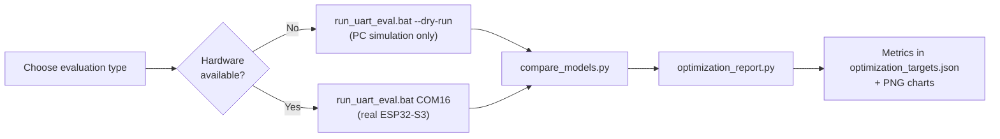
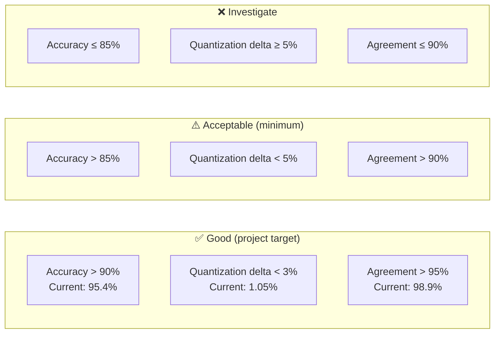
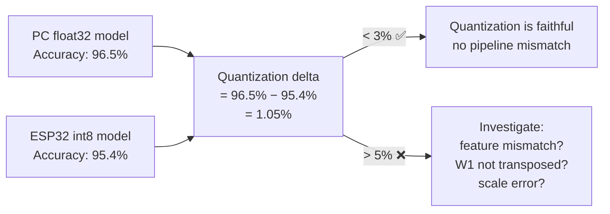
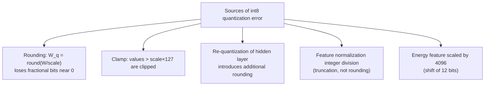
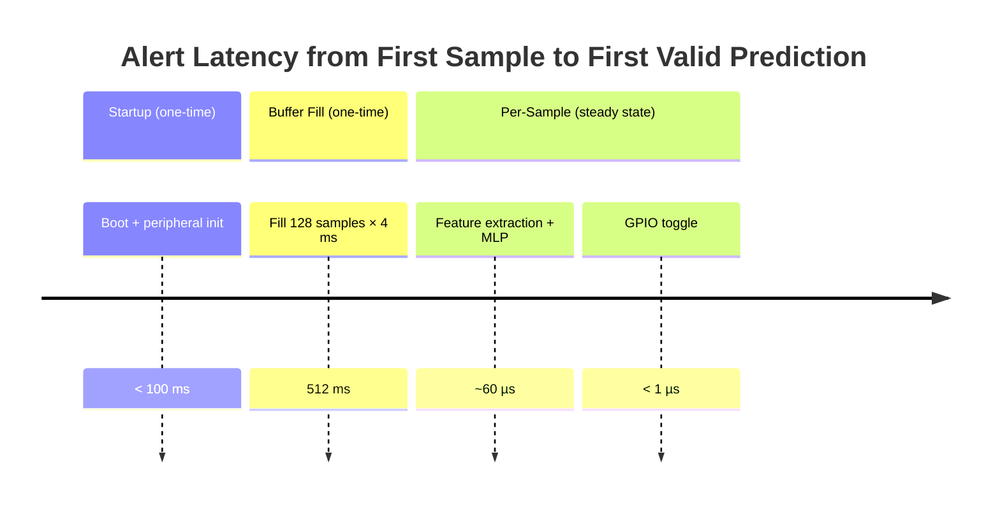
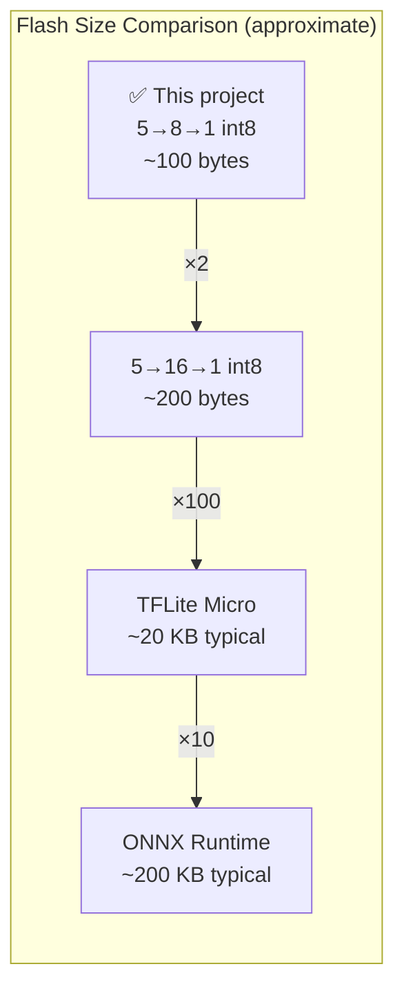
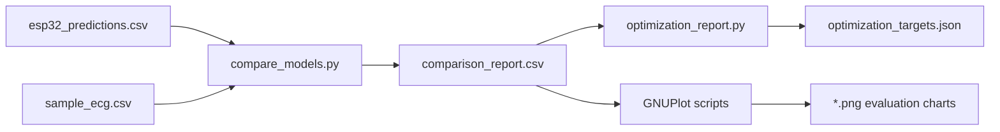
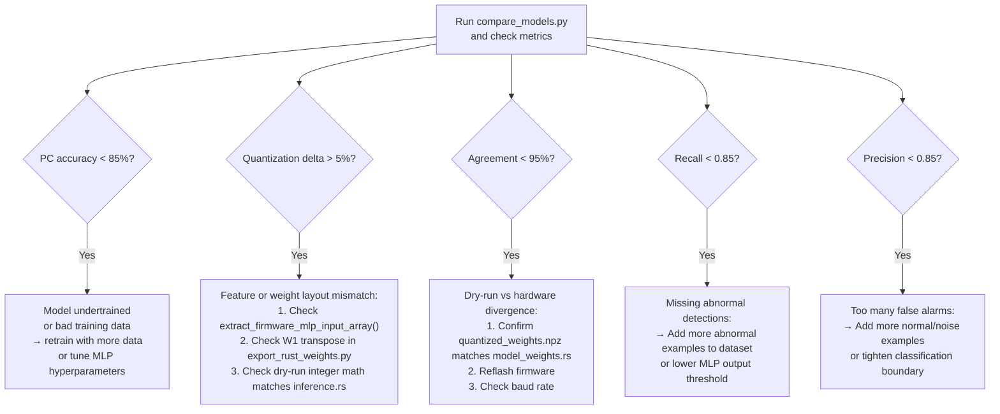

# Evaluation Metrics Guide

This document explains every metric used to evaluate RT-QTinyECG-ESP32-Rust — covering classification correctness, quantization fidelity, real-time timing, and model size.

---

## Table of Contents

1. [Quick Results Summary](#1-quick-results-summary)
2. [Running Evaluations](#2-running-evaluations)
3. [Classification Metrics](#3-classification-metrics)
4. [Quantization Fidelity Metrics](#4-quantization-fidelity-metrics)
5. [Real-Time Metrics](#5-real-time-metrics)
6. [Model Size Metrics](#6-model-size-metrics)
7. [Reports and Artifacts](#7-reports-and-artifacts)
8. [Interpreting Failures](#8-interpreting-failures)

---

## 1. Quick Results Summary

### Current Dry-Run Baseline

| Metric | PC float32 | ESP32 / int8 dry-run | Target (Good) | Target (Acceptable) |
|---|:---:|:---:|:---:|:---:|
| Accuracy | **96.5%** | **95.4%** | > 90% | > 85% |
| Precision | 1.000 | 1.000 | > 0.90 | > 0.85 |
| Recall | 0.917 | 0.892 | > 0.90 | > 0.85 |
| F1-score | 0.957 | 0.943 | > 0.90 | > 0.85 |
| Quantization delta | — | **1.05%** | < 3% | < 5% |
| Agreement | — | **98.9%** | > 95% | > 90% |
| Disagreements | — | 25 / 2373 | — | — |

> [!CAUTION]
> These metrics are from **synthetic ECG-like data** only. They verify pipeline correctness, not clinical performance.

### Visual Metric Comparison

```mermaid
xychart-beta
    title "Classification Metrics: PC float32 vs ESP32 int8"
    x-axis ["Accuracy", "Precision", "Recall", "F1"]
    y-axis "Score" 0.85 --> 1.05
    bar [0.965, 1.000, 0.917, 0.957]
    bar [0.954, 1.000, 0.892, 0.943]
```



---

## 2. Running Evaluations

### Command Overview



### Individual Commands

**Dry-run evaluation (no hardware needed):**
```bat
cd /d D:\PropertiesProject-D\Kuliah\Pemkon\Product
run_uart_eval.bat --dry-run
```

**Hardware evaluation (ESP32-S3 required):**
```bat
run_uart_eval.bat COM16
```

**Regenerate comparison metrics only (after existing predictions):**
```bat
py python\compare_models.py
py python\optimization_report.py
```

**Regenerate charts:**
```bat
run_all_plots.bat
```

---

## 3. Classification Metrics

### 3.1 Confusion Matrix

All classification metrics derive from the confusion matrix:

```text
                     Predicted NORMAL    Predicted ABNORMAL
Actual NORMAL              TN  ✅               FP  ❌
Actual ABNORMAL            FN  ❌               TP  ✅
```

| Cell | Name | Meaning |
|:---:|---|---|
| **TN** | True Negative | Normal correctly classified as Normal |
| **TP** | True Positive | Abnormal correctly classified as Abnormal |
| **FP** | False Positive | Normal incorrectly classified as Abnormal (false alarm) |
| **FN** | False Negative | Abnormal incorrectly classified as Normal (missed detection) |

### 3.2 Metric Definitions

| Metric | Formula | Interpretation |
|---|---|---|
| **Accuracy** | `(TP + TN) / total` | Overall correctness across all samples |
| **Precision** | `TP / (TP + FP)` | When the model says "abnormal", how often is it right? |
| **Recall (Sensitivity)** | `TP / (TP + FN)` | Of all actual abnormal samples, how many were detected? |
| **F1-score** | `2 × Precision × Recall / (Precision + Recall)` | Harmonic mean; balances precision and recall |
| **Agreement** | `count(PC pred == ESP32 pred) / total valid` | How aligned are PC float32 and ESP32 int8? |
| **Quantization delta** | `PC accuracy − ESP32 accuracy` | Accuracy lost during int8 quantization |

### 3.3 Precision vs Recall Tradeoff

```mermaid
quadrantChart
    title Precision vs Recall Quadrants
    x-axis "Low Recall" --> "High Recall"
    y-axis "Low Precision" --> "High Precision"
    quadrant-1 Ideal detect all no false alarms
    quadrant-2 Conservative few false alarms misses some
    quadrant-3 Unreliable misses and false alarms
    quadrant-4 Aggressive catches all many false alarms
    PC float32: [0.917, 1.000]
    ESP32 int8: [0.892, 1.000]
```

> [!NOTE]
> Current models fall in **quadrant 2** (conservative): Precision = 1.0 (no false alarms), Recall < 1.0 (some abnormal samples missed). For educational purposes this is acceptable.

### 3.4 Metric Targets



---

## 4. Quantization Fidelity Metrics

### 4.1 What Quantization Delta Measures



### 4.2 Agreement Analysis

Agreement is computed per-sample:

```text
agreement_rate = count( pc_pred[i] == esp32_pred[i] ) / count( esp32_pred[i] != -1 )
```

**Current: 98.9% agreement** = 25 disagreements in 2373 valid predictions.

Disagreement breakdown patterns:

| Pattern | Likely cause |
|---|---|
| `PC=Normal, ESP32=Abnormal` | ESP32 over-detecting; int8 rounding error in Layer 1? |
| `PC=Abnormal, ESP32=Normal` | ESP32 under-detecting; check W1 transposition |
| Random across all samples | Floating-point vs int8 rounding near decision boundary |
| Clustered in specific windows | Feature extraction mismatch in that range |

### 4.3 Quantization Error Sources



---

## 5. Real-Time Metrics

### 5.1 Timing Budget Overview

```mermaid
gantt
    title Firmware Timing Budget per 4 ms Sample Period
    dateFormat X
    axisFormat %L ms

    section ADC Sample
    ADC read (GPIO4)        : 0, 1
    Moving average filter   : 1, 1

    section Inference (after buffer full)
    Feature extraction      : 2, 1
    Normalization           : 3, 1
    MLP Layer 1             : 3, 1
    MLP Layer 2             : 3, 1

    section Output
    GPIO toggle             : 4, 1
    UART TX (if logging)    : 4, 3
```



> [!WARNING]
> UART logging at 115200 baud can take **1–3 ms per line**, which may exceed the 4 ms sampling period if logging every sample. Use `log every Nth sample` or increase baud rate for dense logging.

### 5.2 Sampling Interval Metrics

| Metric | Target | Notes |
|---|:---:|---|
| Mean sample interval | **4.0 ms** | = 1000 ms / 250 Hz |
| Interval std deviation | < 0.2 ms | Delay-based loop; varies with UART activity |
| Coefficient of variation | < 5% | CV = std / mean |

> [!TIP]
> For production-quality timing, replace the delay-based loop with an ESP32-S3 hardware timer (LEDC or GPTimer) and use a double buffer or DMA for UART output.

### 5.3 Inference Time Breakdown

| Stage | Estimated Time |
|---|---:|
| Feature extraction (128-sample scan) | ~5–15 µs |
| Feature normalization | < 1 µs |
| MLP Layer 1 (40 MACs + ReLU) | ~10–30 µs |
| MLP Layer 2 (8 MACs) | ~2–5 µs |
| GPIO toggle | < 1 µs |
| **Total inference** | **~20–60 µs** |
| **Available budget** | **4000 µs** |
| **Headroom** | **> 98%** |

### 5.4 Alert Latency Components



**Total first-alert latency: ≈ 512 ms + boot time**

The dominant latency is the **initial window fill**, not the MLP computation. Reducing the window from 128 to 64 samples halves this delay but reduces classification context.

---

## 6. Model Size Metrics

### 6.1 Weight Layout and Sizes

| Array | Shape | Type | Bytes |
|---|---|---|---:|
| `W1` (Layer 1 weights) | `[8 × 5]` | `i8` | 40 |
| `B1` (Layer 1 biases) | `[8]` | `i32` | 32 |
| `W2` (Layer 2 weights) | `[1 × 8]` | `i8` | 8 |
| `B2` (Layer 2 bias) | `[1]` | `i32` | 4 |
| Scale metadata | 4 × f32 | `f32` | 16 |
| **Total** | | | **100 bytes** |

> [!NOTE]
> `optimization_report.py` reports **116 bytes** because it sums `.npz` arrays including NumPy scalar storage overhead for metadata scalars. The actual firmware const arrays total **84 bytes** (weights + biases only, without scale metadata stored in flash).

### 6.2 Model Size Comparison



The int8 MLP at ~100 bytes is extraordinarily small — suitable for microcontrollers with as little as 8 KB flash.

---

## 7. Reports and Artifacts

### 7.1 Output File Reference

| File | Generated By | Key Contents |
|---|---|---|
| `data/esp32_predictions.csv` | `uart_feed_evaluator.py` | sample_idx, adc, gt_label, pc_pred, esp32_pred |
| `data/comparison_report.csv` | `compare_models.py` | TP, TN, FP, FN per sample, agreement flag |
| `data/optimization_targets.json` | `optimization_report.py` | Accuracy, F1, delta, agreement, tuning suggestions |
| `data/plots/*.csv` | GNUPlot prep scripts | Chart-ready data |
| `images/evaluation/*.png` | GNUPlot scripts | Confusion matrix, ROC, metric bar charts |
| `images/model_esp32/*.png` | GNUPlot scripts | ESP32/int8 specific charts |

### 7.2 Report Flow



---

## 8. Interpreting Failures

### 8.1 Failure Diagnosis Flowchart



### 8.2 Symptom Quick Reference

| Symptom | Likely Cause | First Step |
|---|---|---|
| PC accuracy good, ESP32 bad | Feature or weight layout mismatch | Check W1 transposition and per-window normalization |
| Both accuracies low | Bad training data or undertrained model | Retrain with `max_iter=2000`, check CSV labels |
| Quantization delta > 5% | Inference integer math divergence | Compare `quantize_weights.py` simulation vs `inference.rs` step by step |
| Many `PC=Normal, ESP32=Abnormal` | int8 over-sensitivity, rounding near boundary | Check B1/B2 quantization; inspect disagreements CSV |
| Many `PC=Abnormal, ESP32=Normal` | int8 under-sensitivity | Check energy feature scale (÷4096 applied correctly?) |
| UART timeouts | Wrong port, monitor open, wrong baud | Close Serial Monitor; check Device Manager |
| Mostly `-1` predictions | Buffer not filling (firmware not in UART-feed mode) | Flash with `--features uart-feed` |

---

*Document version: 2026-06-17 | Firmware target: ESP32-S3 Embedded Rust (no_std)*
