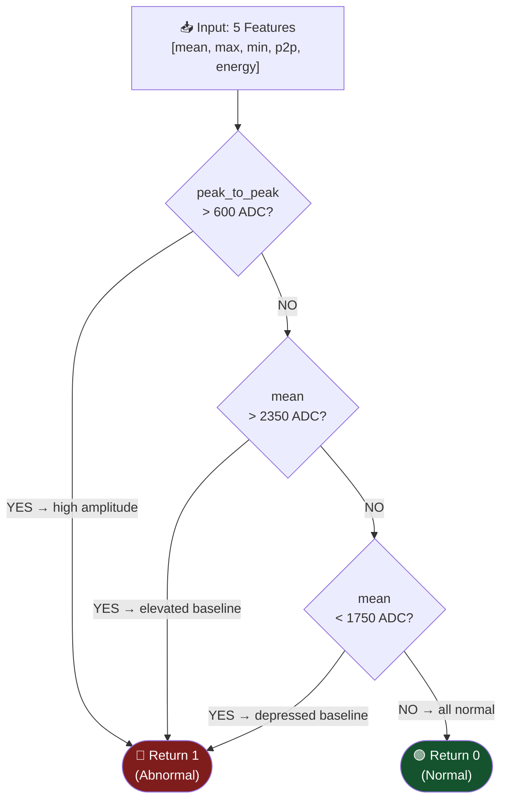
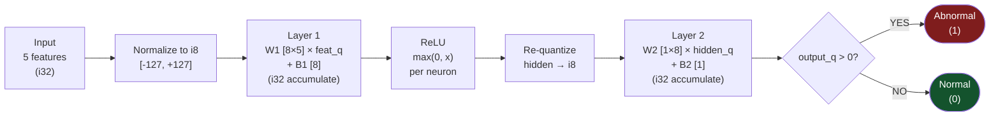
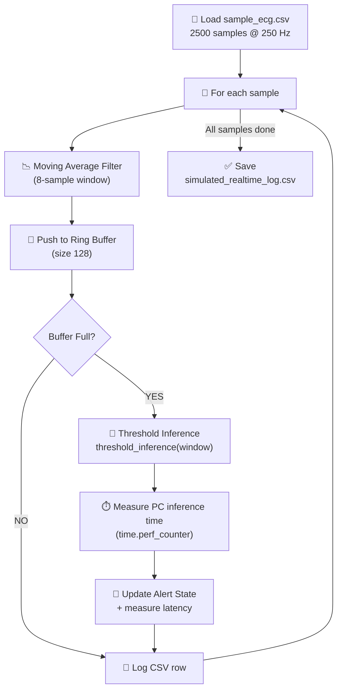

# Firmware Flowchart

This document shows the control flow of the ESP32 Rust firmware.

---

## Main Firmware Loop Flowchart

```mermaid
flowchart TD
    Start(["🚀 Start\n(Power On / Reset)"])
    Init["⚙️ Initialize ESP32 Peripherals\n- ClockControl (240 MHz)\n- GPIO (LED GPIO2, Buzzer GPIO25)\n- ADC1 (GPIO34, 11dB atten.)\n- UART0 (115200 baud)"]
    Header["📡 Print CSV Header\ntime_ms,adc_value,filtered_value,..."]
    Wait["⏱️ Wait Sampling Interval\n4 ms (delay_micros 4000)"]
    ReadADC["🔌 Read ECG ADC\nGPIO34 → 0–4095"]
    LeadOff{"🔍 Lead-off\nDetected?\n(LO+ or LO- HIGH)"}
    ReturnZero["ADC = 0\n(invalid data)"]
    Filter["📉 Moving Average Filter\npush_and_average(adc_raw)"]
    PushBuf["🔄 Push into Ring Buffer\nring_buf.push(filtered)"]
    IsFull{"📊 Ring Buffer\nFull?\n(128 samples)"}
    ExtractFeat["🧮 Extract Features\n- mean\n- max, min\n- peak_to_peak\n- energy"]
    RunInfer["🤖 Run Inference\n(Threshold or MLP)"]
    MeasureTime["⏱️ Record Inference Time\n(CCOUNT cycles → µs)"]
    IsAbnormal{"⚖️ Prediction\n== 1 (Abnormal)?"}
    AlertON["🔴 Alert ON\nLED GPIO2 HIGH\nBuzzer GPIO25 HIGH"]
    AlertOFF["🟢 Alert OFF\nLED GPIO2 LOW\nBuzzer GPIO25 LOW"]
    MeasureLatency["📏 Measure Alert Latency\n(detection → GPIO toggle)"]
    LogCSV["📡 Log CSV Line\nUART0 at 115200 baud\ntime_ms,adc,..."]
    IncTime["🕐 Increment timestamp\n+= 4 ms"]
    Loop(["🔁 Repeat"])

    Start --> Init
    Init --> Header
    Header --> Wait
    Wait --> ReadADC
    ReadADC --> LeadOff
    LeadOff -->|"YES"| ReturnZero
    LeadOff -->|"NO"| Filter
    ReturnZero --> Filter
    Filter --> PushBuf
    PushBuf --> IsFull
    IsFull -->|"NO (buffer filling)"| LogCSV
    IsFull -->|"YES (run inference)"| ExtractFeat
    ExtractFeat --> RunInfer
    RunInfer --> MeasureTime
    MeasureTime --> IsAbnormal
    IsAbnormal -->|"YES"| AlertON
    IsAbnormal -->|"NO"| AlertOFF
    AlertON --> MeasureLatency
    AlertOFF --> LogCSV
    MeasureLatency --> LogCSV
    LogCSV --> IncTime
    IncTime --> Loop
    Loop --> Wait

    style Start fill:#2d6a4f,color:#fff
    style Loop fill:#2d6a4f,color:#fff
    style AlertON fill:#7f1d1d,color:#fff
    style AlertOFF fill:#14532d,color:#fff
    style IsAbnormal fill:#92400e,color:#fff
    style IsFull fill:#1e3a5f,color:#fff
    style LeadOff fill:#4c1d95,color:#fff
```

---

## Inference Decision Flowchart (Mode A: Threshold)

---

## Inference Decision Flowchart (Mode B: Quantized MLP)

---

## Python Simulator Flowchart

