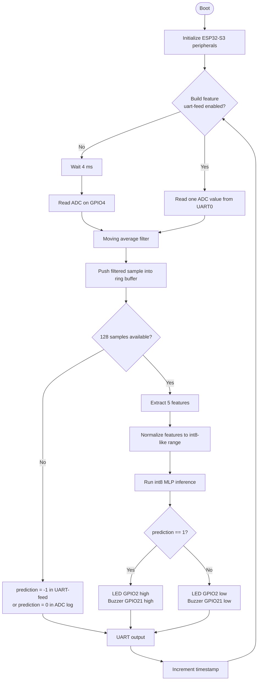
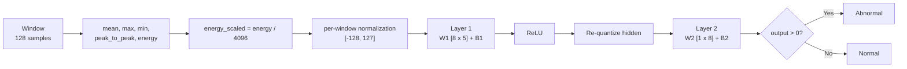
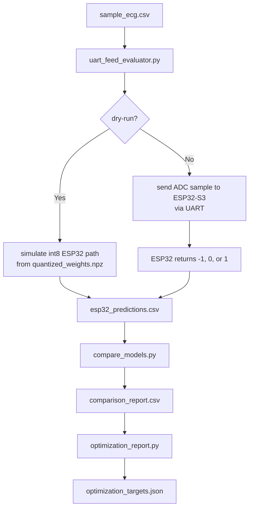
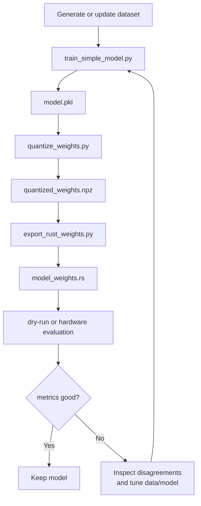

# Firmware and Evaluation Flowcharts

## Firmware Main Loop

```mermaid
flowchart TD
    Start(["Boot"]) --> Init["Initialize ESP32-S3 peripherals"]
    Init --> Mode{"Build feature\nuart-feed enabled?"}

    Mode -->|"No"| Delay["Wait 4 ms"]
    Delay --> ADC["Read ADC on GPIO4"]

    Mode -->|"Yes"| UART["Read one ADC value from UART0"]

    ADC --> Filter["Moving average filter"]
    UART --> Filter
    Filter --> Buffer["Push filtered sample into ring buffer"]
    Buffer --> Full{"128 samples available?"}

    Full -->|"No"| NotReady["prediction = -1 in UART-feed\nor prediction = 0 in ADC log"]
    Full -->|"Yes"| Features["Extract 5 features"]
    Features --> Normalize["Normalize features to int8-like range"]
    Normalize --> Infer["Run int8 MLP inference"]
    Infer --> Decision{"prediction == 1?"}

    Decision -->|"Yes"| AlertOn["LED GPIO2 high\nBuzzer GPIO21 high"]
    Decision -->|"No"| AlertOff["LED GPIO2 low\nBuzzer GPIO21 low"]

    NotReady --> Output["UART output"]
    AlertOn --> Output
    AlertOff --> Output
    Output --> Time["Increment timestamp"]
    Time --> Mode
```

## Quantized MLP Flow

```mermaid
flowchart LR
    A["Window\n128 samples"] --> B["mean, max, min,\npeak_to_peak, energy"]
    B --> C["energy_scaled = energy / 4096"]
    C --> D["per-window normalization\n[-128, 127]"]
    D --> E["Layer 1\nW1 [8 x 5] + B1"]
    E --> F["ReLU"]
    F --> G["Re-quantize hidden"]
    G --> H["Layer 2\nW2 [1 x 8] + B2"]
    H --> I{"output > 0?"}
    I -->|"Yes"| J["Abnormal"]
    I -->|"No"| K["Normal"]
```

## UART-Feed Evaluation Flow

```mermaid
flowchart TD
    A["sample_ecg.csv"] --> B["uart_feed_evaluator.py"]
    B --> C{"dry-run?"}
    C -->|"Yes"| D["simulate int8 ESP32 path\nfrom quantized_weights.npz"]
    C -->|"No"| E["send ADC sample to ESP32-S3\nvia UART"]
    E --> F["ESP32 returns -1, 0, or 1"]
    D --> G["esp32_predictions.csv"]
    F --> G
    G --> H["compare_models.py"]
    H --> I["comparison_report.csv"]
    I --> J["optimization_report.py"]
    J --> K["optimization_targets.json"]
```

## Retraining Flow

```mermaid
flowchart TD
    A["Generate or update dataset"] --> B["train_simple_model.py"]
    B --> C["model.pkl"]
    C --> D["quantize_weights.py"]
    D --> E["quantized_weights.npz"]
    E --> F["export_rust_weights.py"]
    F --> G["model_weights.rs"]
    G --> H["dry-run or hardware evaluation"]
    H --> I{"metrics good?"}
    I -->|"Yes"| J["Keep model"]
    I -->|"No"| K["Inspect disagreements\nand tune data/model"]
    K --> B
```

