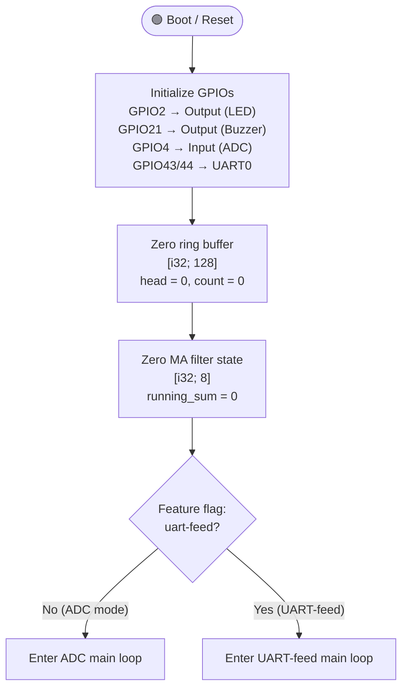
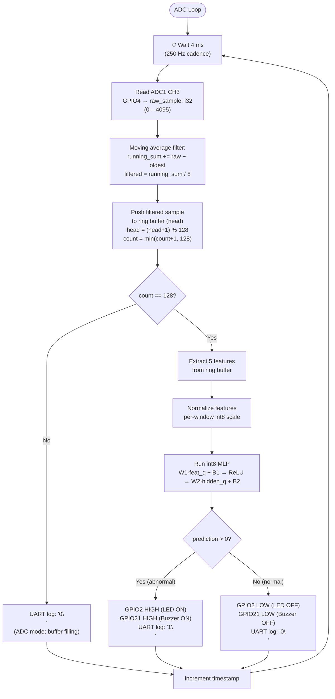
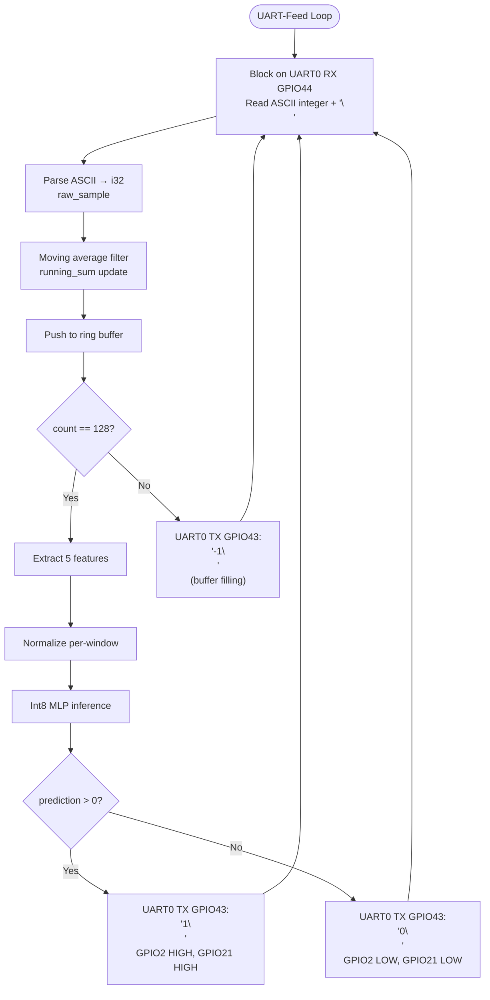
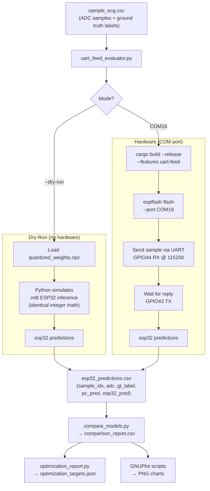
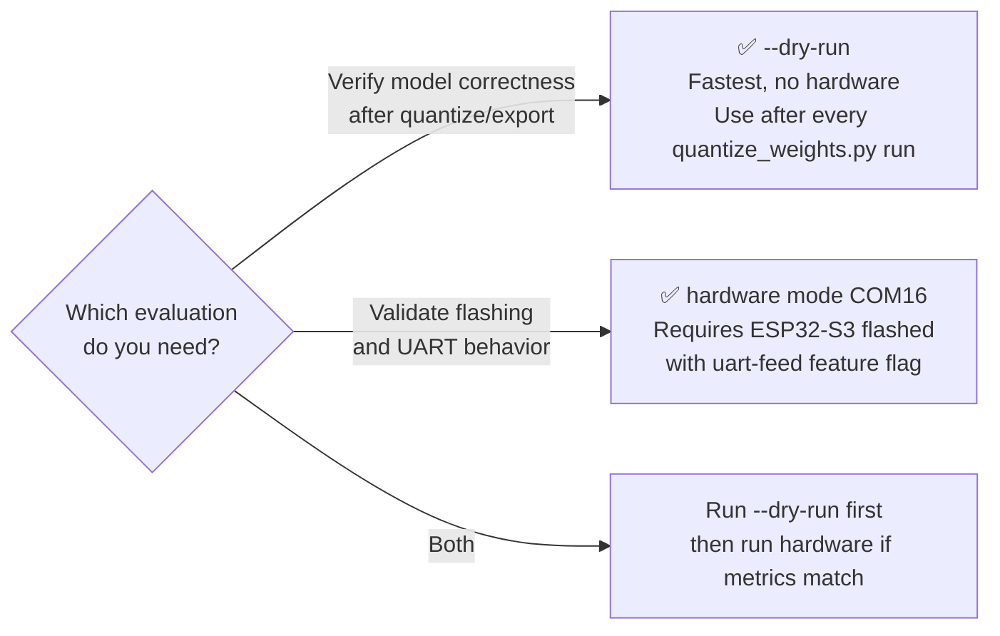
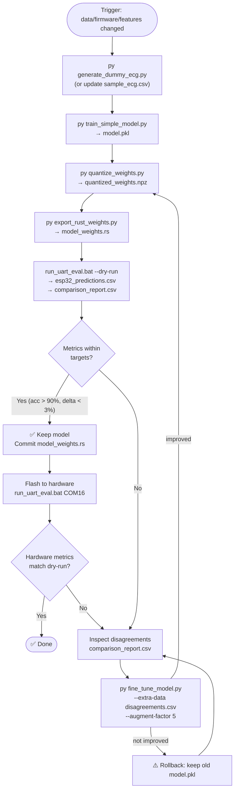
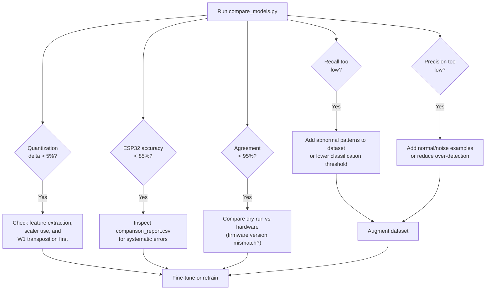
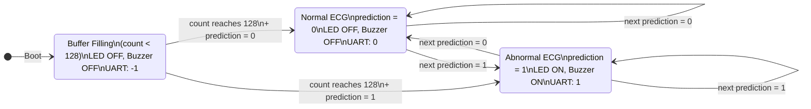
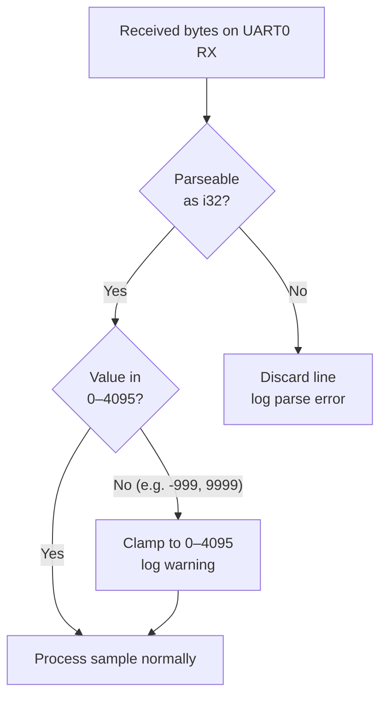

# Firmware and Evaluation Flowcharts

This document provides detailed control-flow diagrams for the embedded firmware main loop, the quantized MLP inference path, the UART-feed evaluation workflow, and the model retraining loop.

---

## Table of Contents

1. [Firmware Boot and Main Loop](#1-firmware-boot-and-main-loop)
2. [Quantized MLP Inference Flow](#2-quantized-mlp-inference-flow)
3. [UART-Feed Evaluation Flow](#3-uart-feed-evaluation-flow)
4. [Model Retraining and Fine-Tuning Flow](#4-model-retraining-and-fine-tuning-flow)
5. [Alert State Machine](#5-alert-state-machine)
6. [Error and Edge Case Handling](#6-error-and-edge-case-handling)

---

## 1. Firmware Boot and Main Loop

### 1.1 Startup Sequence


```mermaid
flowchart TD
    BOOT([" 🟢 Boot / Reset"])
    INIT_GPIO["Initialize GPIOs\nGPIO2 → Output (LED)\nGPIO21 → Output (Buzzer)\nGPIO4 → Input (ADC)\nGPIO43/44 → UART0"]
    INIT_BUF["Zero ring buffer\n[i32; 128]\nhead = 0, count = 0"]
    INIT_FILT["Zero MA filter state\n[i32; 8]\nrunning_sum = 0"]
    CHECK_MODE{"Feature flag:\nuart-feed?"}
    ADC_LOOP["Enter ADC main loop"]
    UART_LOOP["Enter UART-feed main loop"]

    BOOT --> INIT_GPIO --> INIT_BUF --> INIT_FILT --> CHECK_MODE
    CHECK_MODE -->|"No (ADC mode)"| ADC_LOOP
    CHECK_MODE -->|"Yes (UART-feed)"| UART_LOOP
```

### 1.2 ADC Mode Main Loop


```mermaid
flowchart TD
    START(["ADC Loop"])
    DELAY["⏱ Wait 4 ms\n(250 Hz cadence)"]
    READ["Read ADC1 CH3\nGPIO4 → raw_sample: i32\n(0 – 4095)"]
    FILTER["Moving average filter:\nrunning_sum += raw − oldest\nfiltered = running_sum / 8"]
    PUSH["Push filtered sample\nto ring buffer (head)\nhead = (head+1) % 128\ncount = min(count+1, 128)"]
    FULL{"count == 128?"}
    EXTRACT["Extract 5 features\nfrom ring buffer"]
    NORMALIZE["Normalize features\nper-window int8 scale"]
    INFER["Run int8 MLP\nW1·feat_q + B1 → ReLU → W2·hidden_q + B2"]
    DECIDE{"prediction > 0?"}
    ALERT_ON["GPIO2 HIGH (LED ON)\nGPIO21 HIGH (Buzzer ON)\nUART log: '1\\n'"]
    ALERT_OFF["GPIO2 LOW (LED OFF)\nGPIO21 LOW (Buzzer OFF)\nUART log: '0\\n'"]
    NOT_READY["UART log: '0\\n'\n(ADC mode; buffer filling)"]
    TICK["Increment timestamp"]

    START --> DELAY --> READ --> FILTER --> PUSH --> FULL
    FULL -->|"No"| NOT_READY --> TICK --> DELAY
    FULL -->|"Yes"| EXTRACT --> NORMALIZE --> INFER --> DECIDE
    DECIDE -->|"Yes (abnormal)"| ALERT_ON --> TICK
    DECIDE -->|"No (normal)"| ALERT_OFF --> TICK
```

### 1.3 UART-Feed Mode Main Loop


```mermaid
flowchart TD
    START(["UART-Feed Loop"])
    RECV["Block on UART0 RX GPIO44\nRead ASCII integer + '\\n'"]
    PARSE["Parse ASCII → i32\nraw_sample"]
    FILTER["Moving average filter\nrunning_sum update"]
    PUSH["Push to ring buffer"]
    FULL{"count == 128?"}
    EXTRACT["Extract 5 features"]
    NORMALIZE["Normalize per-window"]
    INFER["Int8 MLP inference"]
    DECIDE{"prediction > 0?"}
    REPLY_ABN["UART0 TX GPIO43:\n'1\\n'\nGPIO2 HIGH, GPIO21 HIGH"]
    REPLY_NRM["UART0 TX GPIO43:\n'0\\n'\nGPIO2 LOW, GPIO21 LOW"]
    REPLY_FILL["UART0 TX GPIO43:\n'-1\\n'\n(buffer filling)"]

    START --> RECV --> PARSE --> FILTER --> PUSH --> FULL
    FULL -->|"No"| REPLY_FILL --> RECV
    FULL -->|"Yes"| EXTRACT --> NORMALIZE --> INFER --> DECIDE
    DECIDE -->|"Yes"| REPLY_ABN --> RECV
    DECIDE -->|"No"| REPLY_NRM --> RECV
```

---

## 2. Quantized MLP Inference Flow

### 2.1 Complete Inference Pipeline


```mermaid
flowchart LR
    subgraph INPUT["📥 Input"]
        WIN["Ring buffer window\n128 × i32 samples"]
    end

    subgraph FEAT["📐 Feature Extraction"]
        F1["mean = Σx/128"]
        F2["max = max(x)"]
        F3["min = min(x)"]
        F4["p2p = max − min"]
        F5["energy = Σ(x²)/128/4096"]
    end

    subgraph NORM["⚖️ Normalization"]
        N1["feat_max = max(|feat[i]|, 1)"]
        N2["feat_q[i] = clamp(feat[i]×127÷feat_max, −128, 127)"]
    end

    subgraph L1["🧠 Layer 1  (W1[8×5], B1[8])"]
        L1_MAC["accum[j] = Σᵢ(W1[j×5+i] × feat_q[i]) + B1[j]"]
        L1_RELU["hidden[j] = max(accum[j], 0)  ← ReLU"]
        L1_REQT["h_max = max(|hidden[j]|, 1)\nhidden_q[j] = clamp(hidden[j]×127÷h_max, −128, 127)"]
    end

    subgraph L2["🧠 Layer 2  (W2[8], B2[1])"]
        L2_MAC["output = Σⱼ(W2[j] × hidden_q[j]) + B2[0]"]
    end

    subgraph DEC["⚡ Decision"]
        THRESH{"output > 0?"}
        ABN["Prediction = 1\n🔴 Abnormal"]
        NRM["Prediction = 0\n🟢 Normal"]
    end

    WIN --> F1 & F2 & F3
    F2 & F3 --> F4
    F1 & F2 & F3 & F4 --> F5
    F1 & F2 & F3 & F4 & F5 --> N1 --> N2
    N2 --> L1_MAC --> L1_RELU --> L1_REQT
    L1_REQT --> L2_MAC --> THRESH
    THRESH -->|"Yes"| ABN
    THRESH -->|"No"| NRM
```

### 2.2 Layer 1 Computation Detail

```text
For j = 0 to 7 (8 hidden units):
  accum[j] = W1[j×5+0] × feat_q[0]   ← mean
            + W1[j×5+1] × feat_q[1]   ← max
            + W1[j×5+2] × feat_q[2]   ← min
            + W1[j×5+3] × feat_q[3]   ← peak-to-peak
            + W1[j×5+4] × feat_q[4]   ← energy
            + B1[j]
  hidden[j] = max(accum[j], 0)        ← ReLU (floor at 0)

Re-quantize for Layer 2:
  h_max = max over j of |hidden[j]|   (floor at 1)
  hidden_q[j] = clamp(hidden[j] × 127 / h_max, -128, 127)
```

---

## 3. UART-Feed Evaluation Flow

### 3.1 Overall Evaluation Workflow


```mermaid
flowchart TD
    CSV["sample_ecg.csv\n(ADC samples + ground truth labels)"]
    EVAL["uart_feed_evaluator.py"]
    MODE{"Mode?"}

    subgraph DRY["Dry-Run (no hardware)"]
        DR1["Load quantized_weights.npz"]
        DR2["Python simulates\nint8 ESP32 inference\n(identical integer math)"]
        DR3["esp32 predictions"]
    end

    subgraph HW["Hardware (COM port)"]
        HW1["cargo build --release\n--features uart-feed"]
        HW2["espflash flash\n--port COM16"]
        HW3["Send sample via UART\nGPIO44 RX @ 115200"]
        HW4["Wait for reply\nGPIO43 TX"]
        HW5["esp32 predictions"]
    end

    OUT["esp32_predictions.csv\n(sample_idx, adc, gt_label,\npc_pred, esp32_pred)"]
    COMP["compare_models.py\n→ comparison_report.csv"]
    OPT["optimization_report.py\n→ optimization_targets.json"]
    PLOTS["GNUPlot scripts\n→ PNG charts"]

    CSV --> EVAL
    EVAL --> MODE
    MODE -->|"--dry-run"| DR1 --> DR2 --> DR3 --> OUT
    MODE -->|"COM16"| HW1 --> HW2 --> HW3 --> HW4 --> HW5 --> OUT
    OUT --> COMP --> OPT
    COMP --> PLOTS
```

### 3.2 Dry-Run vs Hardware Decision


```mermaid
flowchart LR
    Q{"Which evaluation\ndo you need?"}

    Q -->|"Verify model correctness\nafter quantize/export"| DRY["✅ --dry-run\nFastest, no hardware\nUse after every quantize_weights.py run"]
    Q -->|"Validate flashing\nand UART behavior"| HW["✅ hardware mode COM16\nRequires ESP32-S3 flashed\nwith uart-feed feature flag"]
    Q -->|"Both"| BOTH["Run --dry-run first\nthen run hardware if metrics match"]
```

### 3.3 Output File Anatomy

```text
esp32_predictions.csv columns:
┌────────────┬────────────┬──────────┬─────────┬─────────────┐
│ sample_idx │  adc_value │ gt_label │ pc_pred │ esp32_pred  │
├────────────┼────────────┼──────────┼─────────┼─────────────┤
│     0      │    2048    │    0     │    0    │     -1      │  ← buffer filling
│     1      │    2060    │    0     │    0    │     -1      │
│   ...      │    ...     │   ...    │   ...   │     ...     │
│    128     │    2100    │    0     │    0    │      0      │  ← first prediction
│    129     │    3500    │    1     │    1    │      1      │  ← abnormal detected
└────────────┴────────────┴──────────┴─────────┴─────────────┘
```

---

## 4. Model Retraining and Fine-Tuning Flow

### 4.1 Full Retraining Loop


```mermaid
flowchart TD
    TRIGGER(["Trigger: data/firmware/features changed"])
    GEN["py generate_dummy_ecg.py\n(or update sample_ecg.csv)"]
    TRAIN["py train_simple_model.py\n→ model.pkl"]
    QUANT["py quantize_weights.py\n→ quantized_weights.npz"]
    EXPORT["py export_rust_weights.py\n→ model_weights.rs"]
    DRYRUN["run_uart_eval.bat --dry-run\n→ esp32_predictions.csv\n→ comparison_report.csv"]
    CHECK{"Metrics within\ntargets?"}
    KEEP["✅ Keep model\nCommit model_weights.rs"]
    FLASH["Flash to hardware\nrun_uart_eval.bat COM16"]
    HW_CHECK{"Hardware metrics\nmatch dry-run?"}
    DONE(["✅ Done"])
    INSPECT["Inspect disagreements\ncomparison_report.csv"]
    FINETUNE["py fine_tune_model.py\n--extra-data disagreements.csv\n--augment-factor 5"]
    ROLLBACK["⚠️ Rollback: keep old model.pkl"]

    TRIGGER --> GEN --> TRAIN --> QUANT --> EXPORT --> DRYRUN --> CHECK
    CHECK -->|"Yes (acc > 90%, delta < 3%)"| KEEP --> FLASH --> HW_CHECK
    HW_CHECK -->|"Yes"| DONE
    HW_CHECK -->|"No"| INSPECT
    CHECK -->|"No"| INSPECT
    INSPECT --> FINETUNE
    FINETUNE -->|"improved"| QUANT
    FINETUNE -->|"not improved"| ROLLBACK --> INSPECT
```

### 4.2 Fine-Tuning Decision


```mermaid
flowchart TD
    RUN["Run compare_models.py"]

    RUN --> Q1{"Quantization\ndelta > 5%?"}
    RUN --> Q2{"ESP32 accuracy\n< 85%?"}
    RUN --> Q3{"Agreement\n< 95%?"}
    RUN --> Q4{"Recall too\nlow?"}
    RUN --> Q5{"Precision too\nlow?"}

    Q1 -->|"Yes"| FIX1["Check feature extraction,\nscaler use, and\nW1 transposition first"]
    Q2 -->|"Yes"| FIX2["Inspect comparison_report.csv\nfor systematic errors"]
    Q3 -->|"Yes"| FIX3["Compare dry-run vs hardware\n(firmware version mismatch?)"]
    Q4 -->|"Yes"| FIX4["Add abnormal patterns to dataset\nor lower classification threshold"]
    Q5 -->|"Yes"| FIX5["Add normal/noise examples\nor reduce over-detection"]

    FIX1 & FIX2 & FIX3 --> FINETUNE["Fine-tune or retrain"]
    FIX4 & FIX5 --> DATA["Augment dataset"]
    DATA --> FINETUNE
```

---

## 5. Alert State Machine

The alert state changes on every new prediction from the MLP (once the ring buffer is full).


```mermaid
stateDiagram-v2
    direction LR

    [*] --> STARTUP : Boot

    STARTUP : Buffer Filling\n(count < 128)\nLED OFF, Buzzer OFF\nUART: -1

    NORMAL : Normal ECG\nprediction = 0\nLED OFF, Buzzer OFF\nUART: 0

    ABNORMAL : Abnormal ECG\nprediction = 1\nLED ON, Buzzer ON\nUART: 1

    STARTUP --> NORMAL : count reaches 128\n+ prediction = 0
    STARTUP --> ABNORMAL : count reaches 128\n+ prediction = 1
    NORMAL --> ABNORMAL : next prediction = 1
    ABNORMAL --> NORMAL : next prediction = 0
    NORMAL --> NORMAL : next prediction = 0
    ABNORMAL --> ABNORMAL : next prediction = 1
```

> [!NOTE]
> Alert state is updated **every 4 ms** (every sample) once the buffer is full. There is no hysteresis or debounce — consecutive samples independently determine the alert state.

---

## 6. Error and Edge Case Handling

### 6.1 Edge Cases in Inference

| Situation | Behavior | Why |
|---|---|---|
| `feat_max = 0` (all features zero) | `feat_max` floored to 1; division safe | Avoids divide-by-zero |
| `h_max = 0` (all hidden units zero) | `h_max` floored to 1 | Avoids divide-by-zero after ReLU |
| ADC = 0 constantly | `peak_to_peak = 0`; likely classified Normal | Wire disconnected; check AD8232 |
| ADC = 4095 constantly | `peak_to_peak = 0`; saturated; likely Normal | Floating input; check ground |
| ADC wildly oscillating | `peak_to_peak` very large; likely Abnormal | Motion artifact; stabilize electrodes |

### 6.2 UART-Feed Edge Cases


```mermaid
flowchart TD
    RX["Received bytes on UART0 RX"]
    PARSE{"Parseable\nas i32?"}
    VALID{"Value in\n0–4095?"}
    PROCESS["Process sample normally"]
    CLAMP["Clamp to 0–4095\nlog warning"]
    ERROR["Discard line\nlog parse error"]

    RX --> PARSE
    PARSE -->|"Yes"| VALID
    PARSE -->|"No"| ERROR
    VALID -->|"Yes"| PROCESS
    VALID -->|"No (e.g. -999, 9999)"| CLAMP --> PROCESS
```

---

*Document version: 2026-06-17 | Firmware target: ESP32-S3 Embedded Rust (no_std)*
