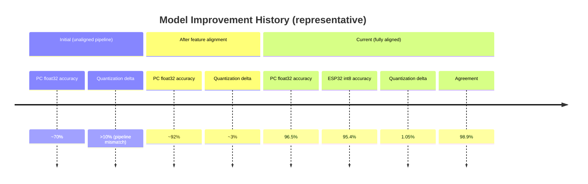
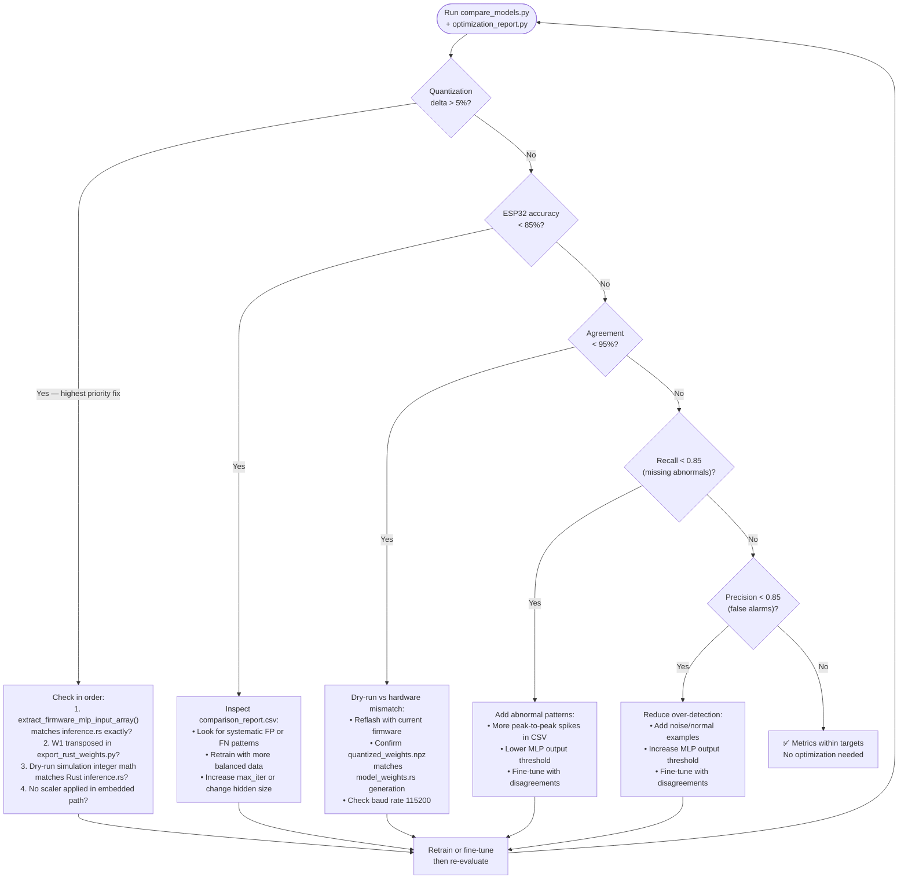
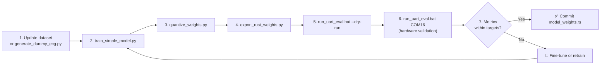
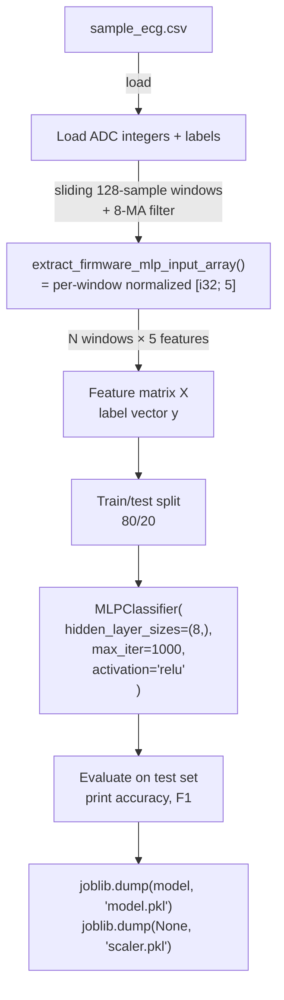
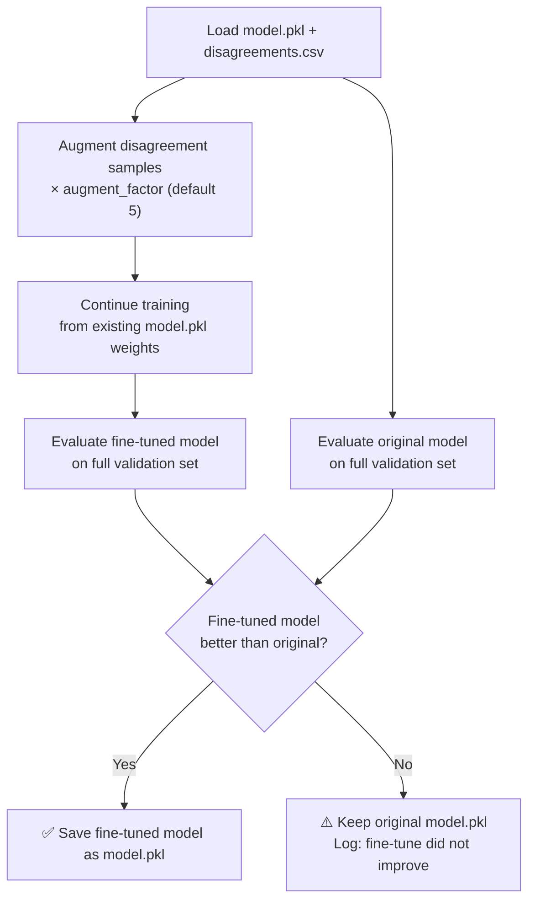
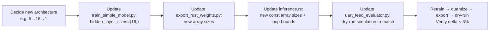
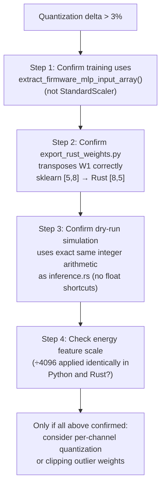
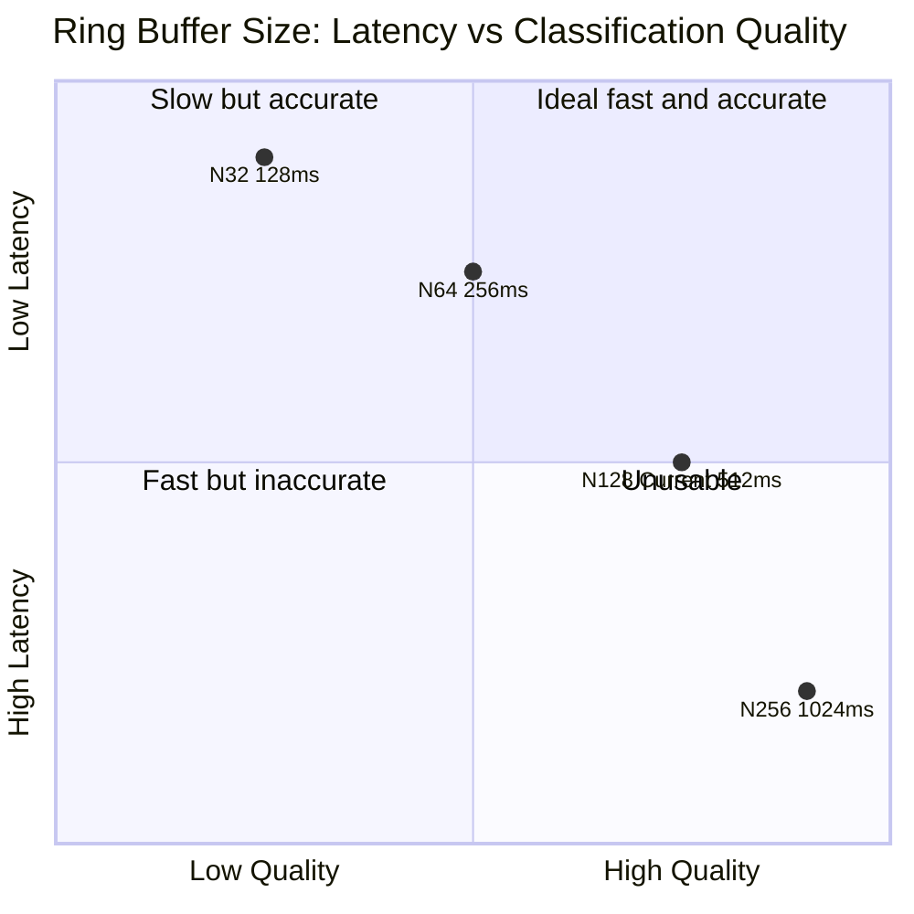

# Optimization Guide

This guide explains how to improve model accuracy, reduce quantization error, and experiment with architecture and signal parameters in RT-QTinyECG-ESP32-Rust.

---

## Table of Contents

1. [Current Baseline](#1-current-baseline)
2. [Optimization Decision Tree](#2-optimization-decision-tree)
3. [Recommended Workflow](#3-recommended-workflow)
4. [Full Retraining](#4-full-retraining)
5. [Fine-Tuning with Disagreement Samples](#5-fine-tuning-with-disagreement-samples)
6. [Architecture Experiments](#6-architecture-experiments)
7. [Quantization Experiments](#7-quantization-experiments)
8. [Signal Parameter Tradeoffs](#8-signal-parameter-tradeoffs)
9. [Final Report Table](#9-final-report-table)

---

## 1. Current Baseline

After aligning the training and firmware feature pipelines, the current dry-run baseline is already within all project targets:

| Metric | Value | Target (Good) | Status |
|---|:---:|:---:|:---:|
| PC float32 accuracy | 96.5% | > 90% | ✅ |
| ESP32/int8 dry-run accuracy | 95.4% | > 90% | ✅ |
| Quantization delta | 1.05% | < 3% | ✅ |
| Agreement | 98.9% | > 95% | ✅ |
| F1-score (int8) | 0.943 | > 0.90 | ✅ |

### Performance Over Optimization Journey



---

## 2. Optimization Decision Tree

Run `compare_models.py` first, then follow this tree to decide what to do:



---

## 3. Recommended Workflow

Always follow this order. Do not skip steps.



### One-Shot Workflow Command

```bat
cd /d D:\PropertiesProject-D\Kuliah\Pemkon\Product
py python\generate_dummy_ecg.py
py python\train_simple_model.py
py python\quantize_weights.py
py python\export_rust_weights.py
run_uart_eval.bat --dry-run
```

For hardware validation:
```bat
run_uart_eval.bat COM16
```

---

## 4. Full Retraining

### When to Fully Retrain

Retrain from scratch (not fine-tune) when any of the following change:

| Changed Item | Why Full Retrain? |
|---|---|
| `generate_dummy_ecg.py` logic | Training distribution changes |
| Feature extraction in `preprocessing.py` | All features are different; fine-tune won't help |
| `inference.rs` feature/normalization code | Must match Python exactly; retrain to verify |
| MLP architecture | Hidden size change requires new weight shapes |
| `model_weights.rs` is stale or deleted | Cannot fine-tune from missing weights |

### Retrain Commands

```bat
py python\generate_dummy_ecg.py
py python\train_simple_model.py
py python\quantize_weights.py
py python\export_rust_weights.py
```

### What `train_simple_model.py` Does



> [!WARNING]
> `scaler.pkl` intentionally stores `None`. Do not replace this with a fitted scaler — it would be applied during evaluation but not in firmware, causing a pipeline mismatch and inflated PC accuracy that doesn't reflect embedded performance.

---

## 5. Fine-Tuning with Disagreement Samples

Fine-tuning is useful when the model is close to target but has systematic disagreements on specific windows.

### When to Fine-Tune (not Retrain)

- Metrics are near target but a small number of specific samples consistently disagree.
- You have `comparison_report.csv` showing the problematic sample indices.
- The overall dataset and feature extraction are unchanged.

### Fine-Tuning Commands

```bat
py python\compare_models.py --save-disagreements data\disagreements.csv
py python\fine_tune_model.py --extra-data data\disagreements.csv --epochs 300 --augment-factor 5
```

Re-export if the fine-tuned model is accepted:
```bat
py python\quantize_weights.py
py python\export_rust_weights.py
```

### Safety Behavior of `fine_tune_model.py`



### What `auto_disagreements.csv` Is

`data/auto_disagreements.csv` is generated by `fine_tune_model.py` when it detects disagreements in `comparison_report.csv`:

```text
Columns: index, gt_label, pc_prediction, esp32_prediction
Purpose: intermediate helper; NOT an inference input
Delete freely: regenerated on next run of fine_tune_model.py
```

---

## 6. Architecture Experiments

The current firmware is hardcoded for `5 → 8 → 1`. Changing architecture requires updating both Python and Rust.

### Architecture Options

| Architecture | Weights bytes | Capacity | Requires firmware update? |
|---|:---:|---|:---:|
| `5 → 4 → 1` | ~60 B | Low — may underfit complex patterns | Yes |
| **`5 → 8 → 1`** | **~100 B** | **Current supported default** | — |
| `5 → 16 → 1` | ~180 B | Higher — may overfit small datasets | Yes |
| `5 → 8 → 8 → 1` | ~200 B | Multi-layer, more expressive | Yes (major) |

> [!CAUTION]
> Do not change the architecture unless you also update `inference.rs`, `model_weights.rs` generation in `export_rust_weights.py`, and the dry-run simulation in `uart_feed_evaluator.py`. A mismatch will produce silent misclassification with no error.

### Architecture Change Checklist



---

## 7. Quantization Experiments

### Current Quantization Scheme

```text
Scheme:    Symmetric int8 per-layer
W_q[i]  =  round( W[i] / scale )     clamped to [-128, 127]
B_q[i]  =  round( B[i] / scale )     stored as i32
scale   =  max( abs(W) ) / 127       one scale per layer
```

### Why This Scheme?

| Property | This scheme | Alternative |
|---|---|---|
| Implementation | Simple: one scale per layer | Per-channel: one scale per output neuron |
| Accuracy | Good (delta < 2% typical) | Better for larger models |
| Flash cost | 2 extra floats (scale + bias scale) | 8+ extra floats for per-channel |
| Firmware complexity | Low | Higher |

### When the Delta Grows — Diagnosis



---

## 8. Signal Parameter Tradeoffs

### Current Values

| Parameter | File | Current Value |
|---|---|:---:|
| Sample rate | `main.rs` | 250 Hz |
| Ring buffer size | `main.rs` | 128 samples |
| Moving average window | `main.rs` | 8 samples |

### Tradeoff Analysis



### Detailed Tradeoff Table

| Change | Benefit | Cost | Update required |
|---|---|---|---|
| Sample rate 250→500 Hz | More temporal detail | 2× UART traffic; tighter timing | `main.rs` delay |
| Sample rate 250→125 Hz | Less UART traffic | Less temporal resolution | `main.rs` delay |
| Buffer 128→64 samples | Halved first-window delay | Less context; may reduce accuracy | `main.rs` const + retrain |
| Buffer 128→256 samples | More context | 1024 ms first-window delay | `main.rs` const + retrain |
| MA window 8→4 samples | Faster response | More noise, less smoothing | `main.rs` const |
| MA window 8→16 samples | Smoother signal | More lag (~32 ms) | `main.rs` const |

> [!IMPORTANT]
> Changing the ring buffer size or sample rate requires **retraining the model** — the feature statistics (mean, energy, peak-to-peak) change with different window lengths and sampling rates.

---

## 9. Final Report Table

Use this table to document experiment results for project reporting:

| Experiment | PC acc | int8 acc | Delta | Agreement | Model bytes | Notes |
|---|:---:|:---:|:---:|:---:|:---:|---|
| **Baseline 5→8→1** | **96.5%** | **95.4%** | **1.05%** | **98.9%** | **~100 B** | Current default |
| Hardware UART run | _(fill after flash)_ | — | — | — | ~100 B | |
| Fine-tuned model | _(fill if improved)_ | _(fill)_ | _(fill)_ | _(fill)_ | ~100 B | |
| 5→16→1 experiment | _(fill)_ | _(fill)_ | _(fill)_ | _(fill)_ | ~180 B | Requires firmware update |
| Buffer=64, 256ms | _(fill)_ | _(fill)_ | _(fill)_ | _(fill)_ | ~100 B | Lower latency experiment |

---

*Document version: 2026-06-17 | Firmware target: ESP32-S3 Embedded Rust (no_std)*
