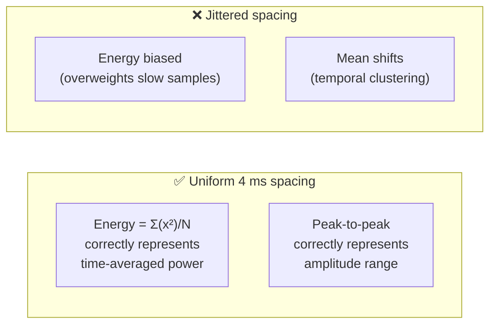
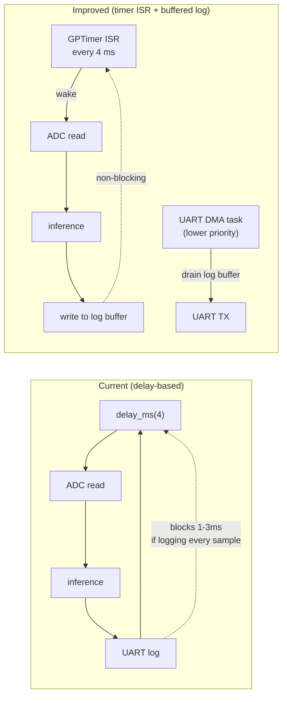
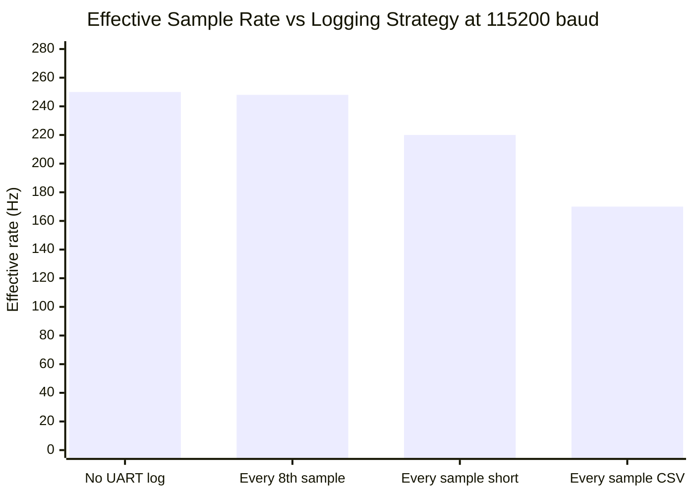
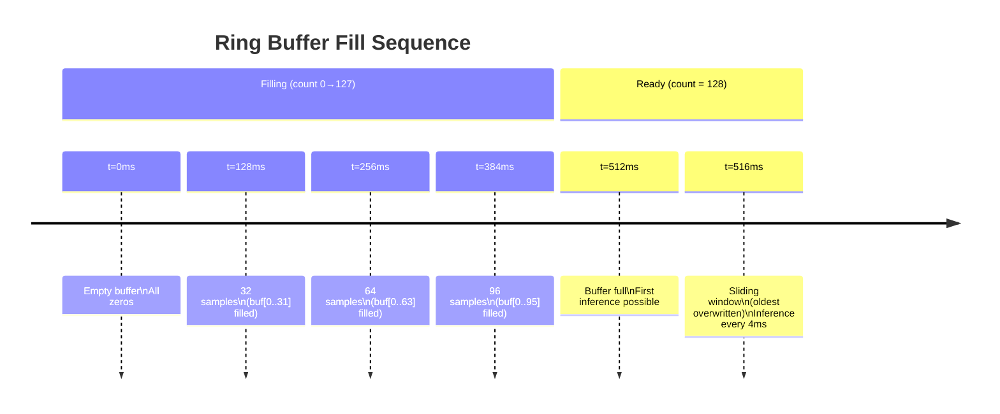
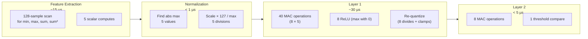
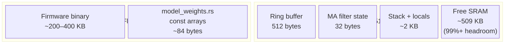
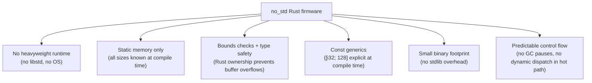
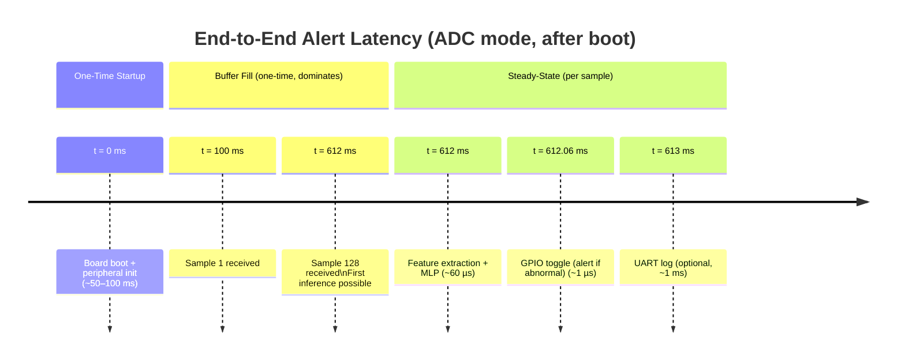
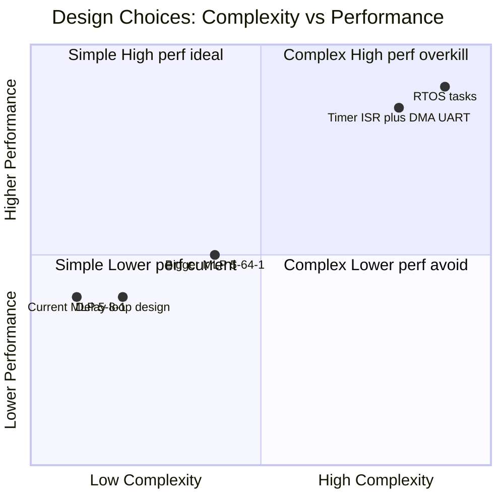

# Real-Time Design Rationale

This document explains the embedded design choices and timing constraints in the RT-QTinyECG-ESP32-Rust firmware, covering sampling cadence, UART bottlenecks, ring buffer design, inference cost, memory use, and design tradeoffs.

---

## Table of Contents

1. [Timing Architecture Overview](#1-timing-architecture-overview)
2. [Fixed Sampling](#2-fixed-sampling)
3. [UART Bottleneck](#3-uart-bottleneck)
4. [Ring Buffer Design](#4-ring-buffer-design)
5. [Window-Based Inference](#5-window-based-inference)
6. [Inference Cost](#6-inference-cost)
7. [Memory Use](#7-memory-use)
8. [Rust and `no_std`](#8-rust-and-no_std)
9. [Alert Latency](#9-alert-latency)
10. [Design Tradeoffs](#10-design-tradeoffs)

---

## 1. Timing Architecture Overview

The firmware runs a single-threaded main loop. Every stage must complete within the 4 ms sampling budget:

```mermaid
gantt
    title Firmware Per-Sample Timing Budget (4 ms = 4000 µs)
    dateFormat  X
    axisFormat  %L µs

    section Always runs
    ADC read (GPIO4)             : 0, 50
    Moving average filter        : 50, 10

    section After buffer full (steady state)
    Ring buffer insert           : 60, 5
    Feature extraction (128 scan): 65, 15
    Feature normalization        : 80, 5
    Int8 MLP Layer 1 (40 MACs)  : 85, 30
    Int8 MLP Layer 2 (8 MACs)   : 115, 10
    GPIO update                  : 125, 1

    section Optional (UART logging)
    UART TX line (@ 115200)      : 126, 1000
```



> [!NOTE]
> UART transmission (if enabled every sample) is the dominant time cost — up to **1–3 ms per line**. All inference operations complete in well under 200 µs.

---

## 2. Fixed Sampling

### Target Rate

```text
250 Hz  =  4 ms per sample
```

### Why 250 Hz?

- Common educational ECG sampling rate (clinical ECG often 500–1000 Hz)
- Provides sufficient resolution for the aggregate window features used (min, max, mean, energy)
- Yields manageable UART traffic and ring buffer fill time

### Why Uniform Sampling Matters

The 5 features computed from the ring buffer assume **fixed time spacing**:



### Current Implementation Limitation

The firmware uses a **delay-based loop**:

```rust
delay_ms(4);
let sample = adc.read(GPIO4);
```

This is simple but imprecise because:
1. The delay does not account for ADC read time (~50 µs)
2. UART logging (if enabled) can block 1–3 ms, pushing actual interval to 5–7 ms

**Production improvement:** use an ESP32-S3 hardware timer (GPTimer API) and decouple UART logging via a circular log buffer written outside the sampling ISR.



---

## 3. UART Bottleneck

### The Problem

At 115200 baud, one byte takes ~87 µs. A typical log line (`"1234,0,1\n"` = 9 bytes) takes:

```text
9 bytes × 87 µs/byte ≈ 780 µs
```

A longer line can take **1–3 ms** — more than half the 4 ms budget.

### Measured Impact



### Mitigations

| Strategy | Implementation effort | Timing improvement |
|---|:---:|:---:|
| Log every Nth sample | Low — add counter | Moderate |
| Increase baud to 921600 | Low — change config | ~8× faster TX |
| Compact binary output | Medium — change format | ~4× smaller lines |
| Non-blocking DMA UART | High — ESP-IDF API | Near-zero impact |
| Separate sampling + logging tasks | High — RTOS | Full isolation |

> [!TIP]
> For UART-feed evaluation (controlled PC input), UART timing matters less because the PC controls sample send rate. The bottleneck is only in ADC mode with continuous logging.

---

## 4. Ring Buffer Design

### Structure

The ring buffer is a fixed-size circular array of `i32` values with a head pointer:

```text
 Capacity: 128 × i32 = 512 bytes (static, BSS segment)
 Head:     usize (index of next write position)
 Count:    usize (samples received; capped at 128)

 On each new sample:
   buf[head] = filtered_sample
   head = (head + 1) % 128
   count = min(count + 1, 128)
```

### Visual State Progression



### Benefits of Ring Buffer over Heap Allocation

| Property | Ring buffer `[i32; 128]` | Vec / heap |
|---|---|---|
| Memory allocation | Static (BSS) — zero runtime cost | Heap — allocator needed |
| Insertion | O(1) — wrap head pointer | O(1) amortized |
| `no_std` compatible | ✅ Yes | ❌ Requires alloc crate |
| Memory determinism | ✅ Fixed 512 bytes always | ❌ Varies at runtime |
| Cache locality | ✅ Contiguous array | ❌ Heap fragmentation possible |

---

## 5. Window-Based Inference

### Why a Full Window Is Needed

A single ADC sample carries no meaningful classification information — it is just a voltage at one instant. A 128-sample window (512 ms) provides enough context to measure:

| Feature | Requires | Notes |
|---|---|---|
| Baseline level (mean) | Many samples | Distinguishes normal vs shifted baseline |
| Peak amplitude (max) | Full swing | Captures R-wave peak |
| Trough amplitude (min) | Full swing | Captures Q/S wave |
| Peak-to-peak | Both extremes | Key arrhythmia indicator |
| Energy | Full window | Detects high-frequency or low-amplitude states |

### Sliding Window Behavior

```text
Sample 128:  [s0,  s1,  s2, ..., s127]  ← first inference
Sample 129:  [s1,  s2,  s3, ..., s128]  ← s0 discarded, s128 added
Sample 130:  [s2,  s3,  s4, ..., s129]  ← sliding by 1 sample
...
```

Each new sample causes one inference — the model runs at **250 Hz in steady state**.

---

## 6. Inference Cost

### Operation Count



### Inference Time Budget

| Component | Approximate time | % of 4 ms budget |
|---|:---:|:---:|
| Feature extraction | ~15 µs | 0.4% |
| Normalization | < 1 µs | < 0.1% |
| MLP Layer 1 (40 MACs + ReLU) | ~30 µs | 0.75% |
| MLP Layer 2 (8 MACs) | ~5 µs | 0.1% |
| GPIO toggle | < 1 µs | < 0.1% |
| **Total inference** | **~60 µs** | **~1.5%** |

> [!TIP]
> Even multiplying inference time by 10× (unlikely regression), it would consume only 15% of the 4 ms budget. Inference performance is not a bottleneck for this architecture.

---

## 7. Memory Use

### Static Working Memory

| Item | Type | Size |
|---|---|---:|
| Ring buffer `[i32; 128]` | Static (BSS) | **512 bytes** |
| Moving average state `[i32; 8]` | Static (BSS) | **32 bytes** |
| MLP weights W1 `[i8; 40]` | Const (flash/rodata) | 40 bytes |
| MLP biases B1 `[i32; 8]` | Const (flash/rodata) | 32 bytes |
| MLP weights W2 `[i8; 8]` | Const (flash/rodata) | 8 bytes |
| MLP bias B2 `[i32; 1]` | Const (flash/rodata) | 4 bytes |
| Stack + locals | Stack | ~1–2 KB |
| **Total SRAM** | | **~2–3 KB** |

### Memory Diagram



> [!NOTE]
> The ESP32-S3 has **512 KB of SRAM**. This firmware uses less than **1% of available RAM**. There is ample headroom for additional features, larger models, or RTOS tasks.

### Heap Usage

```text
Heap allocation: NONE
```

The firmware uses `no_std` Rust with no `alloc` crate. Every buffer is a fixed-size const generic array declared at compile time. This guarantees:
- No runtime allocation failures
- No heap fragmentation
- Predictable maximum memory use
- Compatibility with deeply embedded targets

---

## 8. Rust and `no_std`

### Why `no_std`?



### Hot Path Characteristics

The per-sample hot path avoids:
- ❌ Dynamic dispatch (no trait objects in inference)
- ❌ Heap allocation
- ❌ Floating-point (all arithmetic is integer)
- ❌ Branches on runtime-unknown array sizes

All loops in inference use compile-time-known bounds (`for i in 0..5`, `for j in 0..8`), allowing the compiler to unroll or vectorize.

---

## 9. Alert Latency

### Latency Component Breakdown



### Latency Summary Table

| Component | Approximate value | Reducible? |
|---|:---:|---|
| Boot + init | 50–100 ms | Slightly (remove debug output) |
| Initial window fill | **512 ms** | Yes — reduce buffer size (accuracy tradeoff) |
| Feature extraction | ~15 µs | No |
| MLP inference | ~45 µs | No (already minimal) |
| GPIO toggle | < 1 µs | No |
| UART log | 0–3 ms | Yes — log less frequently |

> [!IMPORTANT]
> **The window fill (512 ms) dominates alert latency.** Optimizing MLP speed from 60 µs to 20 µs saves < 0.01% of total first-alert time. If lower latency is required, reduce the ring buffer from 128 to 64 samples (256 ms fill) and retrain the model.

---

## 10. Design Tradeoffs

### Summary Table

| Design Choice | Benefit | Cost | Alternative |
|---|---|---|---|
| 250 Hz sampling | Common ECG educational rate; manageable UART traffic | Less temporal detail than 500 Hz | 500 Hz: halves window fill time but doubles UART load |
| 128-sample window | Good feature context (512 ms ECG context) | 512 ms first-window delay | 64 samples: 256 ms delay, less context |
| 8-sample moving average | Simple noise rejection, O(1) | ~14 ms lag; may miss fast transients | 4 samples: less lag, more noise |
| Int8 MLP 5→8→1 | Tiny (~100 bytes), fast (~60 µs) | Less expressive than deep networks | 5→16→1: double capacity, still tiny |
| Per-window normalization | No stored scaler; scale-invariant | None (best practice) | Global scaler: fragile, must match embedded |
| CSV UART logging | Easy PC-side debugging | Slow (1–3 ms per line) | Binary: 4× smaller, harder to parse |
| Delay-based timing | Simple implementation | Timing jitter from UART blocks | Timer ISR: precise but complex |
| Static arrays | No allocation, `no_std` compatible | Fixed capacity | Vec: dynamic but needs alloc crate |

### Tradeoff Visualization



---

*Document version: 2026-06-17 | Firmware target: ESP32-S3 Embedded Rust (no_std)*
