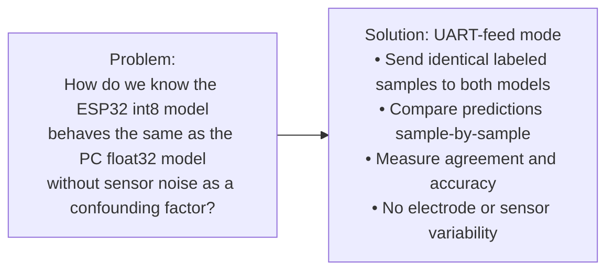
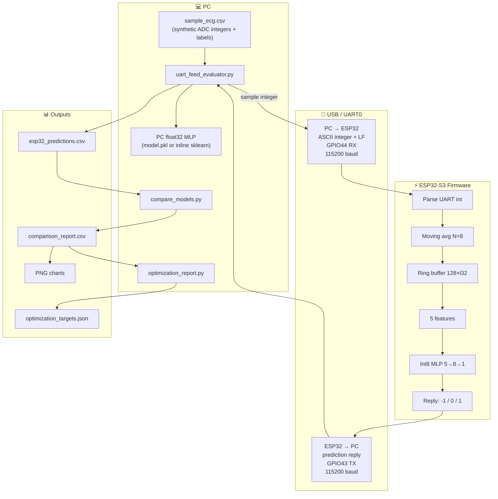
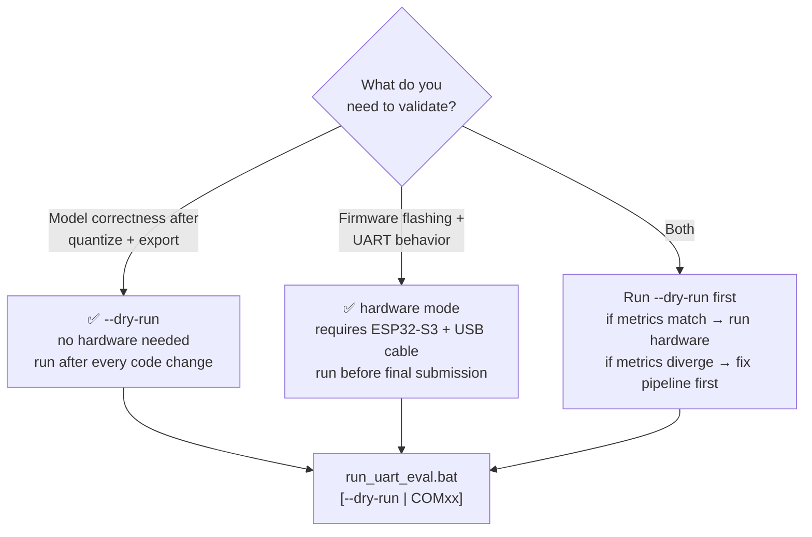
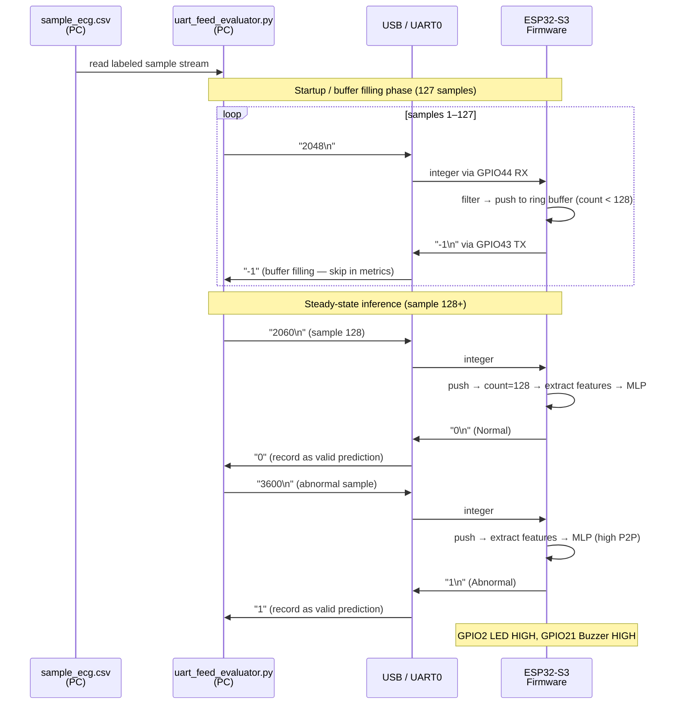
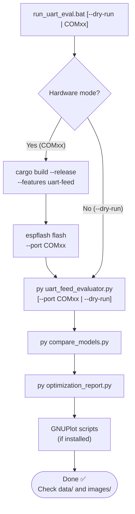
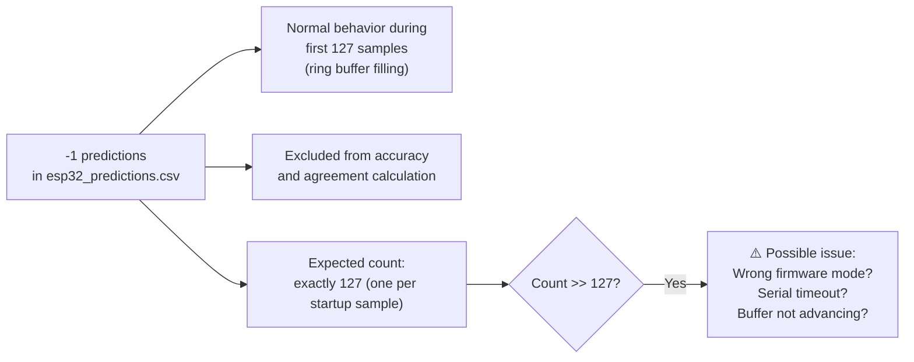
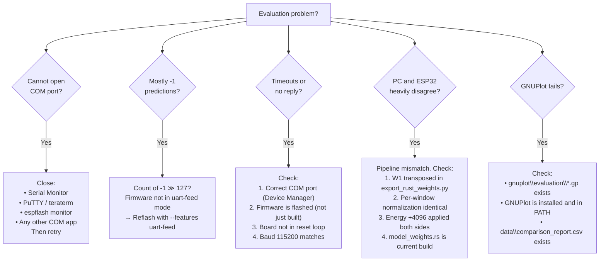

# UART-Feed Evaluation

UART-feed evaluation is the primary method for validating the embedded int8 model against PC float32 behavior using controlled, reproducible input data — without relying on live sensor readings.

> [!IMPORTANT]
> UART-feed evaluation validates **model correctness and firmware behavior**, not sensor quality. For sensor validation, use ADC mode with the AD8232 (see [`wiring_esp32_ad8232.md`](wiring_esp32_ad8232.md)).

---

## Table of Contents

1. [Purpose and Architecture](#1-purpose-and-architecture)
2. [Operating Modes](#2-operating-modes)
3. [UART Communication Protocol](#3-uart-communication-protocol)
4. [Quick Start](#4-quick-start)
5. [Manual Hardware Flow](#5-manual-hardware-flow)
6. [Output Files](#6-output-files)
7. [Result Interpretation](#7-result-interpretation)
8. [Troubleshooting](#8-troubleshooting)

---

## 1. Purpose and Architecture

### What Problem Does UART-Feed Solve?



### System Architecture



---

## 2. Operating Modes

### Mode Comparison

| Property | Dry-Run (`--dry-run`) | Hardware (`COM16`) |
|---|---|---|
| Hardware required | ❌ None | ✅ ESP32-S3 flashed |
| What is simulated | Python simulates int8 ESP32 math | Real firmware on real silicon |
| Speed | Fast (no serial overhead) | Slower (serial round-trip per sample) |
| Validates | Model correctness, quantization, export | All of dry-run + flashing + UART |
| When to use | After every `quantize_weights.py` run | Before final submission |
| Output format | Same `esp32_predictions.csv` | Same `esp32_predictions.csv` |

### Mode Selection Flowchart



---

## 3. UART Communication Protocol

### Frame Format

```text
PC  →  ESP32:   "<integer>\n"          e.g.  "2048\n"
ESP32  →  PC:   "<prediction>\n"       e.g.  "-1\n", "0\n", "1\n"
```

### Prediction Values

| Value | Meaning | When it appears |
|:---:|---|---|
| `-1` | Buffer not yet full | First 127 samples (startup) |
| `0` | Normal ECG classification | Steady-state, normal window |
| `1` | Abnormal ECG classification | Steady-state, abnormal window |

### UART Pin Assignment

| Signal | ESP32-S3 GPIO | PC side | Direction |
|---|:---:|---|:---:|
| UART0 RX (receive) | **GPIO44** | USB-serial adapter TX | → ESP32 |
| UART0 TX (transmit) | **GPIO43** | USB-serial adapter RX | → PC |
| Common ground | GND | USB-serial adapter GND | — |

> [!NOTE]
> On most DevKit boards (DevKitC-1, etc.), the onboard CH340/CP2102 USB-serial chip connects automatically to GPIO43/44. No external adapter is needed — the standard USB cable used for flashing works.

### Full Protocol Sequence



---

## 4. Quick Start

### One-Command Evaluation

**Dry-run (no hardware):**
```bat
cd /d D:\PropertiesProject-D\Kuliah\Pemkon\Product
run_uart_eval.bat --dry-run
```

**Hardware (ESP32-S3 required):**
```bat
run_uart_eval.bat COM16
```

Replace `COM16` with the actual COM port from Device Manager.

### What the Batch File Does



---

## 5. Manual Hardware Flow

Use this when you need finer control over each step.

### Step 1: Build UART-Feed Firmware

```powershell
cd /d D:\PropertiesProject-D\Kuliah\Pemkon\Product\firmware\esp32-rust
. $HOME\export-esp.ps1
cargo build --release --target xtensa-esp32s3-none-elf --features uart-feed
```

> [!WARNING]
> The `uart-feed` feature flag is required. Without it, the firmware runs in ADC mode and will not respond to UART integer samples.

### Step 2: Flash to ESP32-S3

```powershell
espflash flash target\xtensa-esp32s3-none-elf\release\ecg-esp32 --port COM16
```

Close all Serial Monitor, PuTTY, or other terminal windows before flashing.

### Step 3: Run Evaluator

```powershell
cd /d D:\PropertiesProject-D\Kuliah\Pemkon\Product
py python\uart_feed_evaluator.py --port COM16 --baud 115200
```

### Step 4: Compare and Report

```powershell
py python\compare_models.py
py python\optimization_report.py
```

### Hardware Flow Diagram

```mermaid
flowchart LR
    subgraph PREP["Preparation"]
        P1["Close Serial Monitor\nand other COM apps"]
        P2["Connect ESP32-S3\nvia USB"]
        P3["Note COM port\nfrom Device Manager"]
    end

    subgraph BUILD["Build + Flash"]
        B1["source export-esp.ps1"]
        B2["cargo build --release\n--features uart-feed"]
        B3["espflash flash --port COM16"]
    end

    subgraph RUN["Run Evaluation"]
        R1["uart_feed_evaluator.py\n--port COM16"]
        R2["compare_models.py"]
        R3["optimization_report.py"]
    end

    subgraph CHECK["Check Results"]
        C1["esp32_predictions.csv"]
        C2["comparison_report.csv"]
        C3["optimization_targets.json"]
    end

    PREP --> BUILD --> RUN --> CHECK
```



---

## 6. Output Files

### File Reference

| File | Location | Contents |
|---|---|---|
| `esp32_predictions.csv` | `data/` | Per-sample: index, ADC, gt_label, pc_pred, esp32_pred |
| `comparison_report.csv` | `data/` | Per-sample: TP/TN/FP/FN flags, agreement bool |
| `optimization_targets.json` | `data/` | Summary metrics + tuning suggestions |
| ESP32 model charts | `images/model_esp32/*.png` | Confusion matrix, bar charts |
| Evaluation charts | `images/evaluation/*.png` | PC vs ESP32 comparison |

### `esp32_predictions.csv` Structure

```text
sample_idx  │  adc_value  │  gt_label  │  pc_pred  │  esp32_pred
────────────┼─────────────┼────────────┼───────────┼─────────────
     0      │    2048     │     0      │     0     │     -1        ← buffer filling
     1      │    2055     │     0      │     0     │     -1
   ...      │    ...      │    ...     │    ...    │    ...
    128     │    2100     │     0      │     0     │      0        ← first valid
    129     │    3800     │     1      │     1     │      1        ← abnormal
    130     │    3750     │     1      │     1     │      0        ← disagreement!
```

### `optimization_targets.json` Structure

```json
{
  "pc_accuracy": 0.965,
  "esp32_accuracy": 0.954,
  "quantization_delta": 0.0105,
  "agreement": 0.989,
  "f1_pc": 0.957,
  "f1_esp32": 0.943,
  "disagreements": 25,
  "valid_predictions": 2373,
  "recommendations": [
    "Metrics within all targets. No optimization required."
  ]
}
```

---

## 7. Result Interpretation

### Current Dry-Run Results

| Metric | Value | Target | Status |
|---|:---:|:---:|:---:|
| PC float32 accuracy | 96.5% | > 90% | ✅ |
| ESP32/int8 dry-run accuracy | 95.4% | > 90% | ✅ |
| Quantization delta | 1.05% | < 3% | ✅ |
| Agreement | 98.9% | > 95% | ✅ |
| Disagreements | 25 / 2373 | — | — |

### Understanding `-1` Predictions



### Disagreement Analysis

When `PC=X, ESP32=Y` and `X ≠ Y`:

| Pattern | Count (current) | Likely cause |
|---|:---:|---|
| `PC=Normal, ESP32=Abnormal` | ~15 | int8 rounding pushes output above 0 near boundary |
| `PC=Abnormal, ESP32=Normal` | ~10 | int8 rounding pushes output below 0 near boundary |
| Random distribution | Expected | Floating-point vs integer rounding near decision boundary |

---

## 8. Troubleshooting

### Symptom Diagnosis Flowchart



### Quick Reference Table

| Symptom | Most Likely Cause | Fix |
|---|---|---|
| `Access denied: COM16` | Another app has the port open | Close Serial Monitor, PuTTY, etc. |
| All `-1`, never `0` or `1` | Wrong firmware mode (ADC mode flashed) | Flash with `--features uart-feed` |
| UART timeout | Wrong port, firmware not running | Check COM port in Device Manager |
| `esp32_predictions.csv` is empty | Evaluator crashed early | Check Python traceback |
| Delta > 5% | Feature or weight layout mismatch | Verify W1 transpose and per-window normalization |
| Agreement < 90% | Firmware not using latest `model_weights.rs` | Reflash after running `export_rust_weights.py` |
| GNUPlot step fails | GNUPlot not installed or wrong `.gp` path | Install GNUPlot; verify `gnuplot/` directory |

### Notes

- **Round-trip latency** in hardware mode (PC → UART → ESP32 → UART → PC) is not the same as on-device inference time. Inference itself is ~60 µs; serial overhead dominates evaluation wall-clock time.
- **UART at 115200 baud** is adequate for per-sample evaluation of the ~2373-sample validation set. At 115200 baud, 2373 × 2 round-trips take ~4–8 seconds.
- **Dry-run is the primary correctness check.** Hardware mode confirms that flashing, booting, and UART I/O work — not that the model logic is correct (that is dry-run's job).

---

*Document version: 2026-06-17 | Firmware target: ESP32-S3 Embedded Rust (no_std)*
