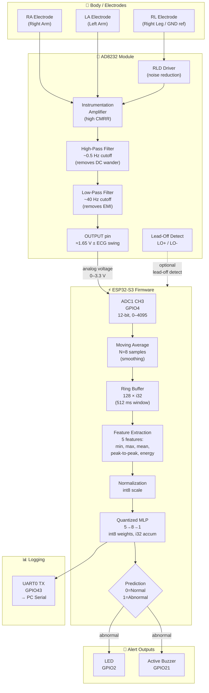
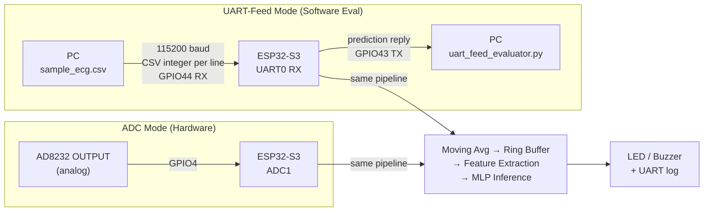
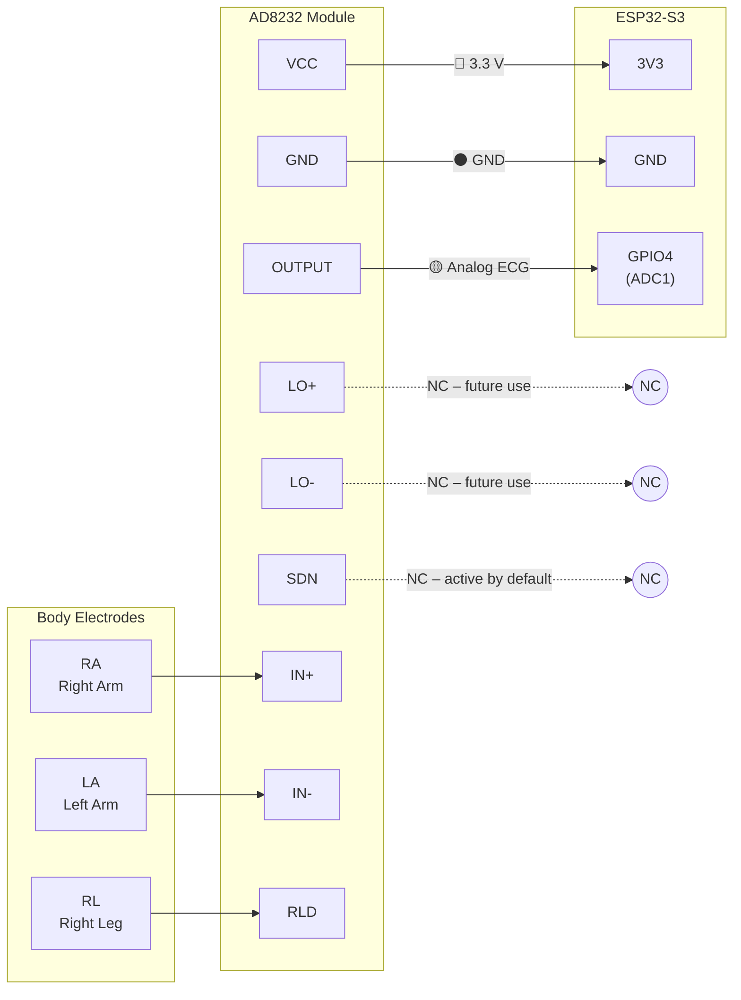
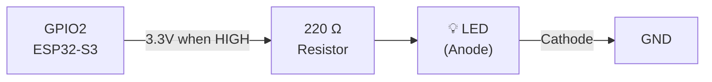
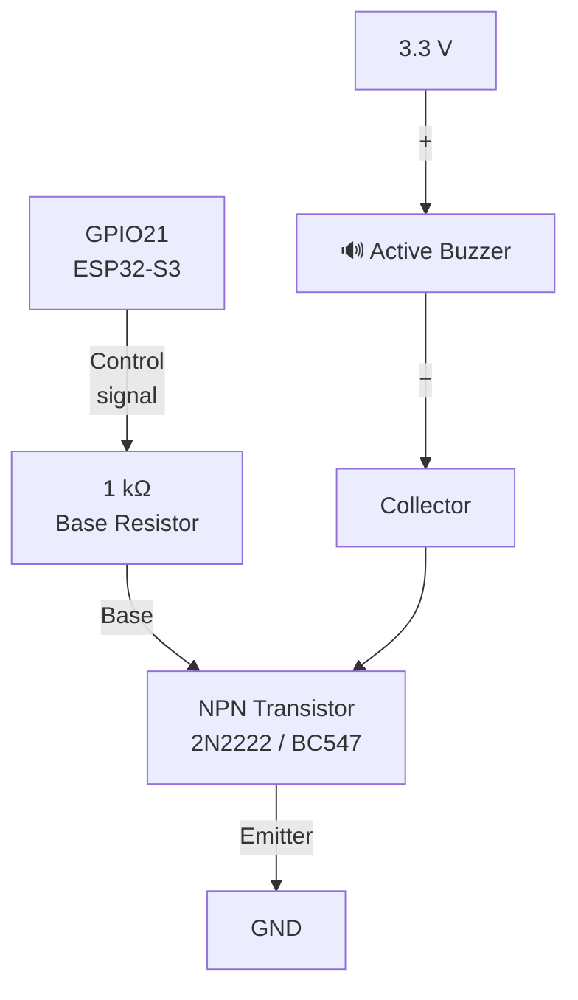
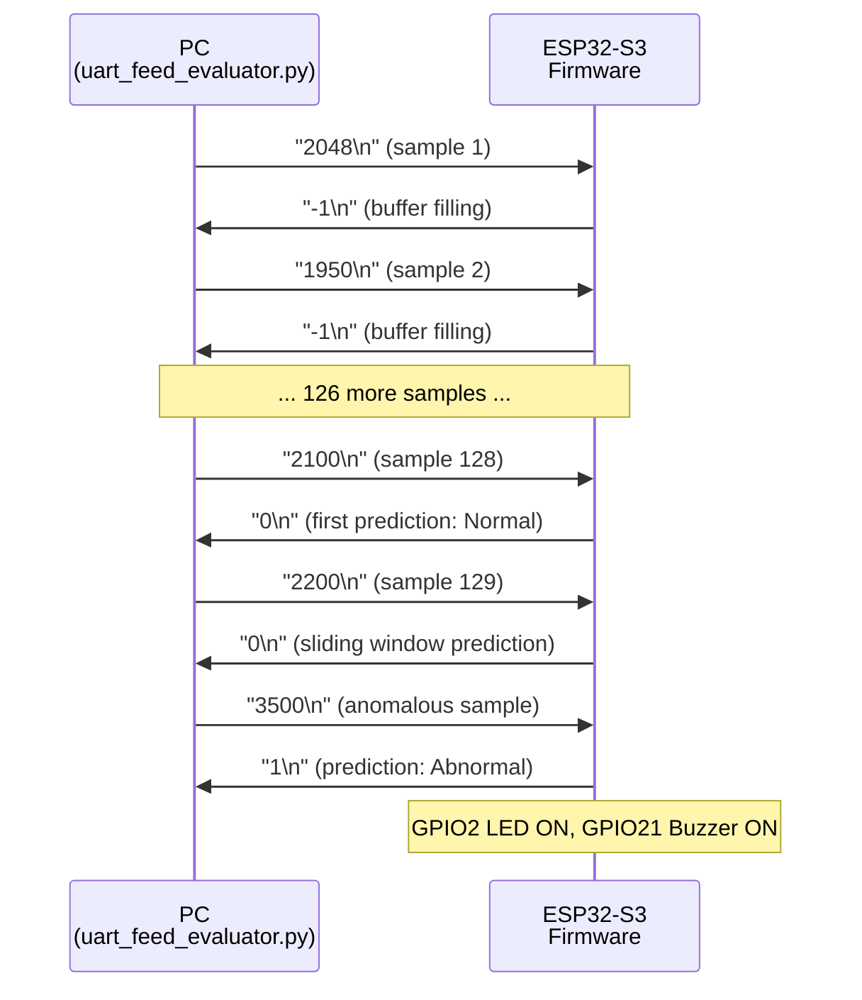
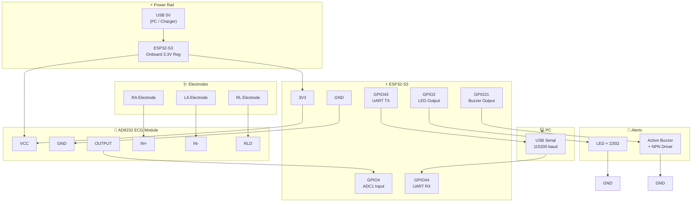
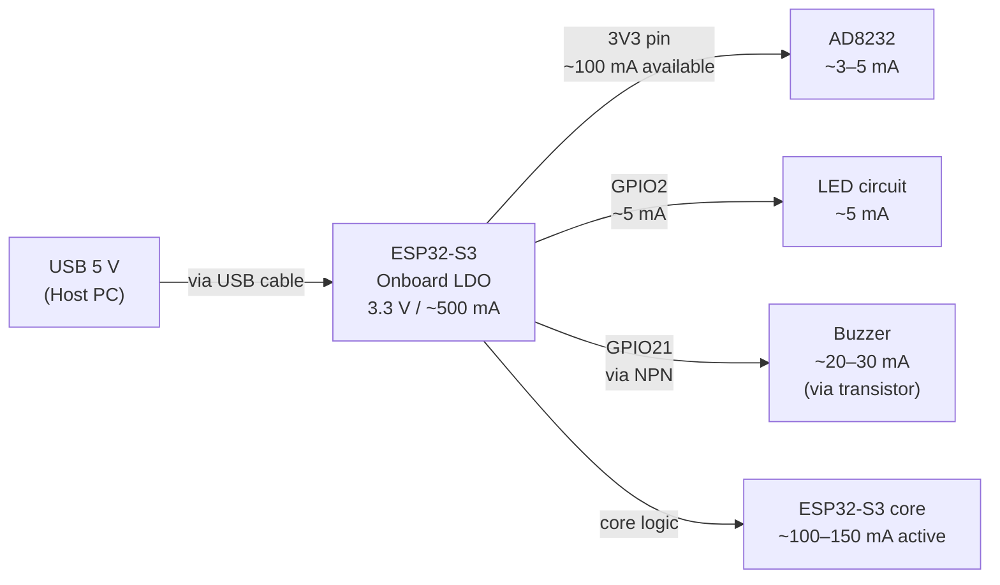
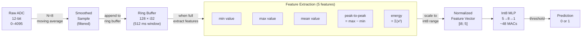

# Wiring Guide: ESP32-S3 and AD8232 ECG Module

> [!CAUTION]
> **Safety Notice — Read Before Proceeding**
> This project is for **educational purposes only**. The AD8232 breakout board and this firmware are **not certified medical devices** and must not be used for clinical diagnosis, patient monitoring, or any form of medical care. Always:
> - Power the circuit via USB only — never mains/wall power.
> - Keep the circuit electrically isolated from mains-connected equipment.
> - Do not attach electrodes to a person while any part of the system is connected to unsafe external equipment.
> - Treat ECG waveforms produced by this setup as experimental data only.

---

## Table of Contents

1. [System Overview](#1-system-overview)
2. [Component Overview](#2-component-overview)
3. [Signal Flow Diagram](#3-signal-flow-diagram)
4. [Firmware Pin Map](#4-firmware-pin-map)
5. [AD8232 to ESP32-S3 Wiring](#5-ad8232-to-esp32-s3-wiring)
6. [Alert Output Circuits](#6-alert-output-circuits)
7. [UART-Feed Mode Wiring](#7-uart-feed-mode-wiring)
8. [Full Connection Diagram](#8-full-connection-diagram)
9. [Power Architecture](#9-power-architecture)
10. [ADC Characteristics and Signal Path](#10-adc-characteristics-and-signal-path)
11. [Critical Electrical Rules](#11-critical-electrical-rules)
12. [Troubleshooting](#12-troubleshooting)

---

## 1. System Overview

This project implements a **tiny ECG classification system** running on an ESP32-S3 microcontroller using a quantized int8 MLP model compiled into Embedded Rust firmware (`no_std`). The AD8232 is an analog front-end that captures heart electrical activity from body electrodes and produces a clean, amplified ECG analog voltage suitable for an ESP32 ADC input.

Two operating modes are supported:

| Mode | Input Source | Use Case |
|---|---|---|
| **ADC mode** | AD8232 analog output → GPIO4 | Live ECG capture from electrodes |
| **UART-feed mode** | PC serial data → GPIO44 (UART0 RX) | Offline evaluation with `sample_ecg.csv` |

The inference pipeline is identical in both modes — only the sample source differs.

---

## 2. Component Overview

### ESP32-S3

The ESP32-S3 is an Xtensa LX7 dual-core SoC running up to 240 MHz. Key features used in this project:

| Feature | Detail |
|---|---|
| ADC resolution | 12-bit (0–4095 counts) |
| ADC reference voltage | ~3.3 V (internal) |
| ADC input range | 0 V – 3.1 V (practical) |
| UART0 | GPIO43 TX / GPIO44 RX |
| GPIO drive strength | 40 mA max per pin |
| Flash | SPI flash, holds firmware + int8 weights |
| RAM | SRAM, holds ring buffer + filter state |

> [!NOTE]
> The current firmware targets **ESP32-S3**, not the classic ESP32 or ESP32-C3. Classic ESP32 boards often expose GPIO34 (ADC input-only) and GPIO25 — those are **not** the pins used here.

### AD8232

The AD8232 is a single-lead ECG analog front-end IC. It integrates:

- Instrumentation amplifier (high CMRR to reject body noise)
- Right-leg drive (RLD) reference circuit
- Two-pole high-pass filter (removes DC baseline wander, default ~0.5 Hz cutoff)
- Three-pole low-pass filter (removes EMI and high-frequency noise, default ~40 Hz cutoff)
- Lead-off detection outputs (`LO+`, `LO-`)
- Shutdown pin (`SDN`) for power saving

The OUTPUT pin produces an analog voltage centered around VCC/2 (≈ 1.65 V at 3.3 V supply) that swings with the ECG waveform. This is safe to connect directly to an ESP32-S3 ADC input.

---

## 3. Signal Flow Diagram

### 3.1 End-to-End Data Flow



### 3.2 ADC Mode vs UART-Feed Mode



---

## 4. Firmware Pin Map

The table below is the **authoritative pin assignment** for the current firmware build. Do not use classic ESP32 pin numbers.

| Function | ESP32-S3 GPIO | Direction | Signal Type | Notes |
|---|:---:|:---:|---|---|
| ECG analog input | **GPIO4** | Input | Analog (ADC1 CH3) | 0–3.3 V range; AD8232 OUTPUT |
| LED alert | **GPIO2** | Output | Digital | Built-in LED on many DevKit boards |
| Buzzer alert | **GPIO21** | Output | Digital | Drive via NPN transistor for >5 mA |
| UART0 RX | **GPIO44** | Input | Digital (UART) | Receives integer samples from PC |
| UART0 TX | **GPIO43** | Output | Digital (UART) | Sends prediction results to PC |

> [!WARNING]
> **Do not confuse with classic ESP32 pins.** Older community examples may reference GPIO34 (ADC) or GPIO25 (DAC). Those pins do not exist on the ESP32-S3 in the same capacity. Always verify against this table.

### Pin Location Reference (ESP32-S3 DevKit)

```mermaid
block-beta
  columns 2
  block:LEFT["Left Rail (top→bottom)"]:1
    L1["3V3 ──────────────"]
    L2["GND ──────────────"]
    L3["GPIO43 (TX) ──────"]
    L4["GPIO44 (RX) ──────"]
    L5["GPIO4  (ADC) ─────"]
    L6["GPIO2  (LED) ─────"]
    L7["GPIO21 (BUZ) ─────"]
  end
  block:RIGHT["Connected To"]:1
    R1["── AD8232 VCC / 3V3"]
    R2["── AD8232 GND / Common"]
    R3["── PC USB-Serial TX"]
    R4["── PC USB-Serial RX"]
    R5["── AD8232 OUTPUT"]
    R6["── LED Anode"]
    R7["── Buzzer Driver Base"]
  end
```



---

## 5. AD8232 to ESP32-S3 Wiring

### 5.1 Pin-by-Pin Connection Table

| AD8232 Pin | Wire Color (suggestion) | ESP32-S3 Pin | Notes |
|---|:---:|---|---|
| `VCC` / `3.3V` | 🔴 Red | `3V3` | **3.3 V only** — never 5 V |
| `GND` | ⚫ Black | `GND` | Must share common ground |
| `OUTPUT` | 🟡 Yellow | `GPIO4` | Analog ECG signal; 0–3.3 V |
| `LO+` | 🟠 Orange | *(Not connected)* | Optional: lead-off detection future use |
| `LO-` | 🟤 Brown | *(Not connected)* | Optional: lead-off detection future use |
| `SDN` | — | *(Not connected)* | Leave floating; module stays active |

### 5.2 Wiring Schematic (ASCII)

```text
  AD8232 Breakout                     ESP32-S3 DevKit
  ┌─────────────┐                     ┌──────────────────┐
  │             │                     │                  │
  │  VCC ───────┼────── (Red) ────────┼─── 3V3           │
  │             │                     │                  │
  │  GND ───────┼────── (Black) ──────┼─── GND           │
  │             │                     │                  │
  │  OUTPUT ────┼────── (Yellow) ─────┼─── GPIO4 (ADC1)  │
  │             │                     │                  │
  │  LO+   ╌╌╌╌┼╌╌╌╌╌ (NC)           │                  │
  │             │                     │                  │
  │  LO-   ╌╌╌╌┼╌╌╌╌╌ (NC)           │                  │
  │             │                     │                  │
  │  SDN   ╌╌╌╌┼╌╌╌╌╌ (NC)           │                  │
  │             │                     │                  │
  └─────────────┘                     └──────────────────┘
  
  Electrode Leads:
  ┌──────────┐
  │ AD8232   │──── IN+  ←── RA (Right Arm) electrode
  │          │──── IN-  ←── LA (Left Arm)  electrode
  │          │──── RLD  ←── RL (Right Leg) electrode (ground reference)
  └──────────┘
```

### 5.3 Mermaid Wiring Flow



---

## 6. Alert Output Circuits

### 6.1 LED Circuit

The LED indicates an **abnormal ECG classification** (prediction = 1). Many ESP32-S3 DevKit boards have a built-in LED on GPIO2, but an external LED can also be used.

```text
GPIO2 ──── 220 Ω ──── LED Anode
                      LED Cathode ──── GND
```

**Component values:**
- GPIO2 high voltage: ~3.1–3.3 V
- LED forward voltage (red): ~2.0 V
- Desired current: ~5 mA
- Resistor: `(3.3 - 2.0) / 0.005 = 260 Ω` → use **220 Ω** standard



### 6.2 Buzzer Driver Circuit

An **active buzzer** (one that beeps at its own frequency when powered) is driven via GPIO21. For buzzers drawing more than a few milliamps, a simple NPN transistor driver is required — the ESP32 GPIO cannot safely source/sink high currents.

#### Simple Direct Connection (low-current buzzers < 5 mA)

```text
GPIO21 ──── Buzzer(+)
            Buzzer(−) ──── GND
```

#### Recommended NPN Transistor Driver (buzzers > 5 mA)

```text
GPIO21 ──── 1 kΩ ──── NPN Base  (e.g. 2N2222 / BC547)
                      NPN Collector ──── Buzzer (−)
                      Buzzer (+)    ──── 3.3 V
                      NPN Emitter   ──── GND
```



**Why a transistor?**
- ESP32-S3 GPIO max source current: ~40 mA absolute maximum, but practical limit is 12 mA per pin.
- Active buzzers typically draw 15–30 mA.
- The NPN transistor acts as a switch: GPIO21 drives the base with minimal current (~3 mA through 1 kΩ), while the transistor switches the full buzzer current through its collector–emitter path.

---

## 7. UART-Feed Mode Wiring

In UART-feed mode, **no AD8232 is needed**. The ESP32-S3 receives pre-recorded ECG sample integers from a PC over a USB-to-serial connection.

### 7.1 Communication Protocol

```text
PC  →  ESP32-S3:   "<integer_sample>\n"      e.g. "2048\n"
ESP32-S3  →  PC:   "<prediction>\n"           e.g. "-1\n", "0\n", or "1\n"
```

| Prediction value | Meaning |
|:---:|---|
| `-1` | Buffer not yet full (still filling 128-sample window) |
| `0` | Normal ECG classification |
| `1` | Abnormal ECG classification |

### 7.2 UART Pin Assignment

| Signal | ESP32-S3 GPIO | PC Side |
|---|:---:|---|
| UART0 RX (data from PC) | **GPIO44** | USB-Serial adapter TX |
| UART0 TX (data to PC) | **GPIO43** | USB-Serial adapter RX |
| GND | GND | USB-Serial adapter GND |

> [!NOTE]
> On most DevKit boards, the onboard CH340 or CP2102 USB-serial chip connects automatically to GPIO43/GPIO44. No extra adapter is needed — just the standard USB cable used to flash the firmware.

### 7.3 UART-Feed Sequence Diagram



### 7.4 Running the Evaluator

```bat
run_uart_eval.bat COM16
```

Replace `COM16` with the actual COM port shown in Device Manager. Baud rate is **115200**.

---

## 8. Full Connection Diagram

This diagram shows all connections for ADC mode (AD8232 + alerts + logging):



---

## 9. Power Architecture

### 9.1 Power Supply Chain



### 9.2 Current Budget (ADC Mode, Active)

| Consumer | Typical Current |
|---|---:|
| ESP32-S3 core (active, 240 MHz) | ~150 mA |
| AD8232 module | ~3–5 mA |
| LED (alert active) | ~5 mA |
| Buzzer (via NPN, alert active) | ~20–30 mA |
| **Total (alert on)** | **~185–190 mA** |
| USB port supply capacity | 500 mA (typical) |

> [!TIP]
> The total power draw is well within USB spec. No external power supply is needed for educational/bench use.

---

## 10. ADC Characteristics and Signal Path

### 10.1 AD8232 Output Voltage Profile

The AD8232 centers its output at **VCC/2 = 1.65 V** at rest. The ECG waveform causes the output to swing above and below this midpoint:

```text
Voltage (V)
3.3 ─────────────────────────────────────────── Saturation (avoid)
    │
2.5 ─────────────────────────── P wave peak
    │                      ╭─╮
2.0 ────────────────────╭──╯  ╰──╮──────────── R wave (QRS peak)
    │              ╭────╯         ╰─────────
1.65 ═════════════╪═══════════════════════════ Baseline (VCC/2)
    │    ╭─────────╯
1.2 ────╯─────────────────────────────────────
    │
0.0 ─────────────────────────────────────────── Rail (avoid)

     Time →   [one PQRST complex shown]
```

### 10.2 ESP32-S3 ADC1 Characteristics

| Parameter | Value |
|---|---|
| Resolution | 12-bit (0–4095 counts) |
| Input range (GPIO4) | 0 – ~3.1 V (practical) |
| Sampling in firmware | ~250 Hz (4 ms/sample delay-based loop) |
| ADC1 channel for GPIO4 | Channel 3 |
| Non-linearity | ±1–2 LSB typical (no calibration) |

### 10.3 Digital Signal Processing Chain



### 10.4 Moving Average Effect

The 8-sample moving average provides:
- **Low-pass effect**: attenuates high-frequency noise (motion artifact, 50/60 Hz powerline)
- **Group delay**: introduces ~16 ms lag (4 samples × 4 ms), acceptable for window-based classification
- **No heap**: computed in a fixed `[i32; 8]` circular buffer

---

## 11. Critical Electrical Rules

> [!CAUTION]
> Violating these rules risks permanent damage to the ESP32-S3 or injury.

1. **Never exceed 3.3 V on GPIO4.** The ESP32-S3 is not 5V-tolerant on ADC pins. The AD8232 powered at 3.3 V cannot exceed 3.3 V output, so this is safe when wired correctly.

2. **Always share a common ground.** If AD8232 GND and ESP32-S3 GND are not connected, the ADC will read garbage or be damaged.

3. **Do not connect a 5 V-output sensor directly.** Any sensor or module with 5 V logic output must use a level shifter before connecting to ESP32-S3 GPIO pins.

4. **Use battery or USB power only.** Mains-powered equipment introduces ground loops and safety hazards. USB from a laptop or USB wall charger is acceptable.

5. **Do not attach electrodes to a person while any part of the circuit is mains-connected.** Ground-loop currents can be dangerous. Use a USB-isolated setup or battery power only for human-attached experiments.

6. **Do not hot-plug the AD8232 with the ESP32-S3 powered.** Connect all wiring before powering up.

---

## 12. Troubleshooting

### 12.1 Symptom Table

| Symptom | Likely Cause | Diagnostic Steps | Fix |
|---|---|---|---|
| ADC reads 0 constantly | No signal or AD8232 not powered | Check VCC and GND wiring; measure OUTPUT with multimeter | Verify 3.3 V at AD8232 VCC, check wiring |
| ADC reads 4095 constantly | Saturated or floating input | Check that AD8232 OUTPUT is connected to GPIO4 and GND is shared | Ensure common ground; verify OUTPUT wire |
| Very noisy/jumpy signal | Motion artifacts, poor electrode contact, floating ADC | Keep still; press electrodes firmly; check OUTPUT wire | Improve electrode contact; shorten wires |
| No LED/Buzzer response | GPIO mismatch, driver issue, firmware not classifying | Check GPIO2/21 assignment in firmware; measure voltage on GPIO21 during alert | Confirm pin assignments; add transistor driver |
| Buzzer always on / always off | GPIO logic inverted or transistor wired backwards | Check NPN orientation (collector to buzzer −, emitter to GND) | Reverse transistor or fix base resistor |
| Firmware does not flash | Wrong COM port or serial monitor open | Check Device Manager for COM port; close all serial monitors | Use correct COM port; close monitors |
| UART-feed mode: `-1` never stops | Buffer not filling (bad baud rate or wrong COM port) | Verify 115200 baud, correct COM port | Check `run_uart_eval.bat` arguments |
| UART-feed mode: no reply from ESP | Wrong COM port direction (TX↔RX swapped) | Swap GPIO43/44 connections | Use correct TX→RX cross-connection |

### 12.2 Measurement Reference Points

| Test Point | Expected Value | Notes |
|---|---|---|
| AD8232 VCC | 3.28–3.32 V | Measure relative to AD8232 GND |
| AD8232 OUTPUT (at rest) | ~1.65 V | ±200 mV baseline drift acceptable |
| GPIO4 (ADC input) | ~1.65 V at rest | Same as AD8232 OUTPUT |
| GPIO2 (LED, normal) | ~0 V | HIGH only during abnormal event |
| GPIO2 (LED, alarm) | ~3.1–3.3 V | |
| GPIO21 (buzzer base) | 0 V / 3.3 V | Switches with alarm state |
| NPN collector (buzzer) | ~3.1 V / ~0.1 V | LOW when transistor ON (buzzer active) |

### 12.3 Quick Self-Test Checklist

```text
□ 1. Power on — is the ESP32-S3 boot LED lit?
□ 2. Measure 3.3 V at ESP32-S3 3V3 pin
□ 3. Measure 3.3 V at AD8232 VCC pin
□ 4. Measure ~1.65 V at AD8232 OUTPUT pin
□ 5. Measure ~1.65 V at GPIO4 (same as above)
□ 6. Open serial monitor at 115200 baud — see ADC log lines?
□ 7. Attach electrodes — does signal vary with breathing/movement?
□ 8. Trigger alarm condition — does LED (GPIO2) light up?
□ 9. Trigger alarm — does buzzer (GPIO21 / transistor) sound?
```

---

*Document version: 2026-06-17 | Firmware target: ESP32-S3 Embedded Rust (no_std)*
